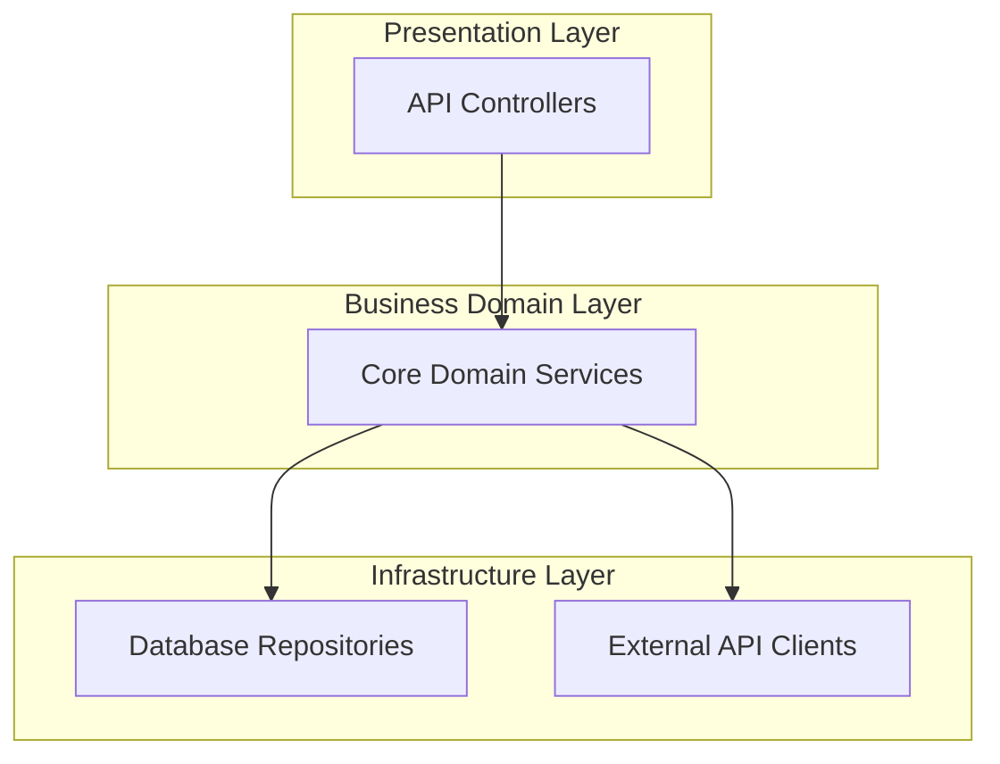
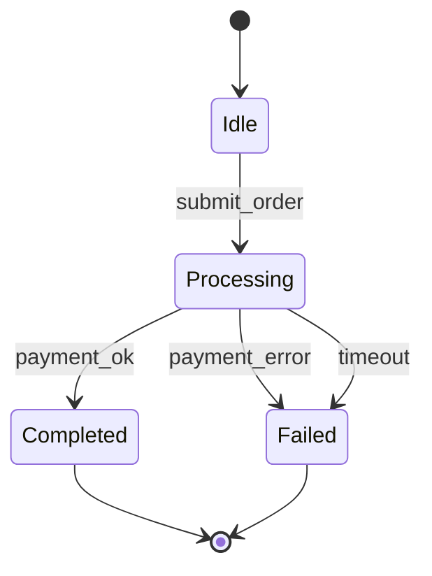
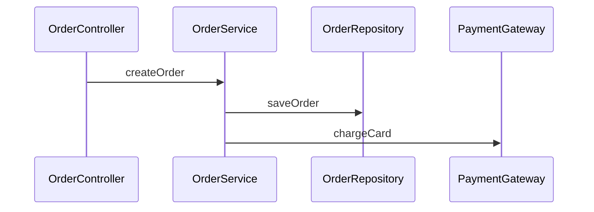

# Invariants DSL & Specification Reference

This reference provides the comprehensive syntax specification for defining target architectures, semantic invariants, and lifecycle rules in `sextant.json` and Markdown specification documents.

---

## 1. Target Architecture Specification (`sextant.json`)

The `sextant.json` file is the machine-readable single source of truth for your architecture. It is strictly validated against the official JSON Schema.

```json
{
  "$schema": "https://raw.githubusercontent.com/sextant-drift/schema/v1/sextant.schema.json",
  "name": "MyEnterpriseApp",
  "version": "1.0.0",
  "layers": [
    {
      "id": "presentation",
      "name": "Presentation Layer (UI/API)",
      "order": 1,
      "allowDependencies": ["domain", "contracts"]
    },
    {
      "id": "domain",
      "name": "Business Domain Layer",
      "order": 2,
      "allowDependencies": ["infrastructure", "contracts"]
    },
    {
      "id": "infrastructure",
      "name": "Infrastructure & External Adapters",
      "order": 3,
      "allowDependencies": ["contracts"]
    },
    {
      "id": "contracts",
      "name": "Shared Types, DTOs & Interfaces",
      "order": 4,
      "allowDependencies": []
    }
  ],
  "components": [
    {
      "id": "Controllers",
      "name": "REST API Controllers",
      "layerId": "presentation",
      "paths": ["src/controllers/**", "src/routes/**"]
    },
    {
      "id": "Services",
      "name": "Core Domain Services",
      "layerId": "domain",
      "paths": ["src/services/**", "src/domain/**"]
    },
    {
      "id": "Repositories",
      "name": "Database Repositories",
      "layerId": "infrastructure",
      "paths": ["src/repos/**", "src/infra/db/**"]
    },
    {
      "id": "ExternalGateways",
      "name": "Third-Party Payment & AI Clients",
      "layerId": "infrastructure",
      "paths": ["src/gateways/**", "src/clients/**"]
    },
    {
      "id": "Contracts",
      "name": "Shared DTOs & Types",
      "layerId": "contracts",
      "paths": ["src/types/**", "src/contracts/**"]
    }
  ],
  "invariants": [
    {
      "id": "PERSIST_BEFORE_PAYMENT",
      "severity": "critical",
      "desc": "Orders must be saved to DB before calling payment gateway",
      "pattern": {
        "must_precede": ["this.repo.save", "orderRepo.create", "db.orders.insert"],
        "target": ["paymentGateway.charge", "stripe.charges.create"],
        "scope": "src/services/**"
      }
    },
    {
      "id": "FORBID_DIRECT_DB_IN_PRESENTATION",
      "severity": "critical",
      "desc": "Presentation layer is strictly forbidden from directly importing DB drivers or ORM",
      "pattern": {
        "forbid_import": ["@prisma/client", "typeorm", "pg", "mysql2", "src/repos/**"],
        "in_path": "src/controllers/**,src/routes/**,src/views/**"
      }
    },
    {
      "id": "MANDATORY_TIMEOUT_ON_EXTERNAL_CALLS",
      "severity": "warning",
      "desc": "All external HTTP client calls must configure an explicit timeout",
      "pattern": {
        "target": ["axios.post", "fetch", "httpService.request"],
        "require_config": ["timeout"],
        "scope": "src/gateways/**"
      }
    }
  ]
}
```

### Layer Constraints & Rules
- `order`: Integer defining vertical architectural hierarchy ($1 = \text{topmost}$, higher = lower).
  - Upper layers call lower layers based on `allowDependencies`.
  - **Layer Bypass (`CRITICAL_BYPASS`)**: Calling layer order $N+2$ skipping $N+1$ without permission.
  - **Layer Inversion (`CRITICAL_INVERSION`)**: Lower layer (order $M$) calling upper layer (order $N$ where $N < M$).
- `allowDependencies`: Whitelist array of target layer IDs. Any cross-layer import not in this array is blocked.
- Type-only imports (`import type { ... }`): Ignored by default to allow harmless type sharing. Use `--count-type-only` to strictly enforce layer purity even on type-only imports.

---

## 2. Semantic Invariant DSL Patterns

### Pattern A: Temporal Precedence (`must_precede`)
Enforces that a safety or state persistence operation must be executed **before** an irreversible network or side-effect operation within the same function block:

```json
{
  "id": "AUTH_BEFORE_SENSITIVE_OP",
  "severity": "critical",
  "desc": "Authentication check must precede sensitive mutations",
  "pattern": {
    "must_precede": ["auth.verifySession", "guard.authorize"],
    "target": ["userService.deleteAccount", "adminService.promoteUser"],
    "scope": "src/controllers/**"
  }
}
```

### Pattern B: Boundary Isolation (`forbid_import`)
Prevents structural leakage of database handles, driver libraries, or internal private modules into unauthorized layers:

```json
{
  "id": "NO_NODE_FS_IN_SHARED",
  "severity": "critical",
  "desc": "Shared contracts module must remain platform-agnostic and browser-safe",
  "pattern": {
    "forbid_import": ["fs", "node:fs", "path", "node:path", "child_process"],
    "in_path": "src/contracts/**,src/shared/**"
  }
}
```

### Pattern C: Non-Functional Guardrails (`require_config`)
Ensures resilience and reliability requirements (such as timeouts, retries, or rate limiters) are configured on external calls:

```json
{
  "id": "CLIENT_CALL_TIMEOUT",
  "severity": "warning",
  "desc": "External client invocations must pass an options object containing a timeout property",
  "pattern": {
    "target": ["httpClient.get", "httpClient.post"],
    "require_config": ["timeout"],
    "scope": "src/infra/**"
  }
}
```

---

## 3. Mermaid Target Architecture Formats

SextantDrift parses Mermaid definitions embedded in `ARCHITECTURE.md`, `AGENTS.md`, or PRDs:

### A. Flowchart Component & Layer Topology (`flowchart TD`)


### B. State Machine Integrity (`stateDiagram-v2`)

- **`[STATE_DEADLOCK]`**: Flagged if any state has $\text{in-degree} \ge 1$ and $\text{out-degree} = 0$ (black hole) unless it is the terminal state `[*]`.
- **`[STATE_UNREACHABLE]`**: Flagged if any declared state has $\text{in-degree} = 0$ (orphan island).
- **`[STATE_MISSING_FALLBACK]`**: Flagged if an asynchronous state (`*Pending*`, `*Processing*`, `*Waiting*`) has no transition containing `error`, `fail`, `timeout`, or `retry`.

### C. Causality Sequence (`sequenceDiagram`)

- **`[DYNAMIC_OUT_OF_ORDER]`**: Triggered if a runtime trace (`.sextant/trace.json`) indicates `chargeCard` was executed before `saveOrder` resolved.
- **`[DYNAMIC_MISSING_CALL]`**: Triggered if `createOrder` exited without executing declared step `saveOrder`.
