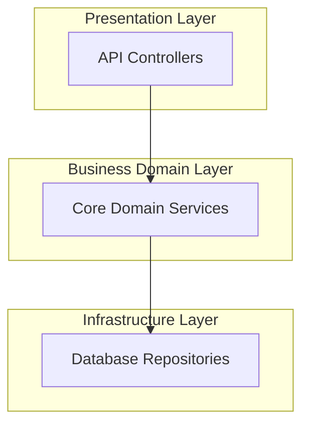
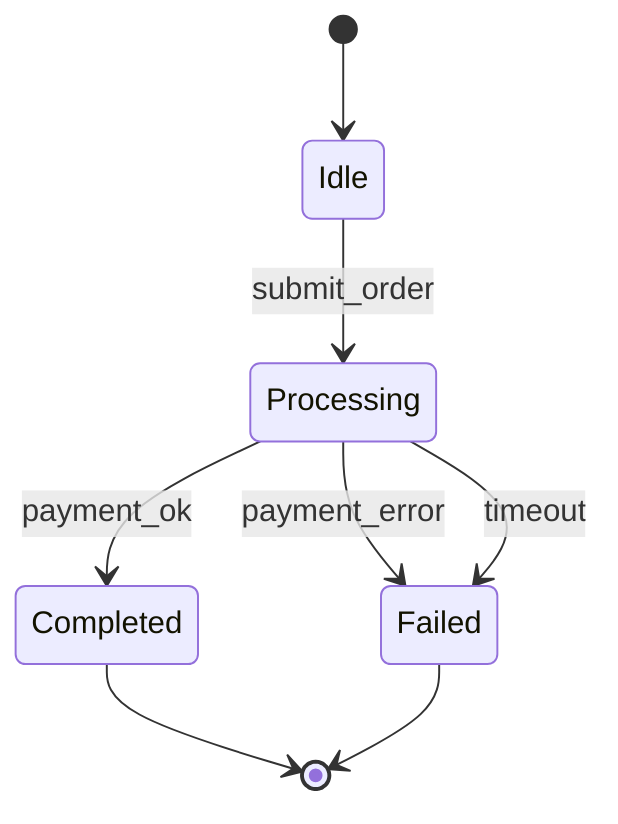
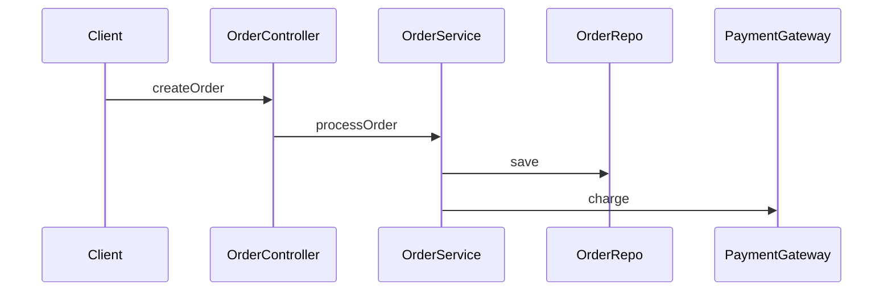

# Invariants DSL & Specification Reference

This reference describes how to define target architectures and semantic invariant rules in `sextant.json` and Markdown specification documents.

---

## 1. Target Architecture Specification (`sextant.json`)

The `sextant.json` file is the machine-readable single source of truth for your architecture.

```json
{
  "$schema": "https://raw.githubusercontent.com/sextant-drift/schema/v1/sextant.schema.json",
  "name": "MyApplication",
  "layers": [
    {
      "id": "presentation",
      "name": "Presentation Layer",
      "order": 1,
      "allowDependencies": ["domain", "contracts"]
    },
    {
      "id": "domain",
      "name": "Business Domain Layer",
      "order": 2,
      "allowDependencies": ["infrastructure", "contracts"]
    },
    {
      "id": "infrastructure",
      "name": "Infrastructure & Data Access",
      "order": 3,
      "allowDependencies": ["contracts"]
    },
    {
      "id": "contracts",
      "name": "Shared Types & Interfaces",
      "order": 4,
      "allowDependencies": []
    }
  ],
  "components": [
    {
      "id": "Controllers",
      "name": "API Controllers",
      "layerId": "presentation",
      "paths": ["src/controllers/**"]
    },
    {
      "id": "Services",
      "name": "Core Domain Services",
      "layerId": "domain",
      "paths": ["src/services/**"]
    },
    {
      "id": "Repositories",
      "name": "Database Repositories",
      "layerId": "infrastructure",
      "paths": ["src/repos/**"]
    }
  ],
  "invariants": [
    {
      "id": "AUTH_BEFORE_DB_ACCESS",
      "severity": "critical",
      "desc": "User identity and permissions must be verified before querying data",
      "pattern": {
        "must_precede": ["auth.verify", "session.validate"],
        "target": ["this.repo.find", "this.repo.save"],
        "scope": "src/controllers/**"
      }
    },
    {
      "id": "FORBID_DIRECT_DB_IN_UI",
      "severity": "critical",
      "desc": "Presentation layer is strictly forbidden from directly importing DB drivers",
      "pattern": {
        "forbid_import": ["@prisma/client", "pg", "mysql2", "typeorm"],
        "in_path": "src/controllers/**,src/views/**"
      }
    },
    {
      "id": "MANDATORY_TIMEOUT_CONFIG",
      "severity": "warning",
      "desc": "Third-party HTTP client calls must specify a timeout parameter",
      "pattern": {
        "require_config": ["timeout"],
        "scope": "src/services/integrations/**"
      }
    }
  ]
}
```

---

## 2. Mermaid Architecture Intent Formats

SextantDrift natively parses Mermaid blocks inside any Markdown documentation (e.g. `ARCHITECTURE.md`, `AGENTS.md`, or PRDs).

### A. Flowchart Component & Layer Topology (`flowchart TD`)


### B. State Machine Lifecycle (`stateDiagram-v2`)

- **Deadlock Rule**: Any state with in-degree $\ge 1$ and out-degree $= 0$ that is not `[*]` is flagged as `STATE_DEADLOCK`.
- **Fallback Rule**: Any state named `*Pending*`, `*Waiting*`, `*Processing*` must provide transitions handling `fail`, `error`, `timeout`, or `retry`.

### C. Sequence Diagram (`sequenceDiagram`)

- **Out of Order Rule**: If runtime trace shows `charge` executed before `save` finished, flags `DYNAMIC_OUT_OF_ORDER`.
- **Missing Call Rule**: If `processOrder` completed without calling `save`, flags `DYNAMIC_MISSING_CALL`.
