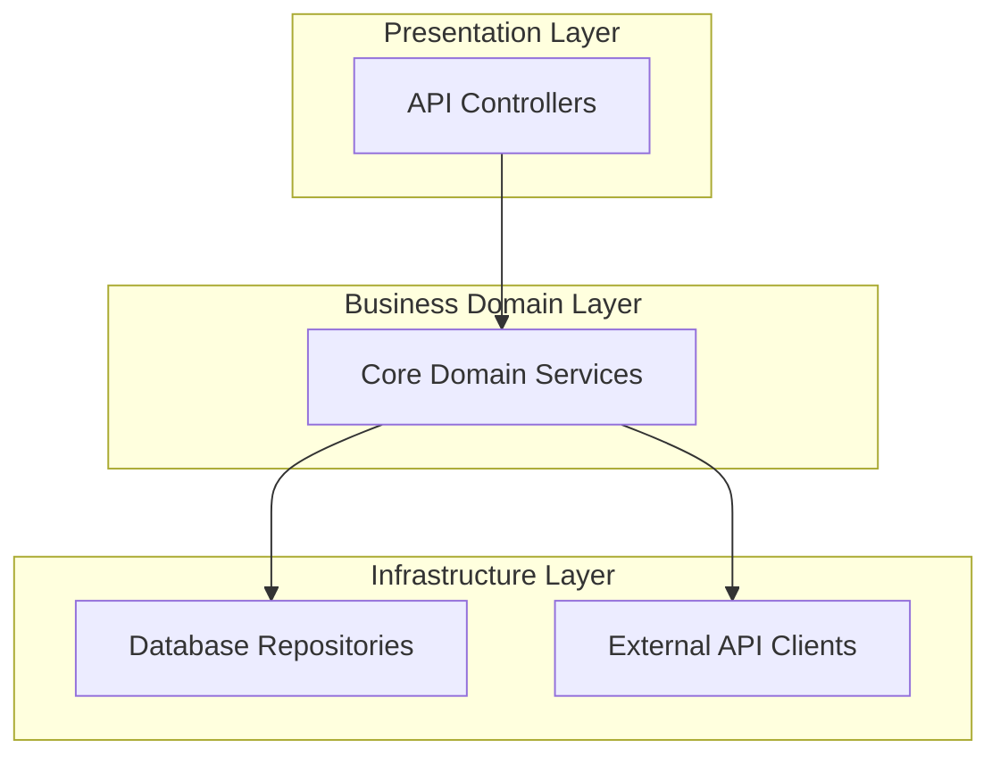
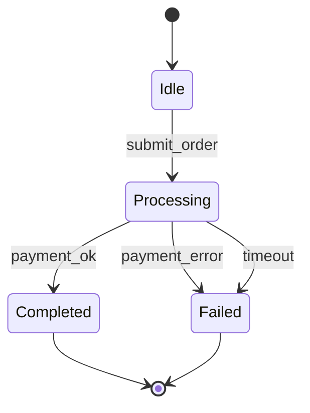
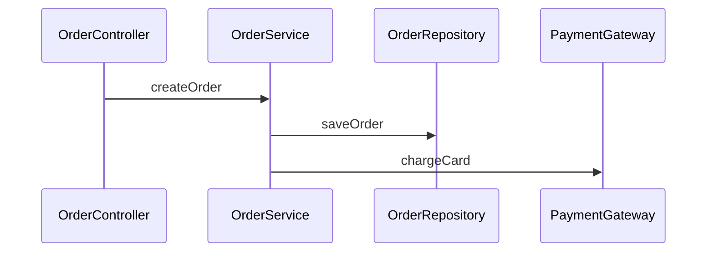

# Invariants DSL & Spec Reference

Syntax for target architecture, semantic invariants, and Mermaid diagrams that SextantDrift reads today (`sextant.json`, `ARCHITECTURE.md`, `AGENTS.md`, etc.).

---

## 1. `sextant.json` — layers, components, invariants

```json
{
  "$schema": "https://raw.githubusercontent.com/sextant-drift/schema/v1/sextant.schema.json",
  "name": "MyEnterpriseApp",
  "version": "1.0.0",
  "layers": [
    {
      "id": "presentation",
      "name": "Presentation Layer (UI/API)",
      "order": 1,
      "allowDependencies": ["domain", "contracts"]
    },
    {
      "id": "domain",
      "name": "Business Domain Layer",
      "order": 2,
      "allowDependencies": ["infrastructure", "contracts"]
    },
    {
      "id": "infrastructure",
      "name": "Infrastructure & External Adapters",
      "order": 3,
      "allowDependencies": ["contracts"]
    },
    {
      "id": "contracts",
      "name": "Shared Types, DTOs & Interfaces",
      "order": 4,
      "allowDependencies": []
    }
  ],
  "components": [
    {
      "id": "Controllers",
      "name": "REST API Controllers",
      "layerId": "presentation",
      "paths": ["src/controllers/**", "src/routes/**"]
    },
    {
      "id": "Services",
      "name": "Core Domain Services",
      "layerId": "domain",
      "paths": ["src/services/**", "src/domain/**"]
    },
    {
      "id": "Repositories",
      "name": "Database Repositories",
      "layerId": "infrastructure",
      "paths": ["src/repos/**", "src/infra/db/**"]
    },
    {
      "id": "ExternalGateways",
      "name": "Third-Party Payment & AI Clients",
      "layerId": "infrastructure",
      "paths": ["src/gateways/**", "src/clients/**"]
    },
    {
      "id": "Contracts",
      "name": "Shared DTOs & Types",
      "layerId": "contracts",
      "paths": ["src/types/**", "src/contracts/**"]
    }
  ],
  "invariants": [
    {
      "id": "PERSIST_BEFORE_PAYMENT",
      "severity": "critical",
      "desc": "Orders must be saved to DB before calling payment gateway",
      "pattern": {
        "must_precede": ["this.repo.save", "orderRepo.create", "db.orders.insert"],
        "target": ["paymentGateway.charge", "stripe.charges.create"],
        "scope": "src/services/**"
      }
    },
    {
      "id": "FORBID_DIRECT_DB_IN_PRESENTATION",
      "severity": "critical",
      "desc": "Presentation layer must not import DB drivers or ORM",
      "pattern": {
        "forbid_import": ["@prisma/client", "typeorm", "pg", "mysql2", "src/repos/**"],
        "in_path": "src/controllers/**,src/routes/**,src/views/**"
      }
    },
    {
      "id": "MANDATORY_TIMEOUT_ON_EXTERNAL_CALLS",
      "severity": "warning",
      "desc": "External HTTP client calls must configure an explicit timeout",
      "pattern": {
        "target": ["axios.post", "fetch", "httpService.request"],
        "require_config": ["timeout"],
        "scope": "src/gateways/**"
      }
    }
  ]
}
```

### Layer rules
- `order`: integer hierarchy (1 = top). Upper layers call lower layers only via `allowDependencies`.
- `CRITICAL_BYPASS`: call skips intermediate layer (order N → N+2) without permission.
- `CRITICAL_INVERSION`: lower layer (order M) imports upper layer (order N where N < M).
- `allowDependencies`: whitelist of target layer IDs; other cross-layer imports fail.
- Type-only imports (`import type { ... }`) ignored by default; use `--count-type-only` to count them.

---

## 2. Semantic invariant patterns

### A. Temporal precedence (`must_precede`)

```json
{
  "id": "AUTH_BEFORE_SENSITIVE_OP",
  "severity": "critical",
  "desc": "Authentication check must precede sensitive mutations",
  "pattern": {
    "must_precede": ["auth.verifySession", "guard.authorize"],
    "target": ["userService.deleteAccount", "adminService.promoteUser"],
    "scope": "src/controllers/**"
  }
}
```

### B. Boundary isolation (`forbid_import`)

```json
{
  "id": "NO_NODE_FS_IN_SHARED",
  "severity": "critical",
  "desc": "Shared contracts must stay platform-agnostic",
  "pattern": {
    "forbid_import": ["fs", "node:fs", "path", "node:path", "child_process"],
    "in_path": "src/contracts/**,src/shared/**"
  }
}
```

### C. Config guardrail (`require_config`)

```json
{
  "id": "CLIENT_CALL_TIMEOUT",
  "severity": "warning",
  "desc": "External client calls must pass options with timeout",
  "pattern": {
    "target": ["httpClient.get", "httpClient.post"],
    "require_config": ["timeout"],
    "scope": "src/infra/**"
  }
}
```

---

## 3. Mermaid target diagrams

Parsed from `ARCHITECTURE.md`, `AGENTS.md`, or PRDs.

### A. Flowchart topology (`flowchart TD`)


```mermaid
flowchart TD
    subgraph Presentation ["Presentation Layer"]
        Controllers["API Controllers"]
    end
    subgraph Domain ["Business Domain Layer"]
        Services["Core Domain Services"]
    end
    subgraph Infrastructure ["Infrastructure Layer"]
        Repositories["Database Repositories"]
        Gateways["External API Clients"]
    end

    Controllers --> Services
    Services --> Repositories
    Services --> Gateways
```

### B. State machine (`stateDiagram-v2`)


```mermaid
stateDiagram-v2
    [*] --> Idle
    Idle --> Processing: submit_order
    Processing --> Completed: payment_ok
    Processing --> Failed: payment_error
    Processing --> Failed: timeout
    Completed --> [*]
    Failed --> [*]
```

| Violation | When |
| :--- | :--- |
| `STATE_DEADLOCK` | State has in-degree ≥ 1 and out-degree 0 (black hole), unless terminal `[*]` |
| `STATE_UNREACHABLE` | Declared state has in-degree 0 (orphan) |
| `STATE_MISSING_FALLBACK` | Async-named state (`*Pending*`, `*Processing*`, `*Waiting*`) lacks `error` / `fail` / `timeout` / `retry` transition |

State-machine heal patterns → read [`remediation-patterns.md`](./remediation-patterns.md) Pattern 6.

---

## Appendix: sequenceDiagram + dynamic checks (experimental Phase 5)

`sequenceDiagram` blocks are parsed, but **runtime causality checks are not the default gate**. They run only with `--trace <path>` (or `.sextant/trace.json`) — experimental Phase 5.


```mermaid
sequenceDiagram
    participant Controller as OrderController
    participant Service as OrderService
    participant Repo as OrderRepository
    participant Gateway as PaymentGateway

    Controller->>Service: createOrder
    Service->>Repo: saveOrder
    Service->>Gateway: chargeCard
```

| Violation | Meaning (only under `--trace`) |
| :--- | :--- |
| `DYNAMIC_OUT_OF_ORDER` | Trace shows later step before earlier step resolved |
| `DYNAMIC_MISSING_CALL` | Declared step never executed |
| `DYNAMIC_UNEXPECTED_CALL` | Call not in the diagram appeared in the trace |

Prefer static module / invariant / contract / stateDiagram gates. Phase 5 `--trace` heal intents → read [`remediation-patterns.md`](./remediation-patterns.md) Pattern 8.
