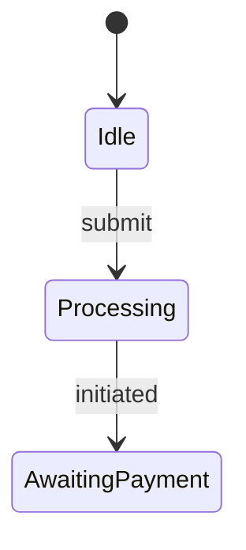
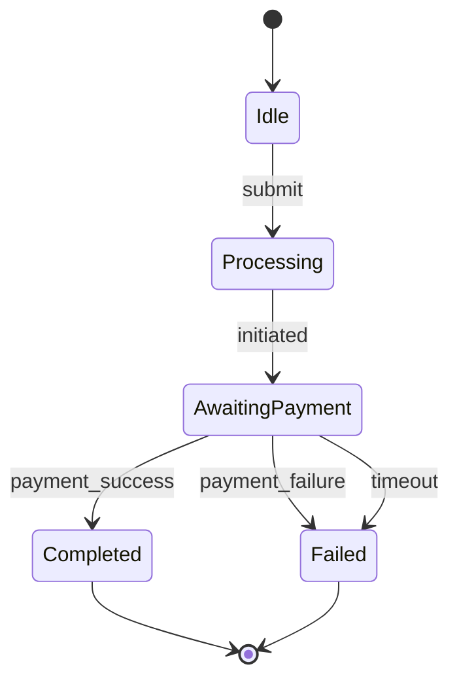

# Architecture Remediation & Refactoring Patterns

This guide provides tested TypeScript refactoring patterns to eliminate architecture violations reported by SextantDrift without disrupting business functionality.

---

## Pattern 1: Resolving `[CRITICAL_BYPASS]` (Layer Bypass)

### Problem
A Controller directly imports a Repository, bypassing intermediate business logic layers:

```typescript
// ❌ src/controllers/user.controller.ts
import { UserRepository } from '../repos/user.repo.js'; // Bypass Presentation -> Infra!

export class UserController {
  async handleGetUser(req: Request) {
    return UserRepository.findById(req.params.id);
  }
}
```

### Remediation
Route the call through an intermediate Domain Service:

```typescript
// ✅ src/controllers/user.controller.ts
import { UserService } from '../services/user.service.js';

export class UserController {
  async handleGetUser(req: Request) {
    return UserService.getUserProfile(req.params.id);
  }
}

// ✅ src/services/user.service.ts
import { UserRepository } from '../repos/user.repo.js';

export class UserService {
  static async getUserProfile(id: string) {
    // Encapsulate domain logic, validation, and authorization
    return UserRepository.findById(id);
  }
}
```

---

## Pattern 2: Resolving `[CRITICAL_INVERSION]` (Layer Inversion)

### Problem
A lower layer (Domain Service) directly imports an upper delivery layer (Controller/CLI):

```typescript
// ❌ src/services/order.service.ts
import { CreateOrderRequestDto } from '../controllers/dto.js'; // Inversion! Domain -> Controller
```

### Remediation
Apply the **Dependency Inversion Principle (DIP)**. Extract shared DTOs, interfaces, and contracts into a shared lower `contracts` or `types` module:

```typescript
// ✅ src/contracts/order.types.ts
export interface CreateOrderRequestDto {
  userId: string;
  items: Array<{ productId: string; quantity: number }>;
}

// ✅ src/services/order.service.ts
import type { CreateOrderRequestDto } from '../contracts/order.types.js';

// ✅ src/controllers/order.controller.ts
import type { CreateOrderRequestDto } from '../contracts/order.types.js';
```

---

## Pattern 3: Resolving `[CRITICAL_CYCLE]` (Circular Dependency)

### Problem
`ServiceA` imports `ServiceB`, and `ServiceB` imports `ServiceA`:

```typescript
// ❌ src/services/service-a.ts
import { computeTax } from './service-b.js';
export function calculateTotal(base: number) { return base + computeTax(base); }

// ❌ src/services/service-b.ts
import { calculateTotal } from './service-a.js';
export function computeTax(base: number) { return base > 100 ? 10 : 5; }
```

### Remediation
Extract the common calculation or interface into a shared leaf module, or decouple through dependency injection/events:

```typescript
// ✅ src/services/tax-calculator.ts (Leaf module)
export function computeTax(base: number) { return base > 100 ? 10 : 5; }

// ✅ src/services/service-a.ts
import { computeTax } from './tax-calculator.js';
export function calculateTotal(base: number) { return base + computeTax(base); }

// ✅ src/services/service-b.ts
import { computeTax } from './tax-calculator.js';
```

---

## Pattern 4: Resolving `[CRITICAL_FORBIDDEN_IMPORT]` (Forbidden Import)

### Problem
A Controller directly imports a database driver or ORM client:

```typescript
// ❌ src/controllers/user.controller.ts
import { PrismaClient } from '@prisma/client'; // Forbidden in Presentation!
const prisma = new PrismaClient();
```

### Remediation
Confine driver instances and ORM schemas to the infrastructure/repository layer:

```typescript
// ✅ src/repos/prisma-client.ts (Infrastructure Layer)
import { PrismaClient } from '@prisma/client';
export const db = new PrismaClient();

// ✅ src/repos/user.repo.ts (Infrastructure Layer)
import { db } from './prisma-client.js';
export class UserRepo {
  static async findUser(id: string) {
    return db.user.findUnique({ where: { id } });
  }
}
```

---

## Pattern 5: Resolving `[INVARIANT_BROKEN]` (Precedence Invariant)

### Problem
An irreversible external network side-effect (charge payment) executes before state is persisted to the database:

```typescript
// ❌ src/services/checkout.service.ts
async function processCheckout(order: Order) {
  // Violation: External charge before order is recorded in DB!
  await StripeClient.charges.create({ amount: order.amount });
  await OrderRepo.insert(order);
}
```

### Remediation
Persist initial state with `status: 'PENDING'` first, then execute the external call, and finalize state:

```typescript
// ✅ src/services/checkout.service.ts
async function processCheckout(order: Order) {
  const pendingOrder = await OrderRepo.insert({ ...order, status: 'PENDING' });
  try {
    const charge = await StripeClient.charges.create({ amount: order.amount });
    await OrderRepo.updateStatus(pendingOrder.id, 'COMPLETED', charge.id);
  } catch (err) {
    await OrderRepo.updateStatus(pendingOrder.id, 'PAYMENT_FAILED');
    throw err;
  }
}
```

---

## Pattern 6: Resolving `[STATE_DEADLOCK]` & `[STATE_MISSING_FALLBACK]`

### Problem
A Mermaid state machine contains a black-hole state without exit transitions, or an async state without error/timeout fallbacks:



### Remediation
Add exit transitions and explicit error/timeout branches:



---

## Pattern 7: Resolving `[CONTRACT_SHADOW_ENDPOINT]` & `[CONTRACT_MISSING_ENDPOINT]`

### Problem A (Shadow Endpoint):
Controller contains an undocumented endpoint `DELETE /api/v1/orders/:id`, but it is not listed in `api-contract.md`.

**Remediation**:
- If unauthorized: Remove the route method from the controller.
- If legitimate: Document it in `api-contract.md`:
  ```markdown
  ### DELETE /api/v1/orders/:id
  - [param] id: string (required)
  - [status] 204 (No Content)
  - [status] 404 (Not Found)
  ```

### Problem B (Missing Endpoint):
`api-contract.md` specifies `GET /api/v1/health`, but no controller exports it.

**Remediation**:
Implement the missing handler in the corresponding route controller:
```typescript
// ✅ src/controllers/health.controller.ts
export function registerHealthRoutes(app: Express) {
  app.get('/api/v1/health', (req, res) => res.json({ status: 'ok' }));
}
```

---

## Pattern 8: Resolving `[DYNAMIC_OUT_OF_ORDER]` (Runtime Causality Drift)

### Problem
Runtime trace logs show a callback or external call executing before a prerequisite promise resolved:

```typescript
// ❌ Async operation started without awaiting persistence
function handleOrder(order: Order) {
  db.save(order); // Missing await!
  externalGateway.notify(order.id);
}
```

### Remediation
Ensure promises are properly chained or awaited:

```typescript
// ✅ Async execution sequenced properly
async function handleOrder(order: Order) {
  await db.save(order);
  await externalGateway.notify(order.id);
}
```
