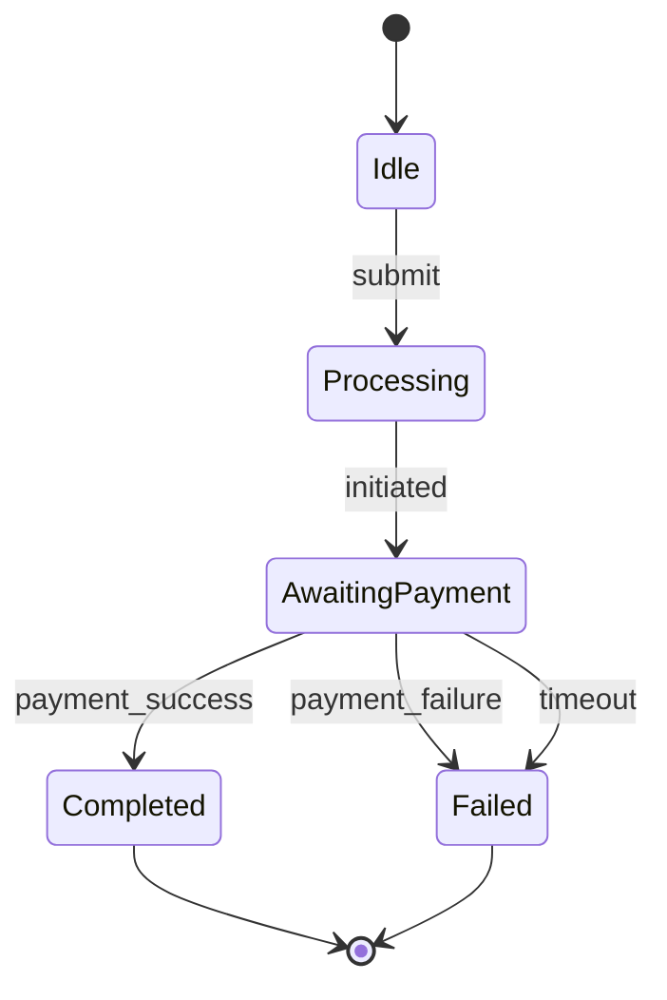

# Remediation Patterns (sole SoT)

Concrete TypeScript / Mermaid fixes for Fix Manifest actions. After each change, re-run `npx sextant-drift check` until **gate-green** (exit 0).

Unknown action → read the Fix Manifest YAML line + `suggestion` field, or `npx sextant-drift check --fix-manifest`.

---

## Pattern 1: `REMOVE_BYPASS` — `[CRITICAL_BYPASS]`

### Problem
Controller imports a Repository, skipping the domain layer:

```typescript
// ❌ src/controllers/user.controller.ts
import { UserRepository } from '../repos/user.repo.js';

export class UserController {
  async handleGetUser(req: Request) {
    return UserRepository.findById(req.params.id);
  }
}
```

### Fix
Route through a domain service:

```typescript
// ✅ src/controllers/user.controller.ts
import { UserService } from '../services/user.service.js';

export class UserController {
  async handleGetUser(req: Request) {
    return UserService.getUserProfile(req.params.id);
  }
}

// ✅ src/services/user.service.ts
import { UserRepository } from '../repos/user.repo.js';

export class UserService {
  static async getUserProfile(id: string) {
    return UserRepository.findById(id);
  }
}
```

---

## Pattern 2: `INVERT_DEP` — `[CRITICAL_INVERSION]`

### Problem
Lower layer imports an upper delivery layer:

```typescript
// ❌ src/services/order.service.ts
import { CreateOrderRequestDto } from '../controllers/dto.js';
```

### Fix
Move shared types into a shared `contracts` / `types` module (DIP):

```typescript
// ✅ src/contracts/order.types.ts
export interface CreateOrderRequestDto {
  userId: string;
  items: Array<{ productId: string; quantity: number }>;
}

// ✅ src/services/order.service.ts
import type { CreateOrderRequestDto } from '../contracts/order.types.js';

// ✅ src/controllers/order.controller.ts
import type { CreateOrderRequestDto } from '../contracts/order.types.js';
```

---

## Pattern 3: `BREAK_CYCLE` — `[CRITICAL_CYCLE]`

### Problem
`ServiceA` ↔ `ServiceB` mutual imports.

### Fix
Extract shared logic into a leaf module:

```typescript
// ✅ src/services/tax-calculator.ts
export function computeTax(base: number) { return base > 100 ? 10 : 5; }

// ✅ src/services/service-a.ts
import { computeTax } from './tax-calculator.js';
export function calculateTotal(base: number) { return base + computeTax(base); }

// ✅ src/services/service-b.ts
import { computeTax } from './tax-calculator.js';
```

---

## Pattern 4: `REMOVE_IMPORT` — `[CRITICAL_FORBIDDEN_IMPORT]`

### Problem
Presentation layer imports a DB driver / ORM:

```typescript
// ❌ src/controllers/user.controller.ts
import { PrismaClient } from '@prisma/client';
const prisma = new PrismaClient();
```

### Fix
Confine drivers to infrastructure / repository:

```typescript
// ✅ src/repos/prisma-client.ts
import { PrismaClient } from '@prisma/client';
export const db = new PrismaClient();

// ✅ src/repos/user.repo.ts
import { db } from './prisma-client.js';
export class UserRepo {
  static async findUser(id: string) {
    return db.user.findUnique({ where: { id } });
  }
}
```

---

## Pattern 5: `FIX_INVARIANT` — `[INVARIANT_BROKEN]`

### Problem
External side-effect runs before persistence:

```typescript
// ❌
async function processCheckout(order: Order) {
  await StripeClient.charges.create({ amount: order.amount });
  await OrderRepo.insert(order);
}
```

### Fix
Persist first (`PENDING`), then call external, then finalize:

```typescript
// ✅
async function processCheckout(order: Order) {
  const pendingOrder = await OrderRepo.insert({ ...order, status: 'PENDING' });
  try {
    const charge = await StripeClient.charges.create({ amount: order.amount });
    await OrderRepo.updateStatus(pendingOrder.id, 'COMPLETED', charge.id);
  } catch (err) {
    await OrderRepo.updateStatus(pendingOrder.id, 'PAYMENT_FAILED');
    throw err;
  }
}
```

---

## Pattern 6: `FIX_STATE_DEADLOCK` / `ADD_TIMEOUT_FALLBACK` / `CONNECT_STATE`

### Problem
State machine has a black-hole state, missing error/timeout exit, or unreachable state.

### Fix
Add exit transitions, fallback branches, and inbound edges:


```mermaid
%% ✅
stateDiagram-v2
    [*] --> Idle
    Idle --> Processing: submit
    Processing --> AwaitingPayment: initiated
    AwaitingPayment --> Completed: payment_success
    AwaitingPayment --> Failed: payment_failure
    AwaitingPayment --> Failed: timeout
    Completed --> [*]
    Failed --> [*]
```

- `STATE_DEADLOCK` → `FIX_STATE_DEADLOCK`: give the state an out-edge (or mark terminal `[*]`).
- `STATE_MISSING_FALLBACK` → `ADD_TIMEOUT_FALLBACK`: add `error` / `fail` / `timeout` / `retry` transition.
- `STATE_UNREACHABLE` → `CONNECT_STATE`: add a transition into the orphan state (or remove it).

---

## Pattern 7: Contract routes — `REMOVE_ROUTE` / `IMPLEMENT_ROUTE`

### `CONTRACT_SHADOW_ENDPOINT` → `REMOVE_ROUTE`
Undocumented route in code. Either delete the handler, or document it in the contract:

```markdown
### DELETE /api/v1/orders/:id
- [param] id: string (required)
- [status] 204 (No Content)
- [status] 404 (Not Found)
```

### `CONTRACT_MISSING_ENDPOINT` → `IMPLEMENT_ROUTE`
Contract declares a route with no handler — implement it:

```typescript
// ✅
export function registerHealthRoutes(app: Express) {
  app.get('/api/v1/health', (req, res) => res.json({ status: 'ok' }));
}
```

Param/status contract types or Format A/B edits → read [`api-contracts.md`](./api-contracts.md).

---

## Pattern 8: Dynamic causality — **experimental Phase 5 (`--trace`)**

> **Not the default heal path.** Only when the gate was run with `--trace <path>` (or `.sextant/trace.json`) *and* a Mermaid `sequenceDiagram` is present. Agents should heal static module / invariant / contract / state violations first.

| Action | Violation | Intent |
| :--- | :--- | :--- |
| `REORDER_CALLS` | `DYNAMIC_OUT_OF_ORDER` | Await / chain so prerequisite completes before dependent call |
| `REMOVE_CALL` | `DYNAMIC_UNEXPECTED_CALL` | Remove call not in the sequence diagram |
| `ADD_CALL` | `DYNAMIC_MISSING_CALL` | Add the missing declared step |

Example (`REORDER_CALLS`):

```typescript
// ❌
function handleOrder(order: Order) {
  db.save(order); // missing await
  externalGateway.notify(order.id);
}

// ✅
async function handleOrder(order: Order) {
  await db.save(order);
  await externalGateway.notify(order.id);
}
```

---

## Appendix: Fix Manifest action → intent

| Action | Violation type(s) | One-line intent |
| :--- | :--- | :--- |
| `REMOVE_BYPASS` | `CRITICAL_BYPASS` | Insert intermediate layer; stop N→N+2 skip |
| `INVERT_DEP` | `CRITICAL_INVERSION` | Move shared types down; stop lower→upper import |
| `BREAK_CYCLE` | `CRITICAL_CYCLE` | Extract leaf module or invert one edge |
| `REMOVE_IMPORT` | `CRITICAL_FORBIDDEN_IMPORT` | Relocate forbidden import to allowed layer |
| `FIX_INVARIANT` | `INVARIANT_BROKEN` | Reorder / add calls to satisfy `must_precede` / other pattern |
| `REMOVE_ROUTE` | `CONTRACT_SHADOW_ENDPOINT` | Delete undocumented route or document it |
| `IMPLEMENT_ROUTE` | `CONTRACT_MISSING_ENDPOINT` | Add handler matching contract method+path |
| `ADD_PARAM` | `CONTRACT_MISSING_PARAM` | Accept required param in handler / DTO |
| `HANDLE_STATUS` | `CONTRACT_UNHANDLED_STATUS` | Return or throw the declared HTTP status |
| `FIX_SPEC` | `CONTRACT_LINT_ERROR` | Fix contract Markdown syntax (method/path/table) |
| `FIX_STATE_DEADLOCK` | `STATE_DEADLOCK` | Add out-transition from black-hole state |
| `CONNECT_STATE` | `STATE_UNREACHABLE` | Wire inbound edge to orphan state |
| `ADD_TIMEOUT_FALLBACK` | `STATE_MISSING_FALLBACK` | Add error/timeout/retry exit on async state |
| `REORDER_CALLS` | `DYNAMIC_OUT_OF_ORDER` | **Phase 5 `--trace`**: fix await/order vs sequenceDiagram |
| `REMOVE_CALL` | `DYNAMIC_UNEXPECTED_CALL` | **Phase 5 `--trace`**: drop unexpected runtime call |
| `ADD_CALL` | `DYNAMIC_MISSING_CALL` | **Phase 5 `--trace`**: add missing declared call |
| `RESOLVE_DRIFT` | default / unknown | Read violation `suggestion`; ask CLI/`--fix-manifest` if unclear |
