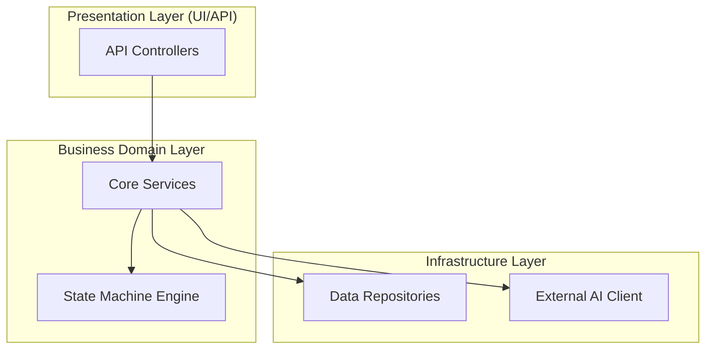

# AGENTS.md — SextantDrift 项目宪章、目标与 Agent 行为约束规范

> **版本**：v2.0 Reboot Edition (2026)  
> **适用对象**：所有参与 SextantDrift 研发、维护、审查及协作的 AI Agent（Claude Code, Cursor, Copilot, Codex, Antigravity 等）与人类工程师。  
> **项目定位**：面向 AI Coding 与现代工程团队的「架构 X 光机与偏航检测罗盘（Architecture X-Ray & Drift Compass）」。

---

## 1. 项目愿景与核心哲学 (Project Vision & Philosophy)

### 1.1 核心痛点与使命
- **2026 年核心矛盾**：人审不过来 AI 代码。AI 编程极大提升了代码产出速度，但 PR 人工审查耗时翻倍，数以万计的代码行深陷细节泥潭。
- **现状缺陷**：
  - 行级 `git diff` 支离破碎，开发者“见木不见林”，无法察觉隐蔽的架构腐化与跨层违规；
  - 传统设计图（Miro / Draw.io / 文字 PRD）画完即弃，无法与真实代码建立动态约束联动。
- **SextantDrift 的使命**：打造架构级“红笔审查台与 X 光机”，用确定性的代码拓扑与红绿差分，终结盲目肉眼审查。

### 1.2 核心产品灵魂：Design by Diagram, Diff by Diagram
- **唯一视觉心智**：永远只看两张图的红绿差分！
  - **左屏（Target）**：设计意图（设计拓扑与约定规范）
  - **右屏（Actual）**：代码实际拓扑（从源码 AST 确凿提取）
  - **标红区（Drift Alert）**：两张图的红线夹角、越界连线与破损约束
- **极简表达律**：
  - **80% 图（骨架与拓扑）**：用标准的 Mermaid 图形天然定义模块边界、调用流向与状态机；
  - **20% 规则（灵魂与不变量）**：图旁边伴随 3~5 条硬性约束（Semantic Invariants），定义事务边界、执行次序与非功能性防护。

---

## 2. 项目核心目标与里程碑路线 (Goals & Milestones)

SextantDrift 放弃第一版的“因果时序优先”重型策略，调换切入顺序，采取 **Core-First（无头核心先行）** 与 **确定性分层先行** 路线：

### 2.1 阶段里程碑规划

| 阶段 | 目标代号 | 核心任务与交付标准 | 核心产物 |
| :--- | :--- | :--- | :--- |
| **Phase 0** | **Clean Slate** | 彻底归档/清除原 Tauri/桌面杂项代码，构建现代化纯粹 Monorepo 与 TypeScript 基线 | 干净的工作区、Vitest 测试套件、TS 编译流水线 |
| **Phase 1** | **Module Drift Engine** | 挂靠 AGENTS.md / Spec 生态，基于 TypeScript AST 实现确定性依赖拓扑提取，捕获跨层旁路、逆向依赖与循环依赖 | `@sextant/core` 模块拓扑与层级漂移引擎 |
| **Phase 2** | **Invariants Engine** | 实现语义不变量规则引擎，通过 AST Pattern 模式匹配拦截致命业务时序与结构违规（如“落库必须在外部调用前”） | Invariants 规则解析器与标准校验规则库 |
| **Phase 3** | **State Verifier** | 解析 Mermaid `stateDiagram-v2`，静态分析状态机死锁（黑洞）、孤岛节点及缺失超时/重试降级链路 | 状态机完整性检测引擎与可视化标记 |
| **Phase 4** | **CLI & Visual Report** | CLI 门禁工具先行，输出彩色终端诊断，并生成自包含、零安装的双图红绿审查报告 | `@sextant/cli` (`npx sextant-drift check`)、`drift-report.html` |
| **Phase 5** | **Dynamic Causality (v2)** | 基于测试运行录制（Dynamic Trace）提取真实异步执行时序，攻克因果级差分 | 运行时 Trace 录制器与因果 DAG 差分 |

### 2.2 终极检验准则 (The Litmus Test)
任何功能演进与代码变更，必须满足三大硬性检验：
1. **五秒原则**：在任何项目中执行 `npx sextant-drift check`，5 秒内必须输出清晰的彩色红绿判定与精确定位到代码行的违规指引；
2. **零幻觉原则**：给出的每一条架构违规，必须具备确凿的 AST 或规则匹配证据，严禁基于 LLM 猜测产生的虚假告警；
3. **一眼看懂原则**：查看 `drift-report.html`，无需文字说明，初级工程师 10 秒内即可通过左右双图的红线夹角指出系统偏航点。

---

## 3. Agent 核心红线与行为约束 (Agent Constraints & Invariants)

在参与本项目的过程中，任何 AI Agent 均必须严格遵守以下**六大绝对戒律（Immutable Invariants）**。任何违背戒律的 PR 或代码变更将被直接拒绝：

```
┌─────────────────────────────────────────────────────────────────────────────┐
│                          SextantDrift Agent 六大绝对戒律                     │
├───────────────────────────────┬─────────────────────────────────────────────┤
│ 戒律 1: 严禁 Agent 自证与自述   │ 拒绝 Agent 自写实际时序，真实拓扑必须机器确定性提取 │
│ 戒律 2: 严禁静态推断异步时序   │ 不靠正则猜运行时序，杜绝假阳性（误报等于自杀）       │
│ 戒律 3: Core-First 无头先行   │ 核心引擎 0 DOM、100% 单测，严禁过早捆绑桌面/重 UI   │
│ 戒律 4: 零侵入纯文本协议总线   │ 不搞私有孤岛格式，完全挂靠 Markdown / Mermaid / Spec│
│ 戒律 5: 逆向推导与低门槛输入   │ 支持反向扫描现有代码，不强迫人类手工预画繁复大图     │
│ 戒律 6: 严守包边界与每次必测   │ 核心分包隔离，每次代码改动必须更新测试并全量跑绿     │
└───────────────────────────────┴─────────────────────────────────────────────┘
```

### 戒律 1：严禁 Agent “自证即幻觉” (Forbid Self-Attestation)
- **背景**：绝不能要求或允许 Agent 在写完代码后自行写回 `actual-sequence.md` 或自我声称“我已按照设计图实现”。
- **约束**：
  - 严禁设计依赖 Agent “自省/反思并汇报实际执行逻辑”的验证机制（这是让嫌疑人自写结案报告，必出幻觉套娃）；
  - 系统的“实际拓扑（Actual）”**必须且只能**由 `@sextant/core` 引擎通过机器静态 AST 分析或动态 Trace 客观提取。

### 戒律 2：严禁静态猜时序，杜绝假阳性 (Zero False Positives in Static Analysis)
- **背景**：在开发者工具领域，**误报等于自杀**。一次虚假的违规报警就会彻底摧毁开发者对工具的信任。
- **约束**：
  - 静态分析只做确定性级别为 8~10 的分析：模块依赖图（DAG）、分层越界（Layer Bypass）、逆向依赖（Layer Inversion）、循环依赖（Cycles）、状态机图死锁、以及 AST 明确的语法节点匹配；
  - 严禁使用简单正则或脆弱的静态分析手段强行猜测复杂的异步事件总线、Promise.all 或多线程运行时序。未引入动态 Trace 前，不提供不可靠的时序因果推断。

### 戒律 3：Core-First（无头核心先行），严禁过早引入重型外壳
- **背景**：第一版项目曾因过度关注 Tauri 桌面壳、番茄钟、富文本排版等无关杂项，导致核心差分引擎沦为玩具实现。
- **约束**：
  - 先做无头引擎，后做呈现外壳。`@sextant/core` 必须为纯 TypeScript 模块，**零 DOM 依赖、零浏览器宿主依赖**，能在 Node.js / Bun / CI 隔离环境中秒级运行；
  - 第一交付形态为 CLI 命令行工具（`npx sextant-drift`）和无服务自包含 HTML 报告，严禁在核心成熟前消耗精力开发复杂桌面客户端或编辑器插件。

### 戒律 4：零侵入纯文本协议，严禁自立私有孤岛标准
- **背景**：开发者不会为了一个工具重写整套文档规范。GitHub Spec Kit、OpenSpec 与 `AGENTS.md` 已经成为既定事实标准。
- **约束**：
  - **总线唯一媒介**：只以代码仓库中 Git 纳管的标准纯文本（Markdown + Mermaid + YAML）为交互总线；
  - 不做私有拦截（不 hook 终端 pty、不逆向 IDE 私有日志、不搞私有云端通信）；
  - 做适配器而非孤岛：主动兼容项目既有的 `AGENTS.md`、`.github/spec-kit` 或内嵌 Mermaid 的需求文档。

### 戒律 5：逆向推导与低门槛优先 (Inference Over Friction)
- **背景**：要求人类在写每段代码前手动画好 4 张详尽图纸是不切实际的。
- **约束**：
  - 核心功能必须优先支持 **“逆向 X 光（Reverse X-Ray）”**：通过一行命令 `npx sextant-drift init`，自动反向静态扫描现有源码并生成初始架构拓扑与不变量骨架，人类只需审阅确认与微调；
  - 交互流程遵循“AI 生成 / 逆向生成 -> 人类 30 秒勾选确认锁定 -> 持续 CI 门禁核验”。

### 戒律 6：严守工程分层边界与每次改动必测 (Layer Invariants & Mandatory Test-on-Change)
- **模块分层守则**：
  - `packages/core`：严禁引用任何 CLI 库（如 `commander`, `chalk`）或 UI 库；
  - `packages/cli`：仅负责命令行解析、调用 core 暴露的纯函数，并将结果格式化输出；
  - `packages/web-report`：自包含纯静态渲染，以 JSON 数据为输入，严禁反向向 core 掺入视图逻辑。
- **每次改动更新并测试铁律 (Mandatory Test Update & Execution)**：
  - **同步更新测试**：任何代码变更（无论是新增特性、重构优化、Bug 修复、依赖调整还是配置修改），**必须同步更新或新增对应测试用例**，严禁只修改业务代码而不更新测试；
  - **提交前全量跑测**：代码改动后，**必须无条件在本地执行全量测试套件（`./start.sh --test` 或 `pnpm test`）**，确认 100% 测试通过（全绿），严禁提交任何未在本地实际运行测试验证的代码；
  - **零容忍盲猜**：严禁 Agent “推测测试能通过”而跳过实际运行。
- **规则测试守则**：
  - 每新增一条 Invariant 规则或 AST 匹配器，**必须同时提交配对的测试用例**：
    - Positive Case（合规代码，确认零误报）；
    - Negative Case（违规代码，确认 100% 精确捕获并断言行号/原因）；
  - 测试套件运行时间必须控制在秒级以内。

---

## 4. 规范文件与 Invariants 规则 DSL 规范

在项目中，Agent 读取或生成的架构规范统一遵循以下格式：

### 4.1 语义不变量（Invariants）声明格式

```yaml
invariants:
  # 场景 A: 时序先验规则
  - id: PERSIST_BEFORE_EXTERNAL
    severity: critical
    desc: "用户输入必须先持久化落库，方可发起外部 LLM 或支付等不可靠网络调用"
    pattern:
      must_precede: ["db.save", "repository.create", "orm.save"]
      target: ["llmService.call", "aiClient.chat", "payment.charge"]
      scope: "src/controllers/**"

  # 场景 B: 严禁跨层旁路调用
  - id: FORBID_DIRECT_DB_IN_UI
    severity: critical
    desc: "UI 组件与表现层严禁直接调用数据库驱动或 ORM 实例"
    pattern:
      forbid_import: ["@prisma/client", "typeorm", "pg", "mysql2", "src/repositories/**"]
      in_path: "src/views/**,src/components/**"

  # 场景 C: 健壮性降级要求
  - id: MANDATORY_FALLBACK_TIMEOUT
    severity: warning
    desc: "所有第三方外部 API 调用必须配置明确的超时与异常兜底"
    pattern:
      require_config: ["timeout"]
      scope: "src/services/integrations/**"
```

### 4.2 架构意图图（Target Architecture）格式
采用纯 Mermaid 声明模块边界与调用方向：



---

## 5. Agent 编码与协作工作流指令 (Operational Instructions)

当接到开发任务时，Agent 请按如下顺序严格开展工作：
1. **核对约束**：查阅当前任务是否违反上述六大戒律，严禁越界引入重型依赖；
2. **测试先行 (TDD)**：先在对应测试目录（如 `@sextant/core/tests` 或 `@sextant/cli/tests`）编写或更新违规代码与合规代码的断言用例（红灯）；
3. **极简实现**：编写高内聚、纯函数的解析与差分逻辑，使测试通过（绿灯）；
4. **每次改动必测门禁 (Mandatory Test Verification)**：
   - 任何代码文件改动后，**必须立即在终端运行全量测试套件**（`./start.sh --test` 或 `pnpm test`）；
   - 确认 100% 用例保持通过，断言执行时间无膨胀、无任何回归或假阳性；
   - 若引入了新功能或修复了缺陷，**必须同步提交对应测试用例**，严禁代码裸奔；
   - 严禁在未实际执行测试并取得成功退出码（Exit Code 0）的情况下声称完成任务；
5. **全包编译自检**：执行 `./start.sh --build`，确保所有子包 TypeScript 编译与类型定义导出（`.d.ts`）正常无损坏；
6. **拒绝过度工程**：不添加未经确认的复杂配置或外部框架，保持代码整洁纯粹。
