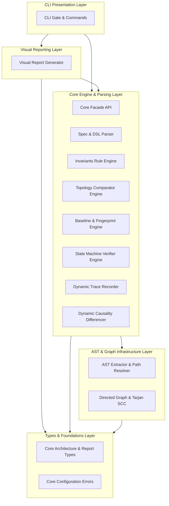
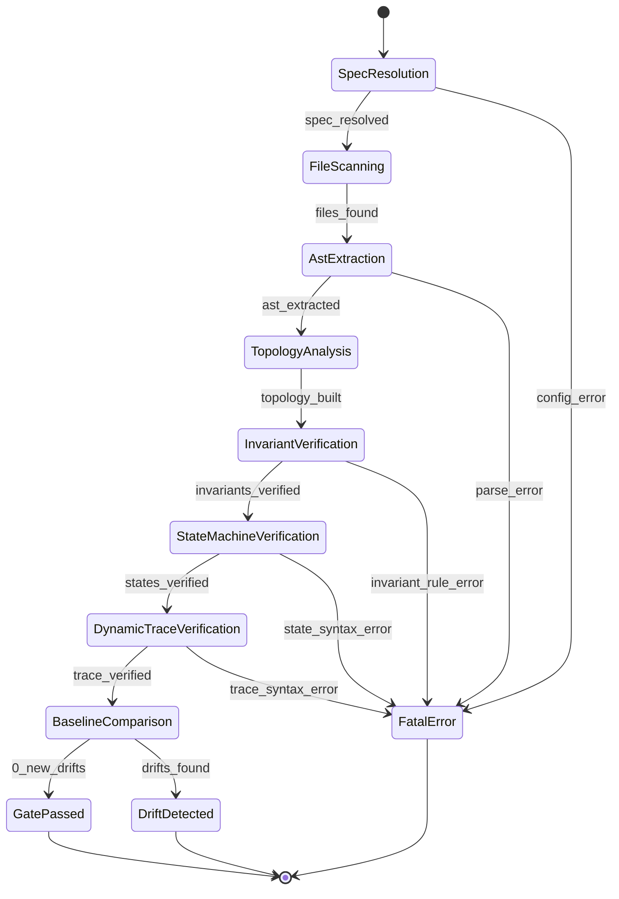

# SextantDrift — 架构全景拓扑与规范文档 (Self-Architecture Specification)

> **版本**：v2.0 Reboot Edition (2026)  
> **单源事实**：[`sextant.json`](file:///home/redtea/Mona_project/SextantDriftV03/sextant.json)  
> **门禁核验**：执行 `npx sextant-drift check` 或 `./start.sh --self-check`

---

## 1. 架构目标拓扑 (Target Architecture Topology)

---

## 2. 核心门禁执行生命周期状态机 (Gate Execution Lifecycle FSM)

本项目自身门禁执行全流程通过有限状态机进行形式化定义：

---

## 2. 核心架构不变量守则 (Architecture Invariants)

1. **戒律 3：Core-First 零外壳污染 (`CORE_ZERO_CLI_DOM`)**
   - `@sextant/core` 严禁引用任何终端 CLI 库（`cac`, `picocolors`, `commander`, `chalk`）或外部上层包（`@sextant/cli`, `@sextant/web-report`）；
   - 保证内核在任何纯 Node.js / CI / 隔离沙箱环境中零额外依赖秒级执行。

2. **视图与报告隔离 (`REPORT_ZERO_CLI`)**
   - `@sextant/web-report` 仅负责纯数据到静态 HTML 的单向无状态渲染，严禁引入 CLI 解析或终端交互逻辑。

3. **依赖单向流动与分层防御**
   - 上层（`cli`, `reporting`）单向调用下层（`engine`）；
   - 引擎层依赖底层 AST 语法分析与图算法基础设施（`infrastructure`）；
   - 所有通用数据结构与错误类收敛于基底层（`contracts`），杜绝循环引用与反向依赖。
