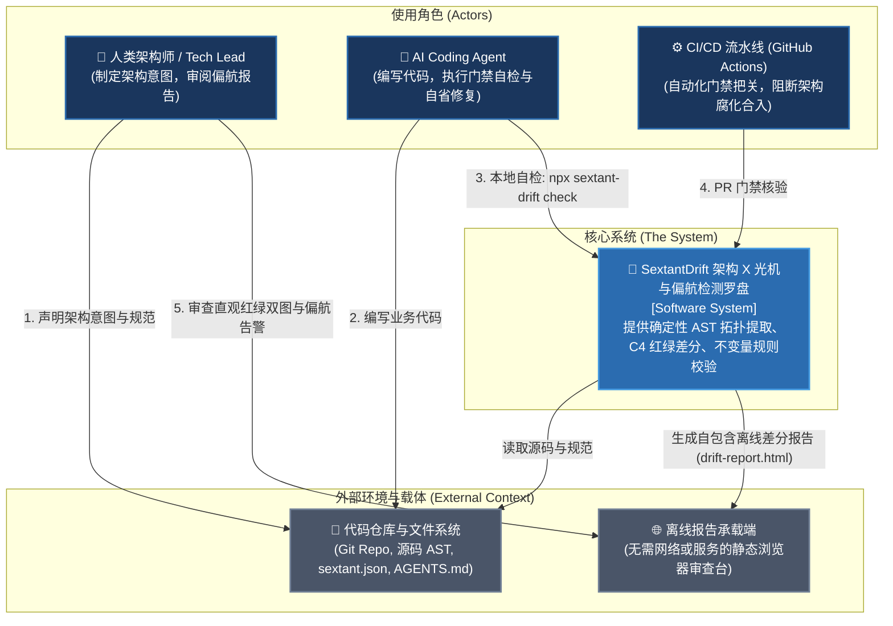
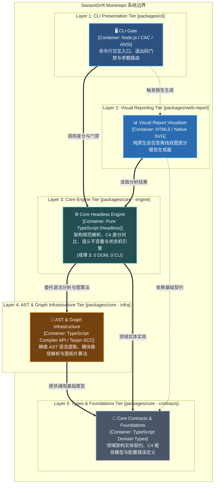
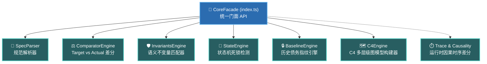
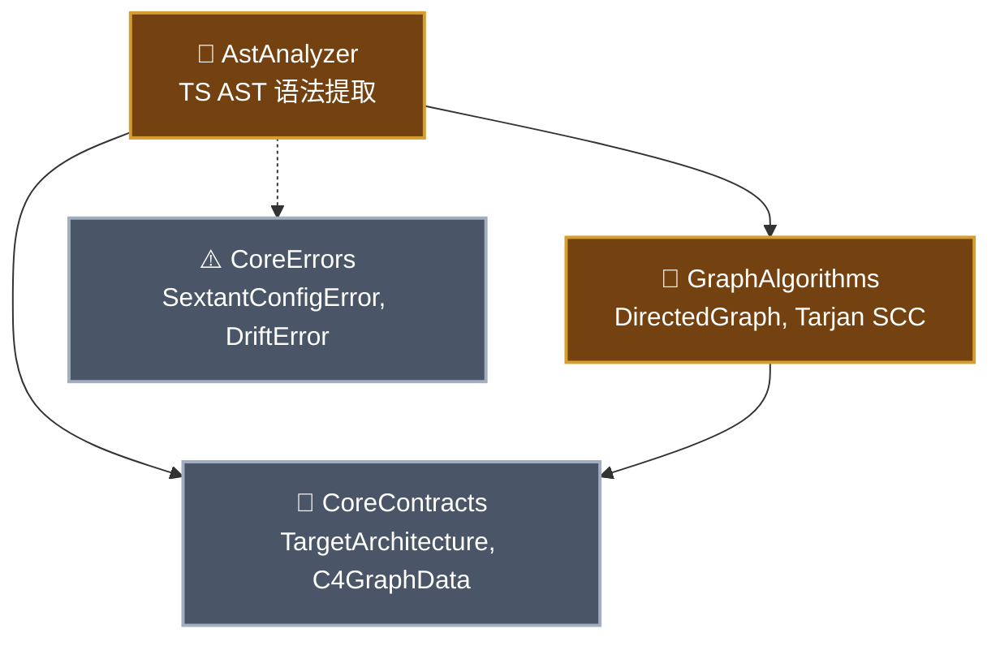
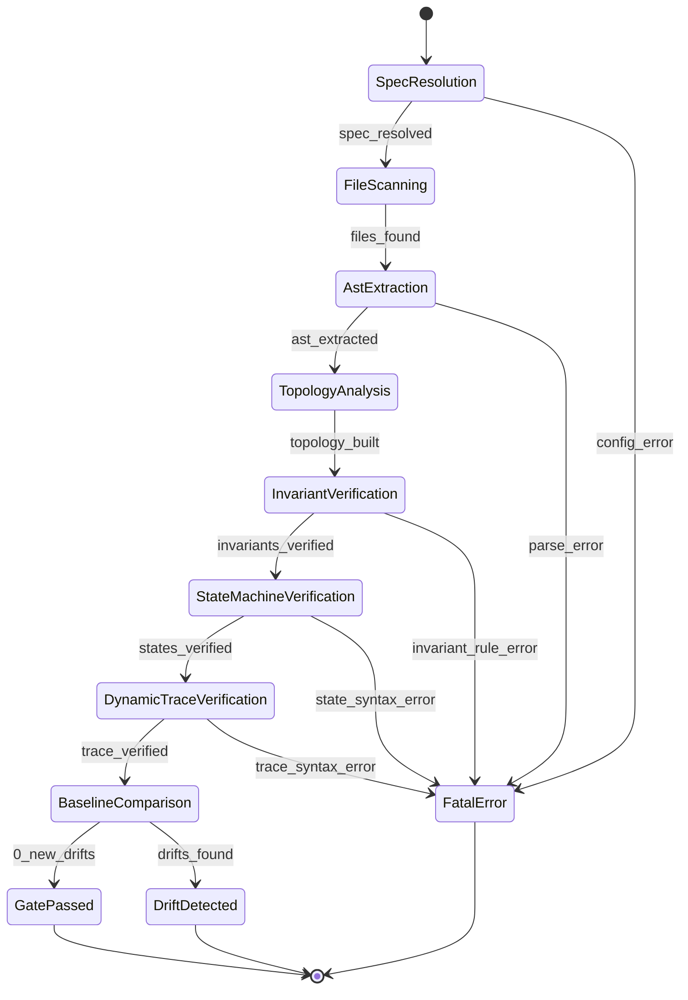

# SextantDrift — 架构全景拓扑与规范文档 (Self-Architecture Specification)

> **版本**：v2.0 Reboot Edition (2026)  
> **单源事实**：[`sextant.json`](file:///home/redtea/Mona_project/SextantDriftV03/sextant.json)  
> **门禁核验**：执行 `npx sextant-drift check` 或 `./start.sh --self-check`

---

## 1. C4 软件架构全景模型 (C4 Architecture Model)

本工程采用标准 C4 架构模型定义系统边界、容器层级与组件映射，唯一单源事实为 [`sextant.json`](file:///home/redtea/Mona_project/SextantDriftV03/sextant.json)。
为了杜绝将所有组件平铺在一张视图内造成的认知疲劳，系统采用**渐进式展开（Progressive Disclosure）**分层设计：

### 1.1 Level 1: System Context (系统上下文视图 — 观全局)
彻底屏蔽内部实现细节，仅呈现系统与使用者（人类、AI Agent、CI）及外部生态的交互边界：

---

### 1.2 Level 2: Container Diagram (容器与分层拓扑视图 — 观分层)
将 15+ 具体组件聚合为 5 大顶层架构容器（Tiers），确立严格的单向防腐依赖流水：

| 架构层级 (Tier / Container) | 序号 | 核心职责 | 技术栈 (Technology) |
| :--- | :--- | :--- | :--- |
| **`cli`** (Presentation Tier) | Layer 1 | 终端命令行交互、退出码门禁与参数解析 | Node.js / CAC / ANSI Terminal |
| **`reporting`** (Visual Reporting) | Layer 2 | 纯原生离线 C4 架构差分审查报告生成 | HTML5 / Native SVG Engine |
| **`engine`** (Core Engine) | Layer 3 | 确定性拓扑提取、C4 差分对比与不变量规则引擎 | Pure TypeScript (Headless, 0 DOM, 0 CLI) |
| **`infrastructure`** (Infrastructure) | Layer 4 | 源码 AST 解析、路径解析与 Tarjan 强连通图算法 | TypeScript Compiler API / Tarjan SCC |
| **`contracts`** (Foundations) | Layer 5 | 领域实体类型契约、C4 规范模型与配置错误定义 | Pure TypeScript Contract Types |

---

### 1.3 Level 3: Component Diagram (组件架构按域下钻 — 观局部)

#### 视点 A：核心引擎容器内部组件 (Core Engine Components)

#### 视点 B：底层基础设施与契约组件 (Infrastructure & Contracts)

### 1.4 核心组件拓扑与物理映射 (Components Mapping)
| 组件 ID | 所属容器 | 技术栈 | 源码映射路径 (Paths) |
| :--- | :--- | :--- | :--- |
| `CliGate` | `cli` | CAC / ANSI | `packages/cli/src/**` |
| `WebReport` | `reporting` | Native SVG | `packages/web-report/src/**` |
| `CoreFacade` | `engine` | TypeScript | `packages/core/src/index.ts` |
| `C4Engine` | `engine` | C4 Model | `packages/core/src/c4/**` |
| `SpecParser` | `engine` | JSON / YAML | `packages/core/src/parser/**` |
| `InvariantsEngine` | `engine` | AST Matcher | `packages/core/src/invariants/**` |
| `ComparatorEngine` | `engine` | Graph Diff | `packages/core/src/comparator/**` |
| `BaselineEngine` | `engine` | SHA-256 | `packages/core/src/baseline/**` |
| `StateEngine` | `engine` | FSM Verifier | `packages/core/src/state/**` |
| `TraceRecorder` | `engine` | Dynamic Trace | `packages/core/src/trace/**` |
| `CausalityEngine` | `engine` | Causality DAG | `packages/core/src/causality/**` |
| `AstAnalyzer` | `infrastructure`| TS AST | `packages/core/src/analyzer/**` |
| `GraphAlgorithms` | `infrastructure`| DirectedGraph | `packages/core/src/graph/**` |
| `CoreContracts` | `contracts` | Types | `packages/core/src/types/**` |
| `CoreErrors` | `contracts` | Errors | `packages/core/src/errors/**` |

### 1.5 合法依赖流向 (Allowed Dependency Flows)
- `cli` ➔ `reporting` (协议: `imports`)
- `cli` ➔ `engine` (协议: `imports`)
- `reporting` ➔ `engine` (协议: `imports`)
- `reporting` ➔ `contracts` (协议: `imports`)
- `engine` ➔ `infrastructure` (协议: `imports`)
- `engine` ➔ `contracts` (协议: `imports`)
- `infrastructure` ➔ `contracts` (协议: `imports`)

---

## 2. 核心门禁执行生命周期状态机 (Gate Execution Lifecycle FSM)

本项目自身门禁执行全流程通过有限状态机进行形式化定义：

---

## 2. 核心架构不变量守则 (Architecture Invariants)

1. **戒律 3：Core-First 零外壳污染 (`CORE_ZERO_CLI_DOM`)**
   - `@sextant/core` 严禁引用任何终端 CLI 库（`cac`, `picocolors`, `commander`, `chalk`）或外部上层包（`@sextant/cli`, `@sextant/web-report`）；
   - 保证内核在任何纯 Node.js / CI / 隔离沙箱环境中零额外依赖秒级执行。

2. **视图与报告隔离 (`REPORT_ZERO_CLI`)**
   - `@sextant/web-report` 仅负责纯数据到静态 HTML 的单向无状态渲染，严禁引入 CLI 解析或终端交互逻辑。

3. **依赖单向流动与分层防御**
   - 上层（`cli`, `reporting`）单向调用下层（`engine`）；
   - 引擎层依赖底层 AST 语法分析与图算法基础设施（`infrastructure`）；
   - 所有通用数据结构与错误类收敛于基底层（`contracts`），杜绝循环引用与反向依赖。
