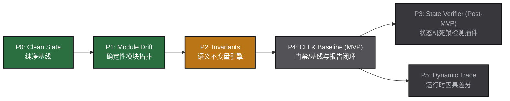

# MISSION.md — SextantDrift 顶层使命与战略抉择共识

> **版本**：v1.1 (2026 深度共识版)  
> **文档性质**：人类创始人与 AI 协作团队在本项目上的**最高非技术决策指南（North Star）**。  
> **核心定位**：面向 AI Coding 时代的「架构辅助设计与 Agent 偏航检测罗盘（Architecture Compass & AI Harness）」。

---

## 1. 存在的原因 (Why We Exist)

### 1.1 时代的真实痛点与转折（2026）
- **AI 产出爆炸，人类肉眼过载**：新一代 Agent（Claude Code, Cursor, Codex 等）让代码产出速度暴增，但**代码审查成本同步暴涨**。开发者深陷在海量行级细节中，疲于奔命。
- **架构无声腐化与“偏航”**：AI Agent 天生倾向于以“局部能跑通”为唯一目标，极易随手跨层引用、偷工减料、破坏领域边界。行级 `git diff` 支离破碎，“见木不见林”，无法察觉系统架构正在走向腐化。
- **死图与活代码的断裂**：过去画在白板或文档里的架构图画完即弃，管不住活代码；而传统静态分析工具过于底层晦涩，缺乏直观反馈。

### 1.2 创始初心 (Dogfooding)
SextantDrift 诞生于创作者在重度使用 AI 协同编程时的真实刺痛与自救需求：
> **“我需要一个工具，能把我心里的架构想法变成不可逾越的规则，管住 Agent 不让它乱来；同时在 Agent 交付后，能让我一眼看出它到底有没有偏航。”**

---

## 2. 核心双重使命 (The Two Core Jobs)

SextantDrift 极度克制，整个产品生命周期只死磕两大核心任务：

```
┌─────────────────────────────────────────────────────────────────────────────┐
│                           SextantDrift 双重核心使命                          │
├──────────────────────────────────────┬──────────────────────────────────────┤
│ 1. 辅助设计架构 (Assisted Design)    │ 2. 指导与约束 AI (Agent Guidance)    │
│ 让人脑的架构想法以最低门槛形式化落地   │ 让设计成为机器可读的硬门禁，管住开发  │
└──────────────────────────────────────┴──────────────────────────────────────┘
```

### 使命一：辅助设计架构 (Assisted Design)
- **C4 Model 层次心智**：借鉴 C4 模型（尤其是 Level 2 Container 容器级 与 Level 3 Component 组件级），聚焦核心组件边界。通用工具函数（如 logger、lodash、helpers）天然不属于组件，**绝不上图，绝不触发伪违规**，保持图纸清爽。
- **图文双向互通**：人类看图最直观（连线即关系），机器读文本最高效（Mermaid + YAML）。系统提供标准图结构契约，作为人机交互与未来可视化 UI 的统一媒介。
- **智能协助与规范化输出**：由上层 Agent & Skill 协助人类梳理意图并检验拓扑可行性，编译输出标准的 `ARCHITECTURE.md` 架构基线。
- **活的架构演进 (Living Architecture)**：架构不是死教条。支持图与代码的双向协同演进，并引入**基于 Git 的架构图版本基线管理**。

### 使命二：指导与约束 AI 开发 (Agent Guidance & Harness)
- **事前立规**：通过标准 `AGENTS.md` / `CLAUDE.md` 顶层约束向 Agent 注入不可逾越的架构红线。
- **事后硬判**：将架构体检作为 Agent 交付前的必须门禁，以确凿的代码依赖拓扑比对，精准指出偏航位置（违规连线、跨层 bypass、违禁 import）。
- **逼退幻觉与熔断机制**：
  - 拒绝 Agent “自证合规”，只以机器确定性分析为唯一凭据；
  - **熔断机制（Circuit Breaker）**：Agent 尝试自省修复上限为 2~3 轮，若仍无法通过门禁，必须主动停下向人类呈报冲突，**将关键架构决策权交还给开发者**。

---

## 3. 目标受众与推进策略 (Target Audience & ICP)

```
[阶段 1: 创始人自身深度自用 (Dogfooding)]
      ↓ 验证极简、高频、零误报、零 token 浪费
[阶段 2: AI-Native 个人全栈与独立开发者]
      ↓ 形成自发口碑与标准 Skill 生态
[阶段 3: 研发团队 Tech Lead 与 开源项目 Maintainer]
      ↓ 进驻 CI 门禁与 PR 自动审查
```

- **第一切入受众 (The Wedge)**：**创始人自己 + 重度使用 AI Agent 编程的个人全栈开发者**。
  - 单人驱动项目，每天生成海量代码，极度渴望对整体架构的掌控感与安全感；
  - 零采购摩擦，只要命令轻巧、反馈精准，就能立即深度嵌入日常工作流。
- **进阶受众 (Scale)**：负责把控团队代码质量与 AI PR 架构合规性的 Tech Lead 与架构师。

---

## 4. 顶层产品哲学与分工架构 (Core Tenets & Division of Labor)

### 4.1 核心分工：智能归 Agent，确定性归引擎
- **SextantDrift 核心引擎**：**绝不内置重型 LLM 调度**。保持纯粹的确定性、零网络、秒级执行。专注于解析拓扑、比对差异、输出高信噪比诊断。
- **Agent & Skill 协同层**：负责高阶推理、业务可行性把关、自然语言交互，并将 SextantDrift 作为一项专业 Skill 挂载到日常编码循环中。

### 4.2 复杂度治理：抓大放小，拒绝微观泥潭
- **聚焦宏观组件边界**：死磕模块与组件边界（Module Boundaries）、分层依赖（Layering）、跨层直连（Bypasses）、逆向依赖（Inversions）与循环依赖（Cycles）。
- **拒绝复杂异步控制流推测**：坚决不碰跨函数复杂异步控制流、事件总线或动态回调的时序猜测（杜绝假阳性）。语义不变量（Invariants）时序匹配严格限定在同一函数/同步代码块内部进行语法级确定性调用次序拦截（如 `must_precede`），宁可少报，绝不误报。
- **约定优于配置 (Convention over Configuration)**：源码目录（如 `src/services`）天然映射到架构组件，允许极少量自定义注解，不强迫写冗长的映射表。
- **善用成熟生态**：不重新造多语言编译器的轮子，站在成熟依赖提取工具的肩膀上。

### 4.3 零侵入与零额度损耗 (Zero Friction & Zero Token Waste)
- **双模单源事实契约**：全仓库单一架构契约优先采用具备严格 JSON Schema 校验的结构化规范 `sextant.json`（微秒级极速解析、机器零歧义），向下无缝自动回退读取根目录 `ARCHITECTURE.md` 或 `AGENTS.md`（Markdown + Mermaid + YAML），并原生支持双向一键导出互转。
- **严禁默认文件污染（No Bloated HTML by Default）**：CLI 运行默认只在终端输出高信噪比格式化文本（单次消耗控制在 50~200 tokens），**严禁在常规检查中生成临时 HTML 文件**，彻底杜绝文件目录污染和 Agent 上下文 Token 浪费。
- **老项目基线快照 (Brownfield Baseline)**：支持历史债务快照（Snapshot），老项目接入时认账历史违规但不阻断，坚守 **“新增代码零偏航（No New Drift）”** 原则。

---

## 5. 坚决不做的事 (Anti-Roadmap & Non-Goals)

1. **坚决不做通用画图/自由白板软件**：绝不做类似 Draw.io / Excalidraw 的泛用绘图板，图必须具备严格工程拓扑语义。
2. **坚决不做微观代码语法与风格 Linter**：不查单文件命名、缩进、未声明变量等细节，不抢 ESLint / Biome 的饭碗。
3. **坚决不搞复杂的私有 Agent 编排调度器**：不造私有 Agent 框架，不重复造 LangChain / AutoGen 的轮子。
4. **坚决不做私有云端 SaaS 绑定与黑盒托管**：坚持 **Local-First** 原则，零账号登录、零数据上云，离线秒级运行。
5. **坚决不做脱离确定性证据的推测性质检**：给出的每一条 Drift 告警，必须有确凿的代码拓扑证据，**宁可少报，绝不误报**。
6. **坚决不在日常 CLI 门禁产生文件污染**：默认执行严禁向工作区写入临时 HTML 垃圾文件；独立双图审查报告 `drift-report.html` 严格作为独立命令或显式 `--report` 参数的按需导出物，坚决不捆绑沉重桌面客户端。

---

## 6. 演进路线与交付梯子 (Phased Delivery Ladder)

技术实施全面与工程总路线图保持完全自洽，按阶段敏捷推进与交付：



- **Phase 0 (Clean Slate - 纯净基线)**：清理桌面包袱，确立 pnpm Monorepo、TypeScript 严格编译与 Vitest 毫秒级单测基线。（已完成 100%）
- **Phase 1 (Module Drift Engine - 模块拓扑与层级漂移引擎)**：纯 TypeScript AST 依赖抽取，Tarjan 算法循环依赖检测，分层旁路 (Bypass) 与逆向 (Inversion) 确定性拦截。（已完成 100%）
- **Phase 2 (Invariants Engine - 语义不变量规则引擎)**：同一同步作用域下的确定性调用时序匹配（如“落库必须在外部调用前”）与文件级违禁导入拦截。（当前攻坚冲刺）
- **Phase 4 (CLI & Visual Report - 极速门禁与自包含审查报告)**：提前落地 `@sextant/cli`（`check` 退出码 0/1/2）、逆向工程 (`init`，生成 `sextant.json` 与 `ARCHITECTURE.md` 视图)、存量债务双模封存 (`baseline`，践行 No New Drift) 及按需导出的自包含双图审查报告 `drift-report.html`，正式达成团队深度自用 MVP。（紧随 P2 启动）
- **Phase 3 (State Verifier - 状态机完整性检测)**：静态分析 Mermaid 状态机的黑洞状态（Deadlock）、孤岛状态与缺失降级链路。（作为 Post-MVP 扩展插件并入）
- **Phase 5 (Dynamic Causality v2 - 运行时 Trace 因果差分)**：基于真实测试运行 Trace 录制器提取异步执行因果，攻克时序差分。（远期探索）

