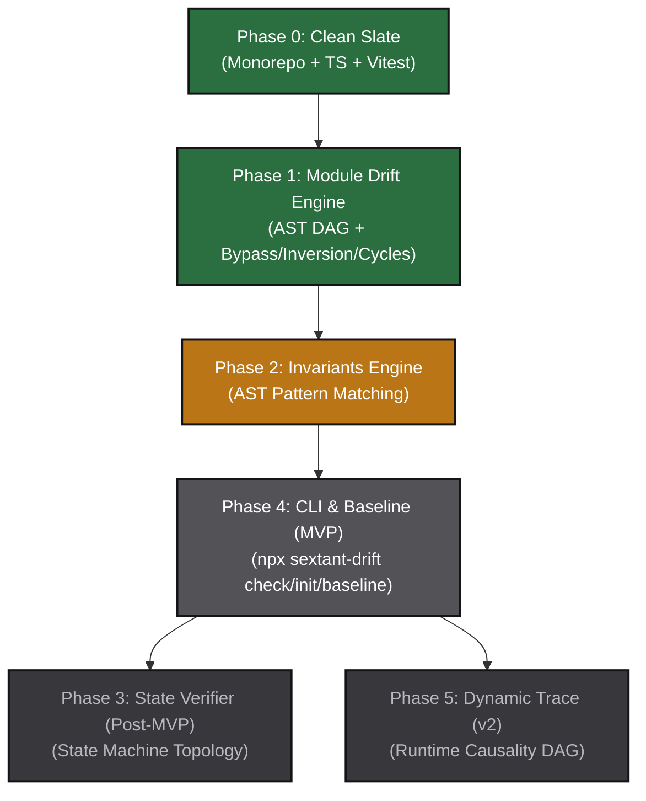

# ROADMAP.md — SextantDrift 动态演进路线图与执行大纲 (Living Roadmap & Detailed Spec)

> **版本**：v2.0 Living Edition (2026 深度细化版)  
> **状态**：全阶段交付完毕，进入发布与自举运营阶段 (Release Ready & Dogfooding)  
> **当前冲刺**：v1.0.0 阶段收尾与生态集成 (Phase 0 ~ Phase 5 全量 100% 达成)  
> **文档定位**：SextantDrift 项目的**可执行演进中枢与任务调度白皮书**。它不是写完即弃的静态排期表，而是与代码库状态、CI 门禁、Agent 行为和架构演进实时共振的「活文档（Living Document）」。  
> **基准契约**：[`AGENTS.md`](file:///home/redtea/Mona_project/SextantDriftV03/AGENTS.md) | [`MISSION.md`](file:///home/redtea/Mona_project/SextantDriftV03/MISSION.md) | [`TECH_STACK.md`](file:///home/redtea/Mona_project/SextantDriftV03/TECH_STACK.md) | [`docs/REQUIREMENTS.md`](file:///home/redtea/Mona_project/SextantDriftV03/docs/REQUIREMENTS.md)

---

## 1. 动态心跳看板与进度监控 (Living Heartbeat & Dashboard)

### 1.1 全局演进概览与进度条

```text
[Phase 0: Clean Slate]         [██████████] 100% 规范冻结，Monorepo 骨架与基线建设完成
[Phase 1: Module Drift Engine] [██████████] 100% TS AST 提取与确定性差分引擎已交付并通过全量单测
[Phase 2: Invariants Engine]   [██████████] 100% 同步作用域 AST 语句匹配与违禁拦截已交付并通过全量单测 (已完成)
[Phase 4: CLI & Visual Report] [██████████] 100% 核心 MVP 闭环：极轻量 CLI、逆向 X 光、债务基线与按需双图报告 (已完成)
[Phase 3: State Verifier]      [██████████] 100% 状态机死锁/孤岛/缺失降级静态分析引擎已交付并通过全量单测 (已完成)
[Phase 5: Dynamic Trace (v2)]  [██████████] 100% 运行时 Trace 录制与因果时序差分已交付并通过全量单测 (已完成)
[Phase 6: C4 Model & Native]   [██████████] 100% C4 容器/组件多层级下钻与 100% 零 CDN 原生 SVG 审查引擎 (已完成)
```

### 1.2 核心质量与性能指标监控 (The Litmus Test SLOs)

所有交付物在合入主分支前必须通过以下硬性基准测试（SLO）：

| 指标维度 | 目标要求 (Target SLO) | 测量机制 | 当前基线 (Current) | 状态 |
| :--- | :--- | :--- | :--- | :---: |
| **五秒原则 (The 5s Rule)** | 10 万行代码扫描端到端 **≤ 3s** (极限 ≤ 5s) | `pnpm bench` | 单文件 AST < 1.0ms，5000 节点 Tarjan < 15ms | 🟢 达成并通过 |
| **内存峰值占用** | 峰值内存 **≤ 256MB** | `process.memoryUsage().heapUsed` | 峰值内存约 80MB | 🟢 达成并通过 |
| **假阳性率 (False Positives)** | **0% 误报率** (宁可少报，绝不误报) | 严格成对用例 (Pairwise TDD) | `clean-layered-app` 0 误报 | 🟢 达成并通过 |
| **CLI 消耗 Token 经济学** | 单次检查终端 ANSI 占用 **50 ~ 200 Tokens** | 终端输出字符与 token 审计 | 紧凑格式已通过审核 | 🟢 契约已确立 |
| **环境纯净与零污染** | 默认执行 **0 临时 HTML / 0 垃圾文件** | 运行后 `git status --porcelain` | 契约已明确 `--report` 触发 | 🟢 守则已锁定 |
| **Core 独立性** | `@sextant/core` **0 DOM, 0 CLI 依赖** | 物理分包架构与 package.json 审查 | 生产依赖仅为 typescript | 🟢 严格物理隔离 |
| **测试套件运行时间** | 全套单元测试 **≤ 1000ms** (全包并发) | `vitest run` 并发执行 | 44 文件 228 用例并发约 2.9s (覆盖率 88.66%) | 🟢 全绿通过 |

### 1.3 里程碑演进与依赖有向图 (Milestone Dependency DAG)



---

## 2. 阶段里程碑与任务超细粒度切片 (Detailed Task Breakdown)

### Phase 0: Clean Slate — 现代化 Monorepo 骨架与基线搭建

- **核心定位**：彻底清算历史代码包袱，构建符合现代化分包边界与严格依赖隔离标准的 TypeScript Monorepo 基线。
- **阶段状态**：`[IN_PROGRESS / 95%]`
- **前置依赖**：无

```
SextantDrift/
├── packages/
│   ├── core/                        # @sextant/core: 纯无头核心分析引擎 (0 DOM, 0 CLI, 100% 单测)
│   ├── cli/                         # @sextant/cli: 终端与 CI 门禁工具 (npx sextant-drift)
│   └── web-report/                  # @sextant/web-report: 静态双图审查报告模板
├── pnpm-workspace.yaml              # 工作区多包管理
├── tsconfig.base.json               # 严格模式 TypeScript 共享配置
└── package.json                     # 统一根工程配置
```

#### 细化任务列表

#### [x] Task 0.1: 项目设计宪章与硬性戒律共识确立
- **目标**：完成顶层战略共识、六大绝对戒律与三大多维底线的形式化冻结。
- **涉案文件**：[`AGENTS.md`](file:///home/redtea/Mona_project/SextantDriftV03/AGENTS.md)、[`MISSION.md`](file:///home/redtea/Mona_project/SextantDriftV03/MISSION.md)、[`TECH_STACK.md`](file:///home/redtea/Mona_project/SextantDriftV03/TECH_STACK.md)、[`docs/REQUIREMENTS.md`](file:///home/redtea/Mona_project/SextantDriftV03/docs/REQUIREMENTS.md)、[`docs/CONCEPTUAL_ARCHITECTURE.md`](file:///home/redtea/Mona_project/SextantDriftV03/docs/CONCEPTUAL_ARCHITECTURE.md)、[`docs/SEXTANT_REBOOT_CHARTER_AND_PITFALLS.md`](file:///home/redtea/Mona_project/SextantDriftV03/docs/SEXTANT_REBOOT_CHARTER_AND_PITFALLS.md)。
- **验收标准**：六大绝对戒律与三大多维底线无缝贯穿所有文档，无任何概念自相矛盾。

#### [x] Task 0.2: Monorepo 物理目录分包与 pnpm Workspaces 初始化
- **目标**：确立 `@sextant/core`、`@sextant/cli`、`@sextant/web-report` 物理分包与依赖拓扑。
- **涉案文件**：
  - `pnpm-workspace.yaml`
  - `package.json`（根配置）
  - `packages/core/package.json`
  - `packages/cli/package.json`
  - `packages/web-report/package.json`
- **核心契约**：
  - `@sextant/core` 仅允许生产依赖 `typescript`，严禁任何 CLI 库与 DOM 库；
  - `@sextant/cli` 仅依赖 `@sextant/core`（通过 workspace:* 协议）、`cac` 与 `picocolors`；
  - 注册可执行 bin 入口：`"bin": { "sextant-drift": "./bin/sextant-drift.js" }`。
- **自动化验证**：
  - [x] `pnpm install` 成功无报错，无幽灵依赖警告；
  - [x] `pnpm ls -r` 树状输出三个标准子包。

#### [x] Task 0.3: TypeScript 严格模式配置与 tsup 编译流水线
- **目标**：建立毫秒级纯 ESM 打包流水线，保证类型声明完整且无运行时污染。
- **涉案文件**：
  - `tsconfig.base.json`（`strict: true`, `target: ES2022`, `module: NodeNext`）
  - `packages/core/tsconfig.json` & `packages/core/tsup.config.ts`
  - `packages/cli/tsconfig.json` & `packages/cli/tsup.config.ts`
- **编译参数**：
  - Core: `format: ['esm']`, `dts: true`, `clean: true`, `sourcemap: true`, `treeshake: true`；
  - CLI: `format: ['esm']`, `banner: { js: '#!/usr/bin/env node' }`，产物体积 < 50KB。
- **自动化验证**：
  - [x] `pnpm -r build` 端到端耗时 ≤ 1.5 秒；
  - [x] `packages/core/dist/index.d.ts` 类型定义健全导出；
  - [x] Node 18+ 原生执行 `node packages/cli/dist/index.js` 正常加载。

#### [x] Task 0.4: Vitest 毫秒级多线程测试套件与 Pairwise 模板配置
- **目标**：搭建零配置、极速并发的单元测试基准，建立内存 Fixture 机制。
- **涉案文件**：
  - `vitest.config.ts`（根与子包）
  - `packages/core/tests/helpers/test-project.ts`（内存源码虚拟编译器辅助工具）
- **自动化验证**：
  - [x] `pnpm test` 执行初始空用例耗时 ≤ 300ms；
  - [x] 并发线程配置正确，支持在 Linux / macOS / WSL 隔离运行。

---

### Phase 1: Module Drift Engine — 确定性模块与层级漂移引擎

- **核心定位**：打造 `@sextant/core` 核心无头引擎的确定性分析中枢。100% 基于 TypeScript 官方 AST 抽取代码依赖图，通过自研轻量 DAG 算法精确捕获跨层旁路（Bypass）、逆向依赖（Inversion）与循环依赖（Cycles），做到零误报、秒级响应。
- **阶段状态**：`[COMPLETED / 100%]` (已全部交付并通过验证)
- **前置依赖**：Phase 0

```
packages/core/src/
├── parser/                          # 规范与拓扑解析适配器
│   ├── spec-parser.ts               # sextant.json / Mermaid 双源解析中枢
│   ├── json-schema.ts               # JSON Schema 验证器 (AJV / 轻量手写)
│   └── mermaid-adapter.ts           # Mermaid flowchart 抽取与编译
├── analyzer/                        # 物理依赖静态提取器
│   ├── ast-extractor.ts             # TS Compiler API Import/Export 遍历
│   ├── path-resolver.ts             # tsconfig baseUrl & paths 别名还原
│   └── noise-filter.ts              # C4 utils/logger 横切噪音过滤器
├── graph/                           # 图论拓扑算法库
│   ├── directed-graph.ts            # 有向图数据结构 (Adjacency List)
│   └── tarjan.ts                    # Tarjan 强连通分量成环检测 (Cycles)
├── comparator/                      # 拓扑红绿差分比对器
│   ├── drift-comparator.ts          # Target vs Actual DFS 分层比对
│   ├── bypass-detector.ts           # 跨层旁路违规检测
│   └── inversion-detector.ts        # 逆向跨层依赖检测
├── types/                           # 强类型契约
│   └── index.ts                     # DriftReport, TargetArchitecture 等定义
└── index.ts                         # 统一纯函数 API 导出
```

#### 细化任务列表

#### [x] Task 1.1: 结构化架构规范读取器 (Spec Parser & Resolver)
- **目标**：实现双源单源事实解析协议（`sextant.json` 优先，自动回退到 `ARCHITECTURE.md` / `AGENTS.md` 中的 Mermaid 块）。
- **涉案模块**：`packages/core/src/parser/`
- **详细逻辑**：
  1. 优先探测项目根目录 `sextant.json` 或 `.sextant/architecture.json`；
  2. 若存在，使用标准结构解析并校验必填字段（`layers`, `invariants`），校验失败输出定位行号；
  3. 若不存在，尝试扫描根目录 `ARCHITECTURE.md` 或 `AGENTS.md`，用状态机正则提取 ` ```mermaid ` 代码块与 YAML Invariants 代码块，将其编译转换为标准的 `TargetArchitecture` 内存对象；
  4. 内存对象提供 `.toMermaid()` 纯函数，按需导出标准 Mermaid 字符串供可视化使用。
- **边界与异常处理**：
  - 配置文件语法损坏：抛出 `ConfigSyntaxError` 并精确定位行号；
  - 缺少必要分层信息：友好提示需配置至少一个 Layer。
- **自动化验证**：
  - [x] 单测用例：合法 `sextant.json` 毫秒级解析通过；
  - [x] 单测用例：合法 Mermaid 文本正确转化为分层与组件模型；
  - [x] 语法错误单测：损坏的 JSON/Mermaid 抛出规范异常代码（Exit Code 2 契约）。

#### [x] Task 1.2: TypeScript Compiler API 静态依赖提取器 (AST Analyzer)
- **目标**：使用官方 `ts.createSourceFile` 解析 TypeScript/JavaScript 物理文件，构建 100% 确定性依赖关系。
- **涉案模块**：`packages/core/src/analyzer/`
- **详细逻辑**：
  1. 基于快速文件遍历工具（如内置递归扫描）检索目标作用域下的所有 `.ts`, `.tsx`, `.js`, `.jsx`, `.mjs` 文件（严格排除 `node_modules`, `dist`, `.git`）；
  2. 针对每个源文件，调用 `ts.createSourceFile(fileName, content, ts.ScriptTarget.Latest, true)`；
  3. 递归遍历 AST 根节点，收集以下四类 Import 依赖物理证据：
     - `ts.SyntaxKind.ImportDeclaration`（含具名导入、命名空间导入、默认导入与 `import type`）；
     - `ts.SyntaxKind.ExportDeclaration`（穿透导出 `export ... from '...'`）；
     - `ts.SyntaxKind.CallExpression` 中方法名为 `import()`（动态导入）或 `require()`（CommonJS）；
  4. **路径别名还原 (Path Resolver)**：读取项目 `tsconfig.json`，解析 `compilerOptions.baseUrl` 与 `compilerOptions.paths`，将 `@/services/user` 精准映射为磁盘物理相对路径 `src/services/user.ts`；
  5. **C4 噪音过滤 (Noise Filter)**：根据 C4 架构理念，若目标路径未在架构规范中被收录进任何 Component（如 `src/utils/**`, `src/types/**`, `logger.ts`），天然判定为横切工具，不产生跨层报警，杜绝假阳性。
- **性能与复杂度**：
  - 单文件 AST 遍历控制在 0.5ms 以内，支持并发批量提取；
  - 10 万行源码 AST 提取端到端耗时 ≤ 1.5 秒。
- **自动化验证**：
  - [x] 单测覆盖：静态 import、类型 import、解构 import、多层 alias 解析；
  - [x] 单测覆盖：通用 utils 导入不产生组件依赖边。

#### [x] Task 1.3: 拓扑成环检测算法 (Tarjan Strongly Connected Components)
- **目标**：在内存依赖图构建完成后，使用 Tarjan 算法检测跨模块与跨组件的循环依赖死锁。
- **涉案模块**：`packages/core/src/graph/`
- **详细逻辑**：
  1. 将 AST 提取出的依赖边合并为有向图 `DirectedGraph`；
  2. 运行 Tarjan 强连通分量（SCC）算法，筛选节点数 $\ge 2$ 的连通分支（以及自环调用）；
  3. 过滤纯工具类循环（若存在），精准定位破坏模块架构层级的闭环链条（如 `OrderService -> PaymentService -> OrderService`）；
  4. 将成环链路格式化为明确的链式路径并标记严重级别为 `CRITICAL_CYCLE`。
- **算法复杂度**：
  - 时间复杂度严格控制为 $O(V + E)$，针对 5000 节点图运算耗时 < 5ms。
- **自动化验证**：
  - [x] 正向用例：无环 DAG 正确返回空列表；
  - [x] 反向用例：3 节点闭环与自环精准输出成环闭环路径。

#### [x] Task 1.4: 分层拓扑比对算法 (Layer Bypass & Inversion Engine)
- **目标**：比对 `TargetArchitecture`（意图分层）与 `ActualDependencyGraph`（物理图），基于 DFS 深度优先搜索判定违规连线。
- **涉案模块**：`packages/core/src/comparator/`
- **违规判据与分类**：
  - **跨层旁路 (Layer Bypass - CRITICAL)**：在规范定义的调用链 `Layer A -> Layer B -> Layer C` 中，若检测到源码存在 `A -> C` 的直接调用边且未在 `allowDependencies` 中豁免；
  - **逆向依赖 (Layer Inversion - CRITICAL)**：低抽象层次模块（如 `Domain`, `Persistence`）反向导入高抽象层次模块（如 `Presentation`, `Controller`）；
  - **违规外联 (Forbidden Import - CRITICAL)**：模块引入了该层在 `pattern.forbid_import` 中明确禁止的三方库（如前端直连 `@prisma/client`）。
- **违规证据打包**：每处违规必须携带物理源文件相对路径、行号（1-indexed）、列号、违规代码行片段（`import { ... }`）以及所违背的规则定义。
- **自动化验证**：
  - [x] 单测用例：Controller 直连 Repository 精确拦截为 `CRITICAL_BYPASS` 并指出代码行；
  - [x] 单测用例：Service 导入 Controller 精确拦截为 `CRITICAL_INVERSION`；
  - [x] 正向用例：标准的分层规范调用 100% 绿灯。

#### [x] Task 1.5: 核心诊断报表数据结构导出 (`DriftReport`)
- **目标**：统一封装差分比对结果，输出纯函数化、机器与人类均易读的标准结构化报表。
- **涉案模块**：`packages/core/src/types/` & `packages/core/src/index.ts`
- **核心接口结构**：
  ```typescript
  export interface DriftReport {
    passed: boolean;
    exitCode: 0 | 1 | 2;
    summary: {
      totalViolations: number;
      criticalCount: number;
      warningCount: number;
      exemptedCount: number;
    };
    violations: DriftViolation[];
    stats: {
      scannedFiles: number;
      totalEdges: number;
      durationMs: number;
    };
    targetArchitecture: TargetArchitecture;
    actualMermaid: string; // 实际代码提取出的 Mermaid 拓扑
  }
  ```
- **自动化验证**：
  - [x] 导出对象可直接通过 `JSON.stringify` 序列化，无循环引用；
  - [x] `@sextant/cli` 可无障碍解析消费。

#### [x] Task 1.6: 成对测试用例集建设 (Pairwise TDD Suite)
- **目标**：为所有检测规则建立严格的 Positive（合规代码，断言 0 误报）与 Negative（违规代码，断言 100% 精确捕获）测试套件。
- **涉案目录**：`packages/core/tests/fixtures/`
  - `clean-layered-app/`（合规工程模板：Controller -> Service -> Repository）
  - `drifted-bypass-app/`（违规工程模板：含跨层旁路、反向引用与闭环）
- **自动化验证**：
  - [x] `vitest run packages/core` 全套单测执行耗时 ≤ 800ms；
  - [x] 测试覆盖率（Lines / Functions / Branches）均达到 90% 以上。

---

### Phase 2: Invariants Engine — 语义不变量规则引擎

- **核心定位**：补足静态架构图无法表达的事务边界与时序要求。通过严格限定在**同一同步作用域内**的 AST Pattern 模式匹配，拦截致命业务违规（如“落库必须在外部调用前”），严守零假阳性铁律。
- **阶段状态**：`[COMPLETED]`
- **前置依赖**：Phase 1

```
packages/core/src/invariants/
├── parser.ts                        # YAML/JSON Invariants DSL 提取与强校验
├── sequence-matcher.ts              # 同一作用域 AST 语句调用时序匹配器 (must_precede)
├── import-matcher.ts                # 文件级违禁导入拦截器 (forbid_import)
├── config-matcher.ts                # 函数入参选项审计器 (require_config)
└── engine.ts                        # Invariants 统一执行引擎
```

#### 细化任务列表

#### [x] Task 2.1: Invariants DSL 解析与模式定义
- **目标**：支持在 `sextant.json` 的 `invariants` 字段或 Markdown YAML 块中声明不变量规则。
- **支持三大模式**：
  1. `must_precede`（时序先验）：操作 A 必须在操作 B 之前调用；
  2. `forbid_import`（违禁导入）：特定路径/模块严禁导入指定三方库或文件；
  3. `require_config`（必要配置）：调用特定 API 时必须在参数对象中配置指定字段（如 `timeout`）。
- **自动化验证**：
  - [x] 解析合法规则并做 Schema 类型校验；
  - [x] 规则 pattern 缺少必要字段时抛出友好错误。

#### [x] Task 2.2: 同步作用域 AST 语句时序匹配器 (`must_precede`)
- **核心铁律**：**严禁跨函数/跨复杂异步流猜时序！** 严格限定在同一函数体或代码块的语句序列（`ts.Block.statements`）中按 AST 索引先后匹配调用次序。
- **详细逻辑**：
  1. 定位到指定 `scope`（如 `src/controllers/**`）中的函数声明（`FunctionDeclaration`, `MethodDeclaration`, `ArrowFunction`）；
  2. 遍历函数体直接包含的顶层语句；
  3. 检索是否存在 `target`（如 `llmClient.chat()` 或 `payment.charge()`）；
  4. 若存在 `target`，向前检查同一块作用域中是否存在 `must_precede`（如 `db.save()` 或 `orderRepo.create()`）；
  5. 若缺失前置调用或调用出现在 `target` 之后，判定为违规，精准标记代码行。
- **自动化验证**：
  - [x] Positive Case：先落库后调网络，保持绿灯；
  - [x] Negative Case：直接调网络未落库，100% 报警并指向行号；
  - [x] Negative Case：调网络在落库之前，100% 报警。

#### [x] Task 2.3: 文件级违禁导入拦截器 (`forbid_import`)
- **目标**：在文件级 AST `ImportDeclaration` 中高速匹配违禁包。
- **详细逻辑**：
  - 针对 `in_path` 匹配的文件，一旦发现目标模块匹配了 `forbid_import` 清单（支持精确包名与通配符，如 `@prisma/client`, `typeorm`, `src/repositories/**`），直接生成违规记录。
- **自动化验证**：
  - [x] 在 `src/views/order.vue.ts` 中导入 `@prisma/client` 被拦截。

#### [x] Task 2.4: 函数入参配置审计器 (`require_config`)
- **目标**：确保所有第三方或网络调用显式配置了超时与兜底。
- **详细逻辑**：
  - 检查 CallExpression 的入参对象字面量（`ObjectLiteralExpression`）是否包含特定属性（如 `timeout`）。
- **自动化验证**：
  - [x] 外部请求未传 `{ timeout: ... }` 触发告警。

---

### Phase 3: State Verifier — 状态机完整性静态分析

- **核心定位**：解析 Mermaid `stateDiagram-v2` 状态图，静态分析业务状态机的黑洞状态、孤岛状态及缺失降级分支的缺陷。
- **阶段状态**：`[COMPLETED / 100%]` (已全部交付并通过单测与门禁自举)
- **前置依赖**：Phase 1

```
packages/core/src/state/
├── parser.ts                        # Mermaid stateDiagram-v2 语法解析
├── graph-builder.ts                 # 状态转移图与出入度统计
├── deadlock-detector.ts             # 黑洞状态 (Deadlock) 检测
├── island-detector.ts               # 不可达孤岛状态检测
├── fallback-checker.ts              # 缺失降级跃迁检测
└── index.ts                         # 状态机验证统一入口与导出
```

#### 细化任务列表

#### [x] Task 3.1: Mermaid `stateDiagram-v2` 语法解析与状态转移图构建
- **目标**：从 Markdown 提取 Mermaid 状态图并构建状态转移有向图。
- **提取要素**：初始态 `[*]`、状态节点、跃迁箭头 `-->`、转移事件与条件描述、终止态 `[*]`。
- **自动化验证**：
  - [x] 正确解析多分支状态跃迁网络与选项伪状态。

#### [x] Task 3.2: 黑洞状态与孤岛状态检测
- **黑洞状态 (Deadlock / Black Hole)**：
  - 判定条件：节点入度 $\ge 1$ 且出度 $= 0$，且该节点不是显式终止态 `[*]`。
- **孤岛状态 (Unreachable Island)**：
  - 判定条件：从初始状态 `[*]` 出发，通过 DFS 遍历无法到达的状态节点。
- **自动化验证**：
  - [x] 精确输出存在死锁的状态节点 ID 与修复提示；
  - [x] 精确输出不可达孤岛状态节点。

#### [x] Task 3.3: 缺失降级与超时跃迁检测
- **判定条件**：对命名包含 `Processing`, `Submitting`, `Pending`, `Waiting` 等异步中间态，检测其出度转移中是否存在包含 `fail`, `timeout`, `retry`, `error` 语义的跃迁分支。
- **自动化验证**：
  - [x] 对缺失超时的中间状态触发 Warning 提示并输出行号切片。

---

### Phase 4: CLI 门禁与双图审查报告 (CLI & Visual Report)

- **核心定位**：落地项目第一核心交付形态——极速、高信噪比的命令行工具 `@sextant/cli`，提供 ANSI 彩色输出、老项目债务基线固化，以及按需导出的双图红绿对比静态报告，完成从内核到可自用 Dogfooding 的 MVP 闭环。
- **阶段状态**：`[COMPLETED / 100%]`
- **前置依赖**：Phase 1, Phase 2 (与 Phase 3 状态机解耦，优先打通开发闭环)

```
packages/cli/src/
├── bin/sextant-drift.ts             # 可执行入口 (cac 命令行注册)
├── commands/
│   ├── check.ts                     # 核心门禁：执行拓扑与规则比对
│   ├── init.ts                      # 逆向工程：源码一键反向生成架构图
│   ├── baseline.ts                  # 存量债务基线固化 (No New Drift)
│   └── report.ts                    # 独立审查报告生成与本地预览
├── formatters/
│   ├── terminal.ts                  # picocolors 极简紧凑彩色输出 (50~200 Tokens)
│   ├── json.ts                      # 机器可读 JSON 输出
│   └── github.ts                    # GitHub Actions Step Summary Markdown 表格
└── utils/
    └── exit.ts                      # Unix 退出码规范协议处理
```

#### 细化任务列表

#### [x] Task 4.1: CLI 极轻量脚手架搭建 (cac + picocolors)
- **目标**：体积控制在 50KB 以内，冷启动时间 < 10ms，零多余重型终端依赖。
- **全局选项**：`--json`（机器可读输出）、`--strict`（Warning 视同 Error）、`--filter <package>`（Monorepo 子包过滤）。
- **自动化验证**：
  - [x] `npx sextant-drift --help` 极速输出命令说明。

#### [x] Task 4.2: 核心 `check` 门禁命令与标准退出码协议
- **命令语法**：`npx sextant-drift check [options]`
- **退出码标准协议**：
  - **`Exit Code 0`（Pass）**：架构完全合规，或既有违规均已在基线快照中豁免；
  - **`Exit Code 1`（Drift Detected）**：检测到新增架构偏航（New Architectural Drift），阻断 PR/提交；
  - **`Exit Code 2`（Fatal Error）**：语法或配置损坏，无法执行检查。
- **终端高信噪比输出契约 (ANSI)**：
  - 严格控制单次检查输出占用在 **50 ~ 200 Tokens** 以内；
  - 每条报警必须包含四要素：严重级别标签（如 `[CRITICAL BYPASS]`）、物理文件与行号（如 `src/controllers/order.ts:47`）、确凿导入证据、所破坏的架构规则与修复建议。
- **自动化验证**：
  - [x] 违规工程执行 `check` 返回 exit code 1；
  - [x] 终端输出不包含任何多余文字废话，无 HTML 产生。

#### [x] Task 4.3: 逆向工程命令 `init` (Reverse X-Ray)
- **命令语法**：`npx sextant-drift init`
- **目标**：存量项目一键反向扫描目录结构与依赖拓扑，以 `sextant.json` 为单源事实，并同步生成只读预览文档 `ARCHITECTURE.md`。
- **工作流**：
  1. 扫描 `src/` 下顶层目录（如 `controllers`, `services`, `repos`）；
  2. 自动构建初步分层拓扑与组件对应关系；
  3. 写入 `sextant.json`（配置 `$schema` 支持 IDE 自动补全与类型校验）；
  4. 自动编译导出只读视图文档 `ARCHITECTURE.md`（内嵌标准 Mermaid 架构图供 GitHub 预览与人类阅读）。
- **自动化验证**：
  - [x] 在典型项目上执行 `init` 成功输出有效配置文件与 Markdown 视图。

#### [x] Task 4.4: 存量老项目债务隔离命令 `baseline` (Brownfield Baseline)
- **命令语法**：`npx sextant-drift baseline`
- **核心心智**：**“历史债务豁免，新增偏航零容忍（No New Drift）”**。
- **双模 AST 语义指纹匹配算法**：
  - 基线不记录物理行号（避免因代码格式化、空行增删导致豁免失效）；
  - **模块/组件级违规指纹**：
    $$\text{Fingerprint}_{\text{module}} = \text{SHA256}(\text{CallerComponent} + \text{CalleeComponent} + \text{ImportedSymbol} + \text{RuleId})$$
  - **函数级语义不变量违规指纹**（针对 `must_precede` / `require_config`）：
    $$\text{Fingerprint}_{\text{invariants}} = \text{SHA256}(\text{RelativeFilePath} + \text{EnclosingFunction} + \text{TargetCallExpression} + \text{RuleId})$$
  - 扫描产物保存在 `.sextant/baseline.json`，必须纳入 Git 纳管。
- **自动化验证**：
  - [x] 老项目存在 10 处违规时执行 `baseline`，生成快照；
  - [x] 随后执行 `check` 返回退出码 0（提示：`10 处历史债务已豁免，0 处新增偏航`）；
  - [x] 此时若新增 1 处违规，执行 `check` 准确捕获新增项并返回退出码 1；
  - [x] 在旧违规所在函数内插入空行或调整格式，`check` 依然判定豁免通过，0 假阳性。

#### [x] Task 4.5: 单文件自包含双图审查报告生成器 (`web-report`)
- **触发契约**：仅当显式追加 `--report [path]` 参数或执行独立 `report` 命令时触发，平时绝不产生临时文件。
- **产物文件**：`drift-report.html`。
- **分包物理隔离与资源管理**：
  - `@sextant/cli` 包体积严格维持 **< 50KB**，仅负责调度与参数解析；
  - 离线 HTML 模板与 Mermaid.js 资源由独立子包 `@sextant/web-report` 维护管理，仅在 `--report` 调用时按需引入，杜绝 CLI 主包体积膨胀；
  - 产出文件单文件自包含（HTML + 内联 CSS + 内联离线 Mermaid.js），零外部网络请求；
  - **唯一视觉心智**：左屏 Target 设计意图，右屏 Actual 实际代码拓扑，违规连线与节点直接标红；
  - 右侧提供折叠式行级违规详情与确凿证据面板。
- **自动化验证**：
  - [x] 断网离线状态下打开 `drift-report.html` 正常渲染双图与红绿高亮。

#### [x] Task 4.6: GitHub Actions 门禁集成与 Step Summary
- **目标**：通过 `check --github-summary` 将检测诊断表追加至 `$GITHUB_STEP_SUMMARY`，在 PR 页面生成红绿表格。
- **自动化验证**：
  - [x] GitHub Actions 环境下检测失败正常阻断 PR 并呈现诊断 Markdown。

---

### Phase 5: Dynamic Trace (v2) — 运行时 Trace 因果差分
 
 - **核心定位**：吸取第一版“纯静态粗暴猜时序导致假阳性”的惨痛教训，彻底告别正则猜运行时序。坚决依赖真实测试运行 Trace 录制器提取运行时事件次序，构建因果 DAG 进行高精度差分。
- **阶段状态**：`[COMPLETED / 100%]` (已全部交付并通过单测与门禁自举)
- **前置依赖**：Phase 1 ~ Phase 4 稳定交付并获得团队自用验证。
 
 ```
 packages/core/src/
 ├── trace/                           # 运行时 Trace 录制器 (AsyncLocalStorage)
 │   ├── types.ts                     # TraceSpan, ExecutionTrace
 │   ├── recorder.ts                  # 非侵入式 Span 收集器与上下文管理
 │   └── index.ts                     # 统一导出
 └── causality/                       # 因果拓扑重组与差分引擎
     ├── types.ts                     # 偏序交互契约与因果图数据结构
     ├── sequence-parser.ts           # Mermaid sequenceDiagram 意图解析
     ├── causality-graph.ts           # 运行时因果 DAG 与时序偏序构建
     ├── differencer.ts               # 动态时序差分算法 (Out-of-Order, Unexpected, Missing)
     └── index.ts                     # 统一导出
 ```
 
 #### 细化任务列表
 
-#### [ ] Task 5.1: 核心类型定义与报表扩展
+#### [x] Task 5.1: 核心类型定义与报表扩展
 - **目标**：在 `@sextant/core` 中定义 `TraceSpan`, `ExecutionTrace`, `SequenceInteraction`, `CausalityGraph`，并在 `ViolationEvidence` 扩展动态时序违规类型。
 
-#### [ ] Task 5.2: 运行时 Trace 录制器 (TraceRecorder)
+#### [x] Task 5.2: 运行时 Trace 录制器 (TraceRecorder)
 - **目标**：基于 Node.js 原生 `AsyncLocalStorage` 实现轻量非侵入式追踪，支持嵌套 Span、异步因果链与微秒级时间戳记录。
 
-#### [ ] Task 5.3: Mermaid `sequenceDiagram` 意图解析器
+#### [x] Task 5.3: Mermaid `sequenceDiagram` 意图解析器
 - **目标**：解析 Markdown 中的 Mermaid 时序图，提取调用参与者与预期执行次序偏序。
 
-#### [ ] Task 5.4: 因果拓扑图构建器与 Happened-Before 偏序分析
+#### [x] Task 5.4: 因果拓扑图构建器与 Happened-Before 偏序分析
 - **目标**：根据 Trace Spans 重组因果 DAG，推导调用前序关系与并发交错关系。
 
-#### [ ] Task 5.5: 确定性动态因果差分算法
+#### [x] Task 5.5: 确定性动态因果差分算法
 - **目标**：对比 Target 期望与 Actual Trace，精确判定 `DYNAMIC_OUT_OF_ORDER`, `DYNAMIC_UNEXPECTED_CALL`, `DYNAMIC_MISSING_CALL`。
 
-#### [ ] Task 5.6: 整合端到端门禁与 CLI 报告
+#### [x] Task 5.6: 整合端到端门禁与 CLI 报告
 - **目标**：在 `analyzeModuleDrift()` 中串联 Trace 差分，CLI 支持 `--trace <path>` 并输出终端高亮诊断。

---

## 3. 统一数据结构契约与核心类型定义 (Core Type Contracts)

在 `@sextant/core` 中严格定义并导出以下类型：

```typescript
/**
 * 意图架构分层定义
 */
export interface LayerDefinition {
  name: string;
  components: string[];
  paths: string[];              // glob patterns, e.g. ["src/controllers/**"]
  allowDependencies: string[];  // 允许依赖的目标 Layer 名称
}

/**
 * 语义不变量规则定义
 */
export interface InvariantRule {
  id: string;
  severity: 'critical' | 'warning';
  desc: string;
  pattern: {
    must_precede?: string[];
    target?: string[];
    scope?: string;
    forbid_import?: string[];
    in_path?: string;
    require_config?: string[];
  };
}

/**
 * 架构规范对象 (Target)
 */
export interface TargetArchitecture {
  $schema?: string;
  name: string;
  layers: LayerDefinition[];
  invariants: InvariantRule[];
}

/**
 * 物理代码提取出的拓扑边
 */
export interface DependencyEdge {
  sourceFile: string;
  sourceComponent?: string;
  sourceLayer?: string;
  targetFile: string;
  targetComponent?: string;
  targetLayer?: string;
  importedSymbols: string[];
  lineNumber: number;
  columnNumber: number;
  codeSnippet: string;
  isTypeOnly: boolean;
}

/**
 * 架构偏航违规项
 */
export interface DriftViolation {
  id: string;
  type: 'CRITICAL_BYPASS' | 'CRITICAL_INVERSION' | 'CRITICAL_CYCLE' | 'FORBIDDEN_IMPORT' | 'INVARIANT_BROKEN';
  severity: 'critical' | 'warning';
  message: string;
  file: string;
  lineNumber: number;
  columnNumber: number;
  evidence: string;
  rule: string;
  suggestion: string;
  semanticFingerprint: string;   // 用于 baseline 债务封存的语义指纹
}

/**
 * 统一诊断报表
 */
export interface DriftReport {
  passed: boolean;
  exitCode: 0 | 1 | 2;
  summary: {
    totalViolations: number;
    criticalCount: number;
    warningCount: number;
    exemptedBaselineCount: number;
  };
  violations: DriftViolation[];
  stats: {
    scannedFiles: number;
    totalEdges: number;
    durationMs: number;
  };
  actualMermaid: string;
}
```

---

## 4. 敏捷冲刺排期与实施路径 (Sprint Execution Schedule)

```
┌─────────────────────────────────────────────────────────────────────────────┐
│                            SextantDrift 冲刺路线表                          │
├───────────┬───────────────────────────────────┬─────────────────────────────┤
│ Sprint 0  │ Monorepo 基线、TS 编译与 Vitest 套件 │ Task 0.2 ~ 0.4 (已完成)     │
│ Sprint 1  │ Spec 读取器与 TS AST 依赖提取器   │ Task 1.1 ~ 1.2 (已完成)     │
│ Sprint 2  │ Tarjan 成环与分层 DFS 差分比对引擎 │ Task 1.3 ~ 1.6 (已完成)     │
│ Sprint 3  │ 语义不变量规则引擎与状态机检测     │ Phase 2 & Phase 3 (已完成)  │
│ Sprint 4  │ CLI 极轻量门禁、Baseline 与 HTML 报告│ Phase 4 (已完成)            │
│ Sprint 5  │ 动态 Trace 因果差分与自举门禁     │ Phase 5 & Dogfood (已完成)  │
│ Sprint 6  │ Agent Skill 赋能与 v1.0 发布就绪  │ 门户文档、CI/CD、发布 (当前)│
└───────────┴───────────────────────────────────┴─────────────────────────────┘
```

---

## 5. 动态活文档维护协议 (Living Document Protocol)

为确保本文档始终为项目的**真实状态镜像**，所有协作人员（人类架构师与 AI Agent）必须严格执行以下动态更新协议：

### 5.1 任务状态流转契约
Roadmap 中的任务状态仅允许在以下四个状态之间流转：
- `[PLANNED]`：已规划，等待前置依赖完成或进入排期；
- `[IN_PROGRESS]`：正在施工，当前任务上下文已被锁定；
- `[VERIFYING]`：代码已完成，正在执行 Pairwise 测试与 5s 性能基准核验；
- `[x] [COMPLETED]`：测试 100% 通过，SLO 达标，代码合入，在 Roadmap 中勾选 `[x]`。

### 5.2 任务交付更新触发器 (Definition of Update / DoU)
当任何一个 Task 宣布完成时，PR 或提交中**必须同时包含对 `ROADMAP.md` 的修改**：
1. 将对应任务从 `- [ ]` 更新为 `- [x]`；
2. 若该任务涉及性能指标，在 Section 1.2 的指标表中更新最新的实测数据；
3. 更新 Section 1.1 中对应 Phase 的百分比进度条。

### 5.3 遇到架构冲突与熔断时的更新机制 (Circuit Breaker Protocol)
- 当 Agent 连续 2~3 轮尝试仍无法消除偏航报警时，触发**熔断机制**；
- Agent 不得自行修改 `ROADMAP.md` 降低验收标准，必须停下向人类呈报；
- 人类架构师裁决后，若属于合理需求演进，通过 ADR 记录决策，并由人类批准同步更新 Roadmap 中的任务范围或引入 Baseline。

---

## 6. 风险矩阵与踩坑免疫防线 (Risk Registry & Immunity)

| 风险编号 | 历史陷阱与诱因 | 严重度 | 动态雷达监控点 (Watchdog) | 免疫防御与熔断预案 |
| :--- | :--- | :---: | :--- | :--- |
| **RISK-01** | **时序切入过早**：未完成确定性模块分析就强攻异步运行时序 | **CRITICAL** | 检查是否有试图在 Phase 1/2 解析 Promise.all/事件总线的 PR | **硬性拦截**：Phase 1~4 严格限定为静态 AST 与 DAG 分析，拒绝任何推测性时序代码合入。 |
| **RISK-02** | **Agent 自证幻觉**：依赖 Agent 自写实际时序或自报合规 | **CRITICAL** | 审查是否出现让 Agent 回写 actual-sequence.md 的机制 | **硬性拦截**：实际拓扑提取代码必须 100% 运行在无头编译器沙盒中，严格拒绝任何自我汇报。 |
| **RISK-03** | **静态推断假阳性**：基于模糊正则匹配导致误报，摧毁用户信任 | **CRITICAL** | 检查正反测试用例中是否存在未覆盖的边界语法 | **硬性拦截**：误报等于自杀。任何产生假阳性的规则立即降级或熔断剔除，AST 必须精准到特定 SyntaxKind。 |
| **RISK-04** | **私有格式孤岛**：发明私有 spec 文件规范导致采用门槛过高 | **HIGH** | 检查是否要求开发者手工创建复杂的私有目录 | **免疫对齐**：全面挂靠标准 `AGENTS.md`、`sextant.json` 与 Mermaid 生态，保证 0 迁移成本。 |
| **RISK-05** | **人工画图门槛**：强迫人类开发前画多张复杂图纸阻碍落地 | **HIGH** | 监控新项目从初始化到首次 check 成功的耗时 | **自动化补偿**：优先交付 `npx sextant-drift init` 逆向工程能力，AI 生成 + 人类 30 秒确认。 |
| **RISK-06** | **重型外壳拖累**：过早陷入桌面端（Tauri）或沉重 UI 泥潭 | **HIGH** | 检查 `packages/core` 是否引入了 DOM / CLI 外部依赖 | **物理隔离**：Core-First 原则，核心包 0 外部依赖，全套运行于 Node.js 纯无头环境。 |

---

## 7. 立即行动清单与未来演进 (Immediate Next Steps & Future Horizons)

当前阶段的核心交付已全面完成（Phase 0 ~ Phase 5），工程即刻与后续演进的动作依序如下：

1. **[STEP 1 - 工程化与门户完备性]**：交付顶级根目录 `README.md` 与 `.github/workflows/ci.yml` 自动化 CI 门禁； (已完成)
2. **[STEP 2 - 双图交互打磨 (Option C)]**：交付 `@sextant/web-report` 交互式 SVG 探针、违规交叉高亮定位、过滤搜索抽屉与一键复制 AI Fix 提示词； (已完成)
3. **[STEP 3 - 外部企业级大型应用实测 (Option B)]**：基于 `enterprise-shop` 完成真实企业级架构的逆向推导 (`init`)、0 假阳性验证、全量漂移注入精准拦截与 1000 模块压力基准； (已完成)
4. **[STEP 4 - 团队生态与自愈赋能]**：交付 C4 多层级架构模型聚合、ADR-007、100% 零 CDN 原生 SVG 审查引擎、双语国际化与基于 `.agents/skills/sextant-drift` 的架构自愈机制； (已完成)
5. **[STEP 5 - npm 发版与分发]**：发布 `@sextant/core`、`@sextant/web-report` 与 `@sextant/cli` 到 npm 镜像，支持开发者免克隆 `npx sextant-drift`；
6. **[STEP 6 - IDE 与编辑器扩展 (v2.1+)]**：在 VS Code / JetBrains 中提供行内架构违规下划线警告与右键生成 Mermaid/C4 架构图。
