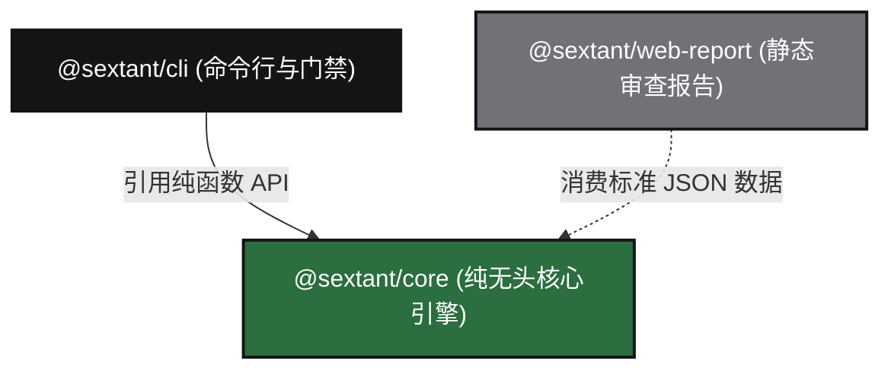

# TECH_STACK.md — SextantDrift 统一技术栈与开发部署规范

> **版本**：v2.0 Clean-Slate Reboot Edition (2026)  
> **状态**：正式基线 (Approved Baseline)  
> **适用对象**：SextantDrift 核心研发团队、自动化 CI 流水线及所有参与编码的 AI Agent。  
> **核心使命**：面向 AI Coding 与现代工程团队的「架构 X 光机与偏航检测罗盘（Architecture X-Ray & Drift Compass）」。

---

## 1. 战略定位与设计哲学 (Philosophy & North Star)

SextantDrift 重启版本践行 **“彻底弃绝旧版遗传，深度吸纳踩坑教训”** 的最高原则。彻底剥离第一版中臃肿的 Tauri 桌面外壳、番茄钟、富文本排版等无关包袱，回归 20 世纪经典计算机科学的严密图论与语义不变量形式化验证。

### 1.1 核心三大体验底线 (The Litmus Test)
任何技术选型与工程演进，必须无条件满足以下三大硬指标：
1. **五秒原则 (The 5-Second Rule)**：在 10 万行代码规模的项目中，执行 `npx sextant-drift check` 端到端耗时必须 **≤ 3 秒**（上限 5 秒），峰值内存占用 **≤ 256MB**。
2. **零幻觉底线 (Zero False Positives)**：误报等于自杀。每一处偏航报警必须具备确凿的 AST 物理行号与拓扑规则证据，严禁基于正则或概率推断产生虚假报警。
3. **Token 经济学与环境纯净 (Zero Token Waste & Clean Footprint)**：CLI 默认只在终端输出紧凑高信噪比的 ANSI 彩色文本（单次检查消耗控制在 **50 ~ 200 tokens**），**严禁在工作区生成临时 HTML 或多余垃圾文件**。

---

## 2. 旧版踩坑复盘转化的技术硬约束 (Pitfalls to Hard Invariants)

旧版经历的 6 大致命陷阱在此全面转化为不可逾越的底层技术约束：

```
┌──────────────────────────────────────────────────────────────────────────────────┐
│                         旧版 6 大致命陷阱 ──► 现代硬性技术约束                      │
├─────────────────────────────────────┬────────────────────────────────────────────┤
│ 陷阱 1: 切入顺序严重倒置            │ 硬约束 1: 确定性 AST 拓扑提取先行，时序因果延后    │
│ 陷阱 2: Agent 自证即幻觉 (自写时序) │ 硬约束 2: 100% 机器编译器静态提取，拒绝 Agent 自述  │
│ 陷阱 3: 脆弱静态推断猜运行时序      │ 硬约束 3: 静态只做确定性 DAG 与语法匹配，杜绝正则猜│
│ 陷阱 4: 另立私有 spec.md 孤岛标准   │ 硬约束 4: 零侵入纯文本总线 (Markdown + Mermaid)   │
│ 陷阱 5: 要求人类预画 4 张图的高门槛 │ 硬约束 5: init 逆向推导与老项目 Baseline 债务封存  │
│ 陷阱 6: 沉重桌面端拖死核心引擎      │ 硬约束 6: Core-First 无头先行，0 DOM 纯 TS 模块    │
└─────────────────────────────────────┴────────────────────────────────────────────┘
```

1. **切入顺序约束**：将确定性级别为 8~10 的模块依赖图（DAG）、分层越界（Bypass）、逆向依赖（Inversion）、循环依赖（Cycles）以及 Hoare 不变量作为核心第一任务；不可靠的运行时因果留待 Phase 5 依托动态测试 Trace 解决。
2. **证据确凿约束**：系统的“实际拓扑（Actual）”必须且只能由 `@sextant/core` 引擎基于 TypeScript AST 语法树遍历提取，绝不采信 Agent 自行回写的任何时序或结论。
3. **分析边界约束**：静态分析坚决不做事件总线、Promise.all 或多线程运行时序的猜测，只针对确凿的语法结构节点进行拦截。
4. **结构化单源事实协议 (JSON Schema)**：首选具备严格 JSON Schema 校验的结构化 JSON 规范文件（`sextant.json` 或 `.sextant/architecture.json`）作为架构单源事实，机器解析微秒级，AI Agent 读写零歧义；同时向下无缝兼容读取根目录 `ARCHITECTURE.md` 或 `AGENTS.md` 中的 Mermaid 拓扑块，并原生支持按需自动导出 Mermaid 拓扑图供可视化审阅。
5. **逆向推导优先**：支持通过 `init` 命令从物理代码目录与导入关系反向编译出初始 `sextant.json` 架构规范，大幅降低人工画图门槛。
6. **无头核心隔离**：核心引擎与表现层彻底物理解耦，`@sextant/core` 保持 0 DOM、0 浏览器宿主依赖、0 CLI 外部依赖。

---

## 3. 统一技术栈选型矩阵 (Technology Stack Matrix)

| 分层 / 领域 | 选型方案 | 选用版本 / 规范 | 选型核心理由与约束 | 相比旧版的根本改变 |
| :--- | :--- | :--- | :--- | :--- |
| **语言标准** | **TypeScript** | `>= 5.3` (ES2022 / NodeNext) | 强类型契约、严格模式 (`strict: true`)、不可变数据结构保障 | 统一工程语言，杜绝弱类型暗坑 |
| **运行时基准** | **Node.js LTS** | `>= 18.0.0` (跨 Linux, macOS, WSL) | 覆盖 99% CI 门禁与开发者默认机器；兼顾 Bun 原生兼容执行 | 彻底抛弃桌面 WebView 运行时依赖 |
| **Monorepo 管理** | **pnpm Workspaces** | `>= 9.0.0` | 严格杜绝幽灵依赖（Phantom Dependencies），硬链接提升缓存效率 | 废弃单体杂糅，建立严密分包边界 |
| **AST 提取引擎** | **TypeScript Compiler API** | `typescript` 官方包 | 100% 官方语法对齐、原生精确解析 `tsconfig.json` paths 路径别名、类型导入 | 废弃脆弱的正则匹配与黑盒解析库 |
| **图论与拓扑算法** | **自研轻量 DAG 算法引擎** | 纯 TypeScript 实现 | 基于 Tarjan 算法检测闭环 (Cycles)，DFS 验证分层旁路 (Bypass) 与逆向 (Inversion) | 高度内聚，执行时间 < 5ms |
| **规范与规则解析** | **结构化 JSON + Markdown 适配器** | 原生 `JSON.parse` + 轻量校验器 + 纯文本提取器 | 首选 JSON 校验，向下兼容 Mermaid 文本回退，支持自动导出 Mermaid，0 DOM 依赖 | 废弃私有孤岛格式与重型外部解析器 |
| **命令行门禁工具** | **cac + picocolors** | `cac >= 6.7`, `picocolors >= 1.0` | 极轻量组合（体积 < 50KB，冷启动 < 10ms），高信噪比紧凑彩色输出 | 废弃重型终端库与交互繁琐的界面 |
| **独立审查报告** | **纯静态 HTML 模板** | 单文件自包含 (`drift-report.html`) | 纯展示层，仅消费 Core 输出的标准 JSON，内置 Mermaid.js 离线渲染 | 废弃桌面端 Electron / Tauri 宿主 |
| **测试与质量验证** | **Vitest** | `>= 1.5.0` | 原生 ESM/TS 支持，毫秒级多线程并发测试，100% 正反规则断言覆盖 | 建立秒级自动化守护基线 |

---

## 4. Monorepo 分包架构与依赖隔离矩阵

系统由现代化纯粹的 Monorepo 构成，物理分包严守**单向依赖原则**：

```text
SextantDrift/
├── packages/
│   ├── core/                        # @sextant/core: 纯无头核心分析引擎 (0 DOM, 0 CLI, 100% 单测)
│   │   ├── src/
│   │   │   ├── parser/              # Mermaid Flowchart 与 YAML Invariants 提取器
│   │   │   ├── analyzer/            # 基于 TS Compiler API 的代码拓扑抽取器 (AST DAG)
│   │   │   ├── invariants/          # 语义不变量规则引擎 (模式匹配、违规拦截)
│   │   │   ├── state/               # 状态机拓扑分析器 (死锁、孤岛节点排查)
│   │   │   ├── comparator/          # 拓扑红绿差分算法与合规判定
│   │   │   └── index.ts             # 统一外部 API 纯函数导出
│   │   └── tests/                   # 核心单元测试套件 (Vitest)
│   │
│   ├── cli/                         # @sextant/cli: 终端与 CI 门禁工具 (npx sextant-drift)
│   │   ├── bin/sextant-drift.ts     # CLI 执行入口
│   │   └── src/
│   │       ├── commands/            # check, init, baseline 命令实现
│   │       └── formatters/          # 终端彩色输出 (picocolors) 与 JSON 序列化
│   │
│   └── web-report/                  # @sextant/web-report: 静态红绿差分审查报告
│       └── template/                # 单文件自包含 HTML 模板 (纯 CSS + 离线 Mermaid)
│
├── docs/                            # 架构设计与规范文件
├── pnpm-workspace.yaml              # 工作区配置
└── package.json                     # 统一根配置
```

### 4.1 物理分包依赖不变量矩阵 (Package Dependency Invariants)



- **Core 独立性不变量**：
  - `packages/core` **绝对禁止**引入任何 CLI 库（如 `cac`, `commander`, `chalk`, `picocolors`）；
  - `packages/core` **绝对禁止**引入任何 UI 或 DOM 相关库（如 `react`, `vue`, `jsdom`）；
  - `packages/core` 仅导出无副作用的纯函数（Pure Functions），入参为代码路径或文件内容，返回结构化的差异诊断对象（`DriftReport`）。
- **表现层单向流动**：
  - `packages/cli` 负责参数解析，调用 Core 纯函数，并将结果格式化为终端高信噪比文本或输出 exit code；
  - `packages/web-report` 仅接收结构化 JSON 报表，严禁向 Core 注入任何视图或排版逻辑。

---

## 5. 核心引擎实现技术细则 (@sextant/core)

### 5.1 AST 拓扑与依赖抽取 (TypeScript Compiler API)
核心依赖提取遵循以下确凿逻辑：
1. **源文件扫描与解析范围**：严格聚焦 TypeScript (`.ts`, `.tsx`) 与 JavaScript (`.js`, `.jsx`, `.mjs`)，完全基于官方 TypeScript Compiler API。使用 `ts.createSourceFile(fileName, sourceText, ts.ScriptTarget.Latest, true)` 建立抽象语法树，保证 100% 官方语法解析准确度且零黑盒依赖；
2. **依赖收集节点**：
   - `ts.SyntaxKind.ImportDeclaration`（静态导入与类型导入）
   - `ts.SyntaxKind.ExportDeclaration`（`export ... from` 穿透导出）
   - `ts.SyntaxKind.CallExpression` 中 `import()` 或 `require()`（动态模块引用）
3. **路径别名解析 (Path Aliasing)**：
   - 自动解析项目根目录下 `tsconfig.json` 中的 `compilerOptions.paths` 与 `baseUrl`，将 `@/services/...` 准确还原为磁盘相对路径；
   - 杜绝因路径别名无法识别而导致的漏报或误判。
4. **排除横切噪音**：
   - 依据 C4 Model 理念，未在架构图中声明为独立 Component 的公共工具（如 `src/utils/**`, `logger`, `lodash`），天然排除在跨层违规判定之外，杜绝报警噪音。

### 5.2 拓扑差分算法与违规分类 (DAG & Diffing)
将物理依赖图与意图分层图映射后，通过图论拓扑比对精确捕获四大违规：
- **跨层旁路 (Layer Bypass - CRITICAL，退出码 1)**：在分层调用链（如 `A -> B -> C`）中，检测到存在直接跨层连接 `A -> C` 且未在设计图中获得许可；
- **逆向依赖 (Layer Inversion - CRITICAL，退出码 1)**：低抽象层次模块（如 `Domain`, `Infrastructure`）反向导入高抽象层次模块（如 `Controller`, `View`）；
- **循环依赖 (Circular Dependency - CRITICAL，退出码 1)**：基于 Tarjan 算法检测出的强连通分量闭环（如 `A.ts -> B.ts -> C.ts -> A.ts`），作为破坏高内聚低耦合的架构级硬伤，严格作为致命违规阻断交付；
- **违禁外联 (Forbidden Import - CRITICAL，退出码 1)**：特定敏感模块直接导入被禁止的三方库（如前端表现层直连 `@prisma/client` 或数据库驱动）。

### 5.3 结构化架构规范标准 (`sextant.json`)
彻底摒弃散装文本，所有分层边界、组件路径与语义不变量统一收敛为结构化 JSON，支持原生 JSON Schema 验证与微秒级极速解析：

- **AST 不变量匹配深度约束 (Zero False Positives 铁律)**：
  - `must_precede`（时序先验）：严格限定在**同一函数 / 同一同步块作用域**内部进行直接语句调用顺序匹配，杜绝跨函数复杂异步控制流猜测引发的误报；
  - `forbid_import`（跨层违禁导入）：直接在**文件级 ImportDeclaration** 进行确凿语法节点拦截。

```json
{
  "$schema": "https://sextant-drift.dev/schema/v2.json",
  "name": "SextantDrift",
  "layers": [
    {
      "name": "Presentation",
      "components": ["OrderController"],
      "paths": ["src/controllers/**"],
      "allowDependencies": ["Domain"]
    },
    {
      "name": "Domain",
      "components": ["OrderService"],
      "paths": ["src/services/**"],
      "allowDependencies": ["Persistence"]
    },
    {
      "name": "Persistence",
      "components": ["OrderRepository"],
      "paths": ["src/repositories/**"],
      "allowDependencies": []
    }
  ],
  "invariants": [
    {
      "id": "PERSIST_BEFORE_EXTERNAL",
      "severity": "critical",
      "desc": "外部网络调用或 AI 服务前必须先将业务请求落库",
      "pattern": {
        "must_precede": ["db.save", "repository.create", "orm.save"],
        "target": ["llmClient.chat", "aiService.call", "payment.charge"],
        "scope": "src/controllers/**"
      }
    },
    {
      "id": "FORBID_DIRECT_DB_IN_UI",
      "severity": "critical",
      "desc": "UI 与表现层严禁直接调用持久化 ORM 实例",
      "pattern": {
        "forbid_import": ["@prisma/client", "typeorm", "pg", "mysql2", "src/repositories/**"],
        "in_path": "src/views/**,src/components/**,src/controllers/**"
      }
    }
  ]
}
```

---

## 6. 统一命令行与 CI 门禁规范 (@sextant/cli)

### 6.1 命令集与契约 (Command Suite)

```bash
# 核心门禁：日常代码与 PR 架构合规检查（默认纯终端输出，零文件污染）
$ npx sextant-drift check [options]

# Monorepo 场景：针对特定子包独立执行架构门禁核验
$ npx sextant-drift check --filter <package-name>

# 独立审查报告：显式指定生成单文件自包含 HTML 报告
$ npx sextant-drift check --report [path/to/report.html]
$ npx sextant-drift report [--open]

# 逆向工程：存量项目一键反向扫描生成初始 sextant.json
$ npx sextant-drift init

# 债务基线：存量老项目将当前遗留违规固化到 .sextant/baseline.json
$ npx sextant-drift baseline
```

### 6.2 退出码标准协议 (Exit Code Protocol)
严格遵循 Unix 门禁标准，与所有主流 CI/CD 及终端 Agent 无缝集成：
- **`Exit Code 0`（Pass）**：架构完全合规，或所有既有违规均已在基线快照（`baseline.json`）中豁免；
- **`Exit Code 1`（Drift Detected）**：检测到新增架构偏航（New Architectural Drift），终端输出精确行号并阻断提交；
- **`Exit Code 2`（Fatal / Config Error）**：语法或配置损坏（如找不到架构配置文件、JSON Schema 校验失败）。

### 6.3 终端高信噪比输出规范
执行 `check` 发现偏航时的标准 ANSI 彩色紧凑输出示例：

```text
[SEXTANT] Architecture Drift Detected! (1 violation, 0.28s)

✖ [CRITICAL BYPASS] OrderController directly bypasses OrderService
  File   : src/controllers/order.controller.ts:47
  Evidence: import { OrderRepository } from '@/repositories/order.repo'
  Rule   : sextant.json#layers/Presentation (Direct bypass to Persistence is forbidden)
  Fix    : Route calls through OrderService instead of direct repository access.

CHECK FAILED: 1 critical drift found. Run with --json for machine output.
```

---

## 7. 统一测试与质量守则 (Testing Invariants & TDD)

为确保“零误报”铁律，所有规则和解析器均采用严格的测试驱动开发（TDD）：

1. **测试框架**：统一采用 `vitest`，全套单测执行时间必须控制在 **1 秒以内**；
2. **成对用例守则 (Pairwise Testing)**：每新增一条架构规则或 AST 匹配器，**必须同时提交两个对立测试用例**：
   - **Positive Case（合规代码）**：确认在完全遵循规范的代码上严格保持绿灯，断言**零假阳性**；
   - **Negative Case（违规代码）**：确认精准捕获违规行为，断言捕获的文件相对路径、行号以及规则 ID **100% 精确**。
3. **隔离性原则**：所有 AST 分析单测均在内存虚拟文件系统（或测试 fixtures 目录）中执行，严禁依赖真实外部网络或外部持久化状态。

---

## 8. 构建、发布与部署流水线 (Build, Release & CI/CD)

### 8.1 构建与编译 (Build Pipeline)
- **打包工具**：采用 `tsup`（基于 esbuild 构建），秒级输出轻量纯净产物；
- **产物标准**：
  - `@sextant/core`：输出纯 ESM (`target: es2022`, Node.js 18+ 原生模块标准) 与完整的 `.d.ts` 类型定义，构建耗时 < 1 秒，产物体积极小；
  - `@sextant/cli`：输出带 `#!/usr/bin/env node` 头部的独立 ESM 可执行脚本，打包体积控制在 50KB 以内。

### 8.2 GitHub Actions 门禁集成标准与 PR 反馈

在团队代码仓库的 `.github/workflows/architecture-gate.yml` 中无缝嵌入。门禁结果直接输出到终端，并通过标准输出写入 `$GITHUB_STEP_SUMMARY`，在 GitHub 页面生成原生清晰的红绿诊断表格，零权限申请与 Token 消耗：

```yaml
name: Architecture Drift Gate
on: [push, pull_request]

jobs:
  drift-check:
    runs-on: ubuntu-latest
    steps:
      - name: Checkout Code
        uses: actions/checkout@v4

      - name: Setup Node.js
        uses: actions/setup-node@v4
        with:
          node-version: 18

      - name: Run Architecture Drift Check
        run: |
          npx sextant-drift check --strict --github-summary
```

### 8.3 存量老项目引入与债务隔离机制 (Brownfield Baseline)
对于已经存在几十万行代码的存量老系统：
1. 开发者执行 `npx sextant-drift baseline`，系统将扫描并生成 `.sextant/baseline.json`；
2. **强制纳入 Git 版本纳管**：`.sextant/baseline.json` 必须作为团队唯一的架构债务事实凭据提交至 Git 仓库，确保 CI 门禁与全体团队成员在完全一致的基准下协同；
3. **AST 语义指纹匹配算法**：基线记录的违规特征基于 **[调用方组件 + 被调用方组件 + 引用符号签名]** 的 AST 语义指纹，而非易变的物理行号。存量代码发生重构、行号偏移或代码格式化时，历史债务豁免依然有效，精准落实 No New Drift；
4. 后续 CI 门禁遵循 **“历史债务豁免，新增偏航零容忍（No New Drift）”**，只要 PR 没有引入新的架构违规，即可安全通过。
