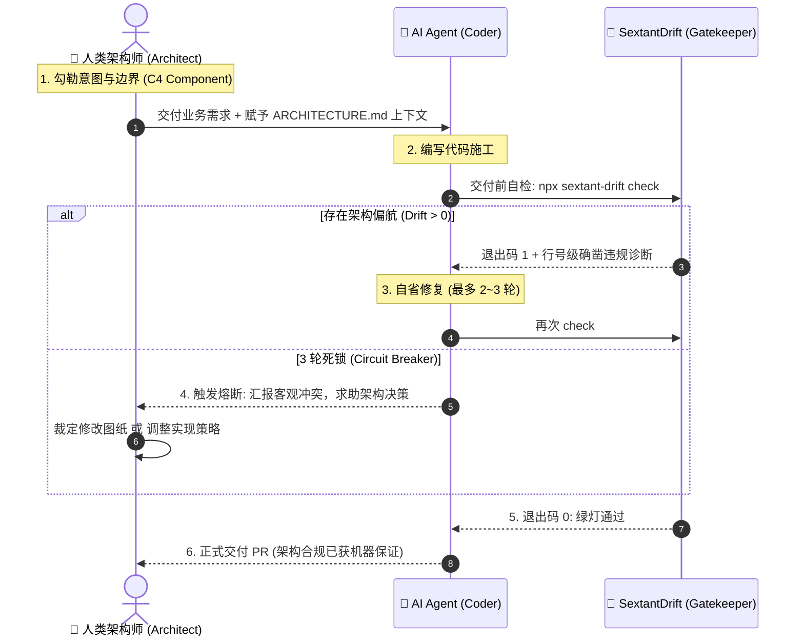

# CONCEPTUAL_ARCHITECTURE.md — SextantDrift 非技术架构与概念模型说明书

> **版本**：v1.0 (2026 正式版)  
> **文档定位**：系统的高阶领域模型与概念架构设计。阐释系统的**核心实体、领域语言、协同模式与生命周期**，独立于具体的技术栈或代码实现细节。  
> **基准参考**：[`MISSION.md`](file:///home/redtea/Mona_project/SextantDriftV03/MISSION.md) | [`docs/REQUIREMENTS.md`](file:///home/redtea/Mona_project/SextantDriftV03/docs/REQUIREMENTS.md)

---

## 1. 架构定位：什么是非技术架构？

在复杂的工程系统中，代码是易变的，技术选型是演进的，但**概念模型（Conceptual Model）与系统运作哲学**是恒定的。

非技术架构（Conceptual Architecture）回答以下本质问题：
- 我们在心智层面对“系统”、“架构”与“偏航”是如何抽象定义的？
- 人类、AI Agent 与检验引擎三者之间如何分工与权责制衡？
- 信息如何在纯文本、拓扑图与代码文件之间流动与转化？

它作为一座稳固的桥梁，连接上层的**战略使命（MISSION.md）**与底层的**工程实现（packages/core）**。

---

## 2. 核心领域概念与统一语言 (Ubiquitous Language)

```
                       ┌────────────────────────┐
                       │  设计意图 (Target)      │
                       │  C4 Component 拓扑图   │
                       └───────────┬────────────┘
                                   │
                                   ▼ 比对差异
    ┌──────────────────────────────┴─────────────────────────────┐
    │                    偏航差分 (Architecture Drift)            │
    │   - 跨层旁路 (Bypass)           - 循环依赖 (Cycles)         │
    │   - 逆向依赖 (Inversion)        - 违禁导入 (Forbidden)      │
    └──────────────────────────────┬─────────────────────────────┘
                                   ▲
                                   │ 确定性提取
                       ┌───────────┴────────────┐
                       │  实际拓扑 (Actual)      │
                       │  源码物理依赖图 (DAG)   │
                       └────────────────────────┘
```

### 2.1 意图拓扑 (Target Topology)
- **定义**：由人类架构师（或由 AI 协助）所期望的系统宏观分层与模块依赖关系；
- **表达介质**：标准 Mermaid `flowchart` 与 `subgraph`；
- **分层心智（C4 Model 映射）**：
  - **Container（容器/应用级）**：例如前端单页、API 服务、Worker 任务。对应系统的主体分界；
  - **Component（组件/模块级）**：容器内部的高内聚业务单元（如 Controllers, Services, Repositories）。
  - **Non-Component（横切与辅助）**：通用的 `utils`、`logger`、`types`。它们天然不是组件，不强制上图，也不参与组件间依赖审计。

### 2.2 实际拓扑 (Actual Topology)
- **定义**：从物理磁盘上的实际源码中通过静态分析客观、确定性提取出的模块调用有向图（DAG）；
- **映射契约**：遵循**“约定优于配置”**。物理目录（如 `src/services`）天然映射为组件节点，杜绝人工维护复杂映射表。

### 2.3 架构偏航 (Architecture Drift)
- **定义**：实际拓扑与意图拓扑之间的**拓扑失真**与**规则破坏**。
- **四大致命偏航形态**：
  1. **跨层旁路 (Layer Bypass)**：违背既定分层顺序，高层模块越过中间层直接使用底层（例如 Controller 跳过 Service 直连 Repo）；
  2. **逆向依赖 (Layer Inversion)**：下层核心领域或基础设施反向依赖了上层表现层，导致抽象泄漏与高耦合；
  3. **循环依赖 (Circular Dependency)**：两个或多个模块之间形成了互相引用的闭环死锁；
  4. **违规导入 (Forbidden Import)**：特定安全敏感层导入了被明确禁止的外部三方库或驱动。

### 2.4 架构基线与债务 (Baseline & Architectural Debt)
- **定义**：面对已有存量项目时，系统对现有历史违规的“认账标记”；
- **核心心智**：**“历史债务封存，新增偏航零容忍（No New Drift）”**。允许系统背着历史包袱前进，但坚决阻断新代码的恶化。

---

## 3. 三角协同治理模型 (The Triad Governance Model)

SextantDrift 的核心生命力在于重构了**人类、AI Agent 与机器门禁**三者之间的权责三角关系：



### 3.1 人类：意图制定者与终极裁决人 (The Sovereign Architect)
- **职责**：定义核心分层逻辑、确立关键业务边界；在发生设计与实现的根本冲突时，行使终极决策权（改图还是改代码）。
- **解放**：不再沦为行级代码肉眼审查的“人力人肉编译器”，只在最高抽象层把控系统演进。

### 3.2 AI Agent：受约束的施工者 (The Governed Implementer)
- **职责**：编写具体的函数与实现细节；
- **自省机制**：在提交代码前，把架构检查作为非功能性测试的一部分自主运行，吃下报错后自我重构；
- **熔断约束**：严守 2~3 轮重试红线，不陷入无限消耗 Token 的无效死循环。

### 3.3 Sextant 引擎：无情、客观的标尺 (The Deterministic Yardstick)
- **原则**：**零智能、零主观、零幻觉**；
- **职责**：以纯粹的数学拓扑与规则比对为依据，给出秒级的 0 或 1 判定，充当绝对中立的独立裁判。

---

## 4. 活的架构生命周期模型 (Living Architecture Lifecycle)

架构不是刻在石头上的死戒律，而是在代码演进中生长的活有机体。系统遵循四大阶段闭环：

```
      [ 1. 构思与逆向 (Conceive) ]
                   │
                   ▼
      [ 2. 基准固化 (Baseline & Freeze) ]
                   │
                   ▼
      [ 3. 施工守卫 (Guard & Harness) ] ──── 发现偏航 ───► [ 熔断与修复 ]
                   │ (合规)                                  │ (合理演进)
                   ▼                                         ▼
      [ 4. 演进吸收 (Evolve & Sync) ] ◄──────────────────────┘
```

1. **构思与逆向 (Conceive)**：
   - 全新项目：以极低摩擦的 Mermaid 快速勾画 3~5 个核心组件；
   - 存量老项目：运行 `init` 逆向 X 光扫描，自动从现有物理代码中推导初始拓扑，人类 30 秒审阅确认。
2. **基准固化 (Baseline & Freeze)**：
   - 确立 `sextant.json` / `ARCHITECTURE.md` 架构单源事实，纳入 Git 版本管理；老项目封存历史基线快照。
3. **施工守卫 (Guard & Harness)**：
   - 日常由 Agent 在本地运行 `check` 守卫，CI 门禁自动把关 PR，偏航即阻断。
4. **演进吸收 (Evolve & Sync)**：
   - 当业务复杂化证明原架构不足时（如新增了合规的消息队列组件），支持将合理的拓扑变动“吸收回图”，形成新版本的架构基线。

---

## 5. 协议总线设计：纯文本本位 (The Pure-Text Bus Architecture)

SextantDrift 拒绝私有二进制文件、拒绝私有云端数据库通信、拒绝 IDE 进程间内存 Hook，坚持**纯文本协议总线**：

| 要素 | 采用标准 | 为什么这样设计？ |
| :--- | :--- | :--- |
| **拓扑定义** | `Mermaid (flowchart)` | 开发者生态中最通用、GitHub 原生支持、人类可读、Agent 秒级理解。 |
| **规则定义** | `YAML / 语义标签` | 结构化、极简、无歧义，便于机器解析。 |
| **单源事实载体** | `sextant.json` / `ARCHITECTURE.md` | 本地优先、微秒级解析 (JSON Schema) 与纯文本无缝回退，与代码共存进 Git 提交，天然具备历史追溯能力。 |
| **门禁接口** | 标准终端退出码与 stdout | 退出码 0/1/2 适用于任何 CI（GitHub Actions）及终端 Agent 捕获。 |

---

## 6. 演进界面映射 (Surface Evolution Ladder)

概念模型在产品表现形态上设计了清晰的解耦与递进梯子：

```
[Phase 1: 终端纯文本 (CLI)]
  - 核心能力：零文件污染、秒级退出码、单行高信噪比报错
  - 核心场景：本地自检、Agent 执行闭环、CI 门禁
       │
       ▼
[Phase 2: 规范化数据层 (Standardized Schema)]
  - 核心能力：统一的架构拓扑与差分 JSON 接口
  - 核心场景：外部生态工具与脚本挂载
       │
       ▼
[Phase 3: 嵌入式视觉交互 (Embedded Visual Canvas)]
  - 核心能力：内嵌的交互连线视图、图文实时双向映射
  - 核心场景：复杂的架构全景推敲与直观视觉 Review
```

这种分层保证了核心引擎与概念模型永远保持轻盈与通用，表现层的升级不会动摇底层架构差分的确定性基石。
