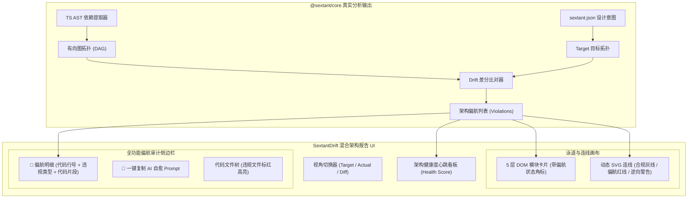

# SextantDrift 架构图 UI 体系设计与适配规范 (Architecture Diagram UI Spec)

> **版本**：v2.0 (2026 UI Upgrade Edition)  
> **设计基准**：参考架构图 UI（5 层分层拓扑、混合 DOM+SVG 动态连线、抽屉式详情检查台）  
> **核心定位**：将 SextantDrift 的「架构 X 光机与偏航检测罗盘」可视化体验从传统纯 SVG 画布升级为现代化「高信噪比混合渲染（Hybrid DOM + Dynamic SVG）」体系。

---

## 一、参考架构图 UI 深度解构 (Deconstruction of Reference UI)

参考 UI 展示了一种兼具**极高工程美感**与**高信噪比交互**的分层系统架构全景方案。其核心设计亮点与底层技术机制包含以下四个维度：

```
┌─────────────────────────────────────────────────────────────────────────────┐
│                       参考架构图 UI 核心设计四维解构                         │
├───────────────────────────────┬─────────────────────────────────────────────┤
│ 1. 混合渲染拓扑 (Hybrid DOM)  │ DOM 处理弹性卡片与文本排版，动态 SVG 负责高精度连线 │
│ 2. 动态正交折线 (Orthogonal)   │ 运行时计算 DOM Rect，绘制平滑直角弯折与同步/异步连线 │
│ 3. 伴随式高亮 (Path Dimming)  │ 卡片悬停自动淡化无关连线（0.12），高亮上下游拓扑链  │
│ 4. 多维侧边检查台 (Sidebar)   │ 抽屉侧边栏集成元信息、内部链路、依赖关系与代码目录树 │
└───────────────────────────────┴─────────────────────────────────────────────┘
```

### 1.1 视觉风格与排版哲学 (Visual Aesthetics & Design Tokens)
- **纸感温和底色 (Warm Paper & Neutral Canvas)**：
  - 画布背景采用 `--bg: #FAFAF7` 与卡片底色 `--surface: #FFFFFF`，搭配浅灰微边框 `--border: #E2E5E9`，告别刺眼的赛博暗色系，提供极佳的长时间阅读舒适度；
  - 字体体系采用双排规范：界面主排版使用现代无衬线（`Noto Sans SC` / 系统原生 `BlinkMacSystemFont`），代码、层级编号与统计数据采用等宽字体（`JetBrains Mono` / `Courier Prime`）。
- **确定性分层语义色彩 (Tier Semantic Color System)**：
  每个层级分配高辨识度的语义主题色与浅色背景底色，卡片顶部通过 3px 彩色饰条（`card::before`）建立强烈的层级归属心智：
  - **L1 接入层 (Access)**：`#3B82F6` (Blue) / `#EFF6FF`
  - **L2 网关层 (Gateway)**：`#8B5CF6` (Purple) / `#F5F3FF`
  - **L3 业务服务层 (Service)**：`#10B981` (Emerald) / `#ECFDF5`
  - **L4 数据层 (Data)**：`#F97316` (Orange) / `#FFF7ED`
  - **L5 基础设施层 (Infra)**：`#64748B` (Slate) / `#F1F5F9`

### 1.2 混合 DOM+SVG 动态连线引擎 (Hybrid DOM + Dynamic SVG Routing)
区别于传统纯 Canvas / 纯 SVG 画布的文本排版困难与重绘卡顿，该 UI 采用了 **“DOM 排版卡片 + 浮动 SVG 连线”** 的轻量方案：
1. **坐标动态投影 (Coordinate Projection)**：
   通过卡片 DOM 节点的 `getBoundingClientRect()` 计算相对于画布容器 `.diagram` 的相对坐标：
   - 起点：`p1 = getBottomCenter(fromEl)`（卡片底部中心点）；
   - 终点：`p2 = getTopCenter(toEl)`（卡片顶部中心点）。
2. **正交直角折线算法 (Orthogonal Elbow Routing)**：
   计算纵向中点 `midY = (p1.y + p2.y) / 2`，生成经典的三段式曼哈顿直角折线路径：
   ```svg
   M p1.x p1.y L p1.x midY L p2.x midY L p2.x (p2.y - 2)
   ```
3. **通信语义区分 (Sync vs Async Markers)**：
   - **同步调用 (Sync HTTP/RPC)**：实线，`stroke: #94A3B8; stroke-width: 1.8`，末端带三角形箭头 `#arrowhead`；
   - **异步消息 (Async Event/MQ)**：虚线，`stroke-dasharray: 6,5`。
4. **悬停焦点探针 (Path Highlighting & Dimming)**：
   当用户鼠标划过卡片时：
   - SVG 容器激活 `.paths-active`，所有无关连线透明度降为 `0.12`；
   - 关联的出入连线保持 `opacity: 1`，加粗至 `stroke-width: 2.4`，消除大图中常见的“连线毛线团”视觉过载。

### 1.3 深度下钻检查台 (Slide-Out Sidebar & Code Tree)
点击卡片后自右侧滑出宽度 420px 的详情抽屉，构成微观架构治理核心视图：
- **元数据栅格 (Meta Grid)**：展示该模块的技术栈、ORM、端口与部署形态；
- **内部调用链路 (Internal Architecture Pipeline)**：以垂直步骤卡片（`页面层 → 组件层 → Hook → API Client`）清晰呈现该组件内部的数据流转次序；
- **上下游关系看板 (Upstream & Downstream Dependencies)**：区分入度调用方与出度依赖项，标识通信类型；
- **代码目录结构 (Collapsible Directory Tree)**：交互式文件树，支持文件夹点击折叠/展开，真实映射工程磁盘结构。

---

## 二、SextantDrift 偏航引擎对参考 UI 的融合改造 (SextantDrift Adaptation)

参考 UI 原型展示的是**静态合规架构的白盒蓝图**。为贯彻 SextantDrift **“Design by Diagram, Diff by Diagram（唯看双图红绿差分）”** 的核心哲学，我们需要在该 UI 基础上注入**动态偏航差分、违规红笔标记与 AI 自愈**能力：



### 2.1 偏航差分红线体系 (Drift Redline Visual System)
在参考 UI 现有的灰线基础上，引入 SextantDrift 的四类偏航指示：

| 连线状态 | 视觉呈现 | 语义定义 | 触发场景 |
| :--- | :--- | :--- | :--- |
| **合规调用 (Compliant)** | 浅灰实线 (`#94A3B8`) | 符合设计规范的分层依赖 | Controller 调用 Service，Service 调用 Repo |
| **跨层旁路 (Layer Bypass)** | **亮红发光虚线** (`#EF4444`, 带红叉标记 ✖) | 绕过中间层跨级越界调用 | Web 前端直接访问 MySQL，Controller 直接直连 Repo |
| **逆向依赖 (Layer Inversion)** | **紫红双向折线** (`#DC2626`, 逆向箭头 ⮌) | 低层模块反向依赖高层表现层 | 基础设施层直接引用 Controller，Domain 引用 UI |
| **循环依赖 (Circular Cycle)** | **琥珀红环状线** (`#F59E0B`, 循环警告标记 ⟲) | 两个或多个模块间形成死锁环 | Service A ⮂ Service B，Tarjan 算法捕获强连通分量 |

### 2.2 顶部三态差分切换器 (Target / Actual / Diff Toggle)
在头部状态栏增加三态分段开关：
1. **Target（设计蓝图）**：仅渲染 `sextant.json` 约定的理想分层与合法依赖连线；
2. **Actual（源码实况）**：仅渲染从代码 AST 中客观提取的真实引用网络；
3. **Diff / Unified（红绿差分，默认）**：合规依赖呈浅灰色，所有偏航连线呈醒目红色，并高亮违规卡片。

### 2.3 侧边栏注入偏航审计与 AI 自愈 (Sidebar AI-Healing Extension)
当点击任意出现偏航的卡片（或直接点击红色偏航连线）时，侧边栏在顶部优先展开 **“🚨 架构偏航审计区”**：
- **违规代码坐标**：精确到文件、行、列（如 `src/controllers/order.ts:18:1`）；
- **违规规则说明**：如 `[CRITICAL_BYPASS] Presentation 层越界直连 Infrastructure 层`；
- **源码上下文 (Code Snippet)**：展示违规的代码片段（如 `import { OrderRepo } from '../repos/order.repo';`）；
- **一键自愈 Prompt (Copy AI Fix Prompt)**：一键复制结构化修复指令，供开发者在 Cursor Composer 或 Claude Code 中按回车瞬间自愈。

### 2.4 零网络绝对契约 (Zero-CDN & Air-Gapped Invariant)
参考原型使用了远程 Google 字体（`miaoda.feishu.cn`, `fonts.googleapis.com`）。根据项目 [`AGENTS.md`](file:///home/redtea/Mona_project/SextantDriftV03/AGENTS.md) 戒律 3 与 [`ADR-007`](file:///home/redtea/Mona_project/SextantDriftV03/docs/decisions/ADR-007-c4-model-and-native-svg-visual-report.md)：
- **严禁生产报告依赖外部 CDN**；
- 生产版本采用系统内置高质量字体回退栈：
  ```css
  font-family: 'Noto Sans SC', -apple-system, BlinkMacSystemFont, 'Segoe UI', Roboto, Helvetica, Arial, sans-serif;
  font-family-mono: 'JetBrains Mono', 'IBM Plex Mono', 'Cascadia Code', Menlo, Monaco, Consolas, monospace;
  ```
- 确保离线无网、金融内网、隔离沙盒中 100% 渲染无白屏、无阻塞。

---

## 三、工程落地与数据映射模型 (Data Mapping & Integration)

从 `@sextant/core` 的分析结果转换为此 UI 数据格式的映射适配器规范：

```typescript
export interface ArchDiagramViewModel {
  systemName: string;
  healthScore: number;
  stats: {
    layerCount: number;
    moduleCount: number;
    connectionCount: number;
    syncCount: number;
    asyncCount: number;
    driftCount: number;
    criticalCount: number;
  };
  layers: {
    id: string;
    level: string; // "L1", "L2", ...
    name: string;
    color: string;
    bgColor: string;
    modules: ArchDiagramModule[];
  }[];
  connections: {
    id: string;
    from: string;
    to: string;
    type: 'sync' | 'async';
    isDrift: boolean;
    driftType?: 'bypass' | 'inversion' | 'cycle' | 'invariant';
    violationId?: string;
  }[];
  violations: Record<string, ModuleViolationDetail[]>;
}
```

---

## 四、实施里程碑总结

1. **原型规范冻结**：本文档确立视觉体系、交互规范、偏航红线标准与离线安全契约；
2. **交互样例交付**：在 `docs/design/sextant-drift-reference-ui-demo.html` 构建自包含可交互演示，包含完整的 Target/Actual/Diff 切换、红线偏航高亮与 AI 自愈 Prompt 生成；
3. **报表与扩展集成**：
   - 纳入 `standalone/sextant-web-report` 报表主题矩阵（现代工程分层主题）；
   - 作为 `packages/vscode-extension`（Cursor 插件）侧边栏 Webview 的官方推荐视图模板。
