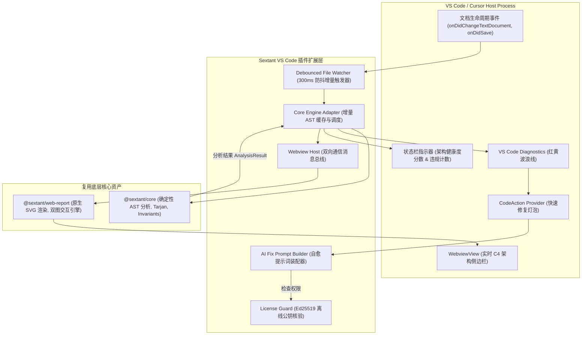
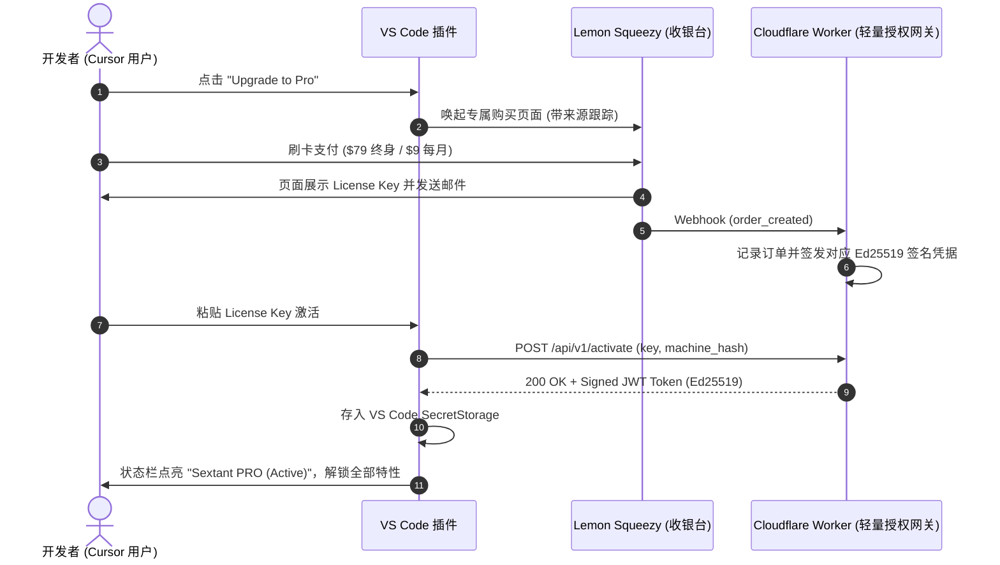

# SextantDrift for Cursor & VS Code — 产品与系统架构设计文档 (Design Document)

> **版本**：v1.0 (2026 Release Edition)  
> **定位**：面向 AI Coding 与现代工程团队的「Cursor 实时架构 X 光机与偏航防御罗盘」  
> **形态目标**：一键上架 VS Code Marketplace 与 Open VSX（Cursor 插件市场），实现个人开发者端内付费闭环与实时架构守护。

---

## 一、产品愿景与核心商业定位 (Vision & Commercial Model)

### 1.1 核心痛点与用户心智
- **痛点**：在 2026 年，Cursor Composer 与 Claude Code 极大提升了代码产出效率，但 AI Agent **缺乏全局架构与跨层防腐感知**，极易引入“跨层直接调用（Layer Bypass）”、“底层反向导入表现层（Layer Inversion）”、“模块循环依赖”以及“时序违规（未落库即调用外部服务）”。
- **现状**：开发者只有在提交 PR 或运行 CI 时才被 `sextant-drift check` 拦截，此时修复需要打断开发心流并重新启动多轮 AI 对话；
- **SextantDrift 插件的价值**：**Shift-Left（左移）到极致**。在开发者与 AI 敲下每一行代码的瞬间，在编辑器内实时给出精准红黄线提示，并通过“一键自愈 Prompt”无缝指挥 Cursor Composer 瞬间修正。

### 1.2 功能矩阵与商业阶梯 (Free vs Pro Tier)

采用标准的 **Product-Led Growth (PLG)** 漏斗模式，免费版提供足够好用的核心价值以实现病毒式口碑，Pro 版针对“效率极致追求者”提供杀手级体验：

```
┌─────────────────────────────────────────────────────────────────────────────┐
│                           SextantDrift 版本功能矩阵                          │
├───────────────────────────────┬───────────────────────────────┬─────────────┤
│ 功能特性                       │ 免费版 (Community Free)       │ Pro 付费版 ($9/月 或 $79 终身)│
├───────────────────────────────┼───────────────────────────────┼─────────────┤
│ 实时代码诊断波浪线 (Squiggly) │ ✅ 支持（红黄色警告跨层 bypass）│ ✅ 支持      │
│ 语法树与依赖实时扫描           │ ✅ 支持（防抖增量扫描）        │ ✅ 支持      │
│ 终端一键修复指引               │ ✅ 基础文本提示               │ ✅ 结构化上下文 │
│ 一键生成 AI 自愈 Prompt (灯泡) │ ❌ 仅前 10 次/天试用          │ 🚀 无限制一键复制/直接注入 │
│ 实时 C4 架构侧边栏 (Webview)   │ ❌ 不支持                     │ 🚀 实时拓扑跟随高亮联动  │
│ 架构偏航即时拦截盾 (Shield)   │ ❌ 不支持                     │ 🚀 补全违规 import 预警 │
│ 存量技术债务隔离 (Baseline)    │ ✅ 支持命令行联动             │ ✅ 支持侧边栏一键固化  │
│ 多项目/Monorepo 完整拓扑      │ 仅单工程根目录                │ 🚀 完整 Monorepo 全景  │
└───────────────────────────────┴───────────────────────────────┴─────────────┘
```

### 1.3 零沟通闭环商业变现模式 (Zero-Touch Billing Architecture)
- **支付平台选型**：**Lemon Squeezy**（作为 Merchant of Record 平台，自动处理 135+ 个国家和地区的增值税 VAT/GST，支持信用卡、PayPal、Apple Pay、Google Pay，无需自建企业跨国财税账户）；
- **授权机制**：
  - 用户在插件内点击 `Upgrade to Pro` -> 浏览器唤起带有专属引荐标记的 Lemon Squeezy Checkout 收银台；
  - 支付完成后自动展示 License Key（形如 `SEXTANT-PRO-XXXX-XXXX-XXXX`）并同步发送邮件；
  - 用户在 VS Code 命令面板输入或点击弹窗一键输入 License Key；
  - **离线公钥签名机制**：插件利用内置的 Ed25519 签名公钥校验 License 票据（包含有效期、机器指纹、过期时间），**支持在内网、断网环境下长期离线运行，彻底杜绝网络依赖风险**。

---

## 二、系统总体架构与模块划分 (System Architecture)

SextantDrift VS Code 插件完全基于现有的 `@sextant/core` 核心分析引擎与 `standalone/sextant-web-report` 独立图渲染资产构建，遵循 **“极简外壳、强劲内核”** 原则：



### 2.1 模块职责划分

| 模块名 | 物理路径建议 | 职责描述 |
| :--- | :--- | :--- |
| **`extension.ts`** | `src/extension.ts` | 插件激活入口点（`activate` / `deactivate`），注册所有 commands、providers 与状态栏。 |
| **`engine-adapter.ts`** | `src/adapters/engine-adapter.ts` | 适配 `@sextant/core`，维护文件级 AST 缓存池，执行增量拓扑比对，避免全项目频繁全量重扫。 |
| **`diagnostic-provider.ts`** | `src/providers/diagnostic-provider.ts` | 将 `@sextant/core` 的 `DriftViolation` 转换为标准的 `vscode.Diagnostic`，精确定位到文件、行、列。 |
| **`code-action-provider.ts`** | `src/providers/code-action-provider.ts` | 实现 `vscode.CodeActionProvider`，在违规代码处提供“一键复制 AI 自愈 Prompt”等 QuickFix 动作。 |
| **`sidebar-provider.ts`** | `src/views/sidebar-provider.ts` | 实现 `vscode.WebviewViewProvider`，将 `@sextant/web-report` 注入侧边栏，支持光标联动与视图下钻。 |
| **`license-manager.ts`** | `src/licensing/license-manager.ts` | 管理 License 存储、远程激活、离线公钥验签与功能特性开关（Feature Gates）。 |

---

## 三、性能防护与增量扫描机制 (Performance & Debouncing)

在编辑器插件开发中，**“输入不卡顿”是第一生命线**。如果开发者每打一个字就全量遍历几百个文件的 AST，IDE 必将发生掉帧与卡顿。

### 3.1 增量分析三级流水线 (Three-Tier Pipeline)

```
[按键输入 (Typing)]
       │
       ▼ (1) 快速防抖节流 (300ms Debounce)
[Dirty File 增量 AST 刷新]  --> 仅重新解析当前正在编辑的单一文件 (耗时 < 5ms)
       │
       ▼ (2) 局部依赖边更新 (Dependency Delta)
[增量更新拓扑图的 出度/入度]  --> 仅替换该文件对应的引用边 (耗时 < 2ms)
       │
       ▼ (3) 增量规则核验
[匹配该文件绑定的 Invariants 规则] --> 刷新当前文件的 Diagnostics (耗时 < 10ms)
       │
       ▼ (4) 侧边栏异步渲染
[PostMessage 通知侧边栏高亮违规连线] --> 非阻塞异步传输
```

### 3.2 性能保证指标
- **单文件键入响应延迟**：`<= 20ms`（主线程无感知）；
- **全工程重扫时机**：仅在保存 `sextant.json`、切换 Git 分支、执行 `git pull` 或手动点击“重新分析”按钮时触发全量刷新；
- **内存占用**：AST 缓存结构压缩，常驻内存占用严格维持在 `<= 35MB`。

---

## 四、核心用户体验与交互细节设计 (UX / UI Specifications)

### 4.1 场景一：代码编辑中的即时红黄线警报
1. **视觉呈现**：
   - 当在 `src/controllers/order.ts` 中写下 `import { OrderRepo } from '../repos/order.repo';`（跨层旁路）；
   - 代码下方立即出现黄色波浪线；
2. **悬浮提示 (Hover Tooltip)**：
   - 悬浮窗不仅显示错误文案，更显示出清晰的架构图谱路径：
     ```text
     [SextantDrift: CRITICAL_BYPASS]
     架构跨层调用违规：
     Presentation (OrderController) ──✖──> Infrastructure (OrderRepo)
     原因：违背分层规范，中间层 Application (OrderService) 被直接旁路。
     ```

### 4.2 场景二：一键 AI 自愈 Prompt (Pro 杀手级体验)
1. 开发者将光标停在黄色波浪线上，按下 `Cmd + .` (Mac) 或点击编辑器边缘的**黄色小灯泡**；
2. 菜单中第一项高亮展示：
   - `✨ Copy AI Fix Prompt (Fix architecture drift in Cursor Composer)`
   - `✨ Insert Fix Directive as Comment above line`
3. 点击后，剪贴板自动写入标准化的 AI 修复指令模板：
   ```markdown
   Please resolve the following architectural drift detected by SextantDrift:
   - File: src/controllers/order.ts (Line 2)
   - Violation: [CRITICAL_BYPASS] Direct dependency from Presentation Layer to Infrastructure Layer.
   - Constraint: Presentation must only access Application/Domain layer (OrderService).
   - Expected Fix:
     1. Inject or call `OrderService` method instead of calling `OrderRepo` directly.
     2. Remove `import { OrderRepo } from '../repos/order.repo';`.
   ```
4. 开发者在 Cursor 中直接按下 `Cmd + I` (Composer) 粘贴回车，AI 瞬间改对，波浪线自动消失。

### 4.3 场景三：实时 C4 架构侧边栏 (Live Webview)
- **界面入口**：VS Code 左侧活动栏（Activity Bar）新增罗盘图标 `Sextant Architecture`；
- **视图内容**：直接复用 `standalone/sextant-web-report` 的原生 SVG 容器与组件双层图；
- **实时联动 (Cursor Tracking)**：
  - 当开发者切换到某个 Controller 代码时，侧边栏中的该 Controller 节点自动闪烁蓝色聚焦环；
  - 侧边栏顶部常驻 **Architecture Health Score: 92/100 (1 Drift Detected)**；
  - 点击侧边栏中的任意一条红色虚线，编辑器自动打开并精确定位到产生违规的代码行。

---

## 五、商业化变现与授权闭环工程设计 (Licensing Architecture)

### 5.1 极简全自动发码与验码链路



### 5.2 离线公钥核验体系 (Air-Gapped & Offline Friendly)
- **Token 构成**：包含 `license_id`, `type: "lifetime" | "monthly"`, `issued_at`, `expires_at`, `machine_hash`；
- **签名算法**：采用 **Ed25519** 椭圆曲线非对称加密（比 RSA 更紧凑、性能高 10 倍以上）；
- **公钥内置**：插件本体内硬编码公钥 `PUBLIC_KEY_PEM`；
- **离线宽限期 (Grace Period)**：
  - 终身版（Lifetime）：激活后永久生效，本地零网络依赖；
  - 月度版（Monthly）：签发 35 天有效期的 JWT，每月联网静默刷新；即使断网出差，30 天内功能完全正常。

---

## 六、研发实施路线图与里程碑 (Execution Milestones)

| 阶段 | 周期 | 核心交付物 | 验收标准 |
| :--- | :--- | :--- | :--- |
| **M1: 插件脚手架与诊断层** | **Day 1 ~ 2** | `packages/vscode-extension` 骨架、LSP 诊断提供器、代码黄线拦截 | 在本地 Cursor 中打开测试工程，跨层 import 实时出现黄色波浪线。 |
| **M2: QuickFix 与自愈 Prompt** | **Day 3** | CodeActionProvider、自愈 Prompt 模板引擎、剪贴板联动 | 点击黄色小灯泡，1 秒生成精确包含上下文的自愈 Prompt。 |
| **M3: C4 架构侧边栏注入** | **Day 4** | Webview 侧边栏、引入 `standalone/sextant-web-report` 产物 | 侧边栏完美渲染原生 SVG 架构图，支持下钻与违规连线高亮。 |
| **M4: 授权门禁与支付对接** | **Day 5** | Lemon Squeezy 产品创建、Cloudflare Worker 激活接口、插件验签 | 购买测试通过，输入 Key 成功点亮 Pro 徽标并解锁侧边栏。 |
| **M5: 市场打包与正式发布** | **Day 6** | `vsce package`、上架 VS Code Marketplace 与 Open VSX | 全球开发者可在 Cursor 插件市场直接搜到并一键安装。 |

---

## 七、总结

本设计方案将 SextantDrift 已有的核心资产（`@sextant/core` 分析内核与 `standalone/sextant-web-report` 独立图渲染）价值最大化放大：
1. **开发成本极低**：核心逻辑不重写，仅构建一层高效的 VS Code 适配器；
2. **商业闭环极短**：利用 Lemon Squeezy 无需处理繁琐的跨境资质与税务，个人即可合规收取全球美金；
3. **用户痛点极强**：紧跟 Cursor 2026 年爆发浪潮，精准切中“AI 代码审查难、架构易腐化”的刚需。
