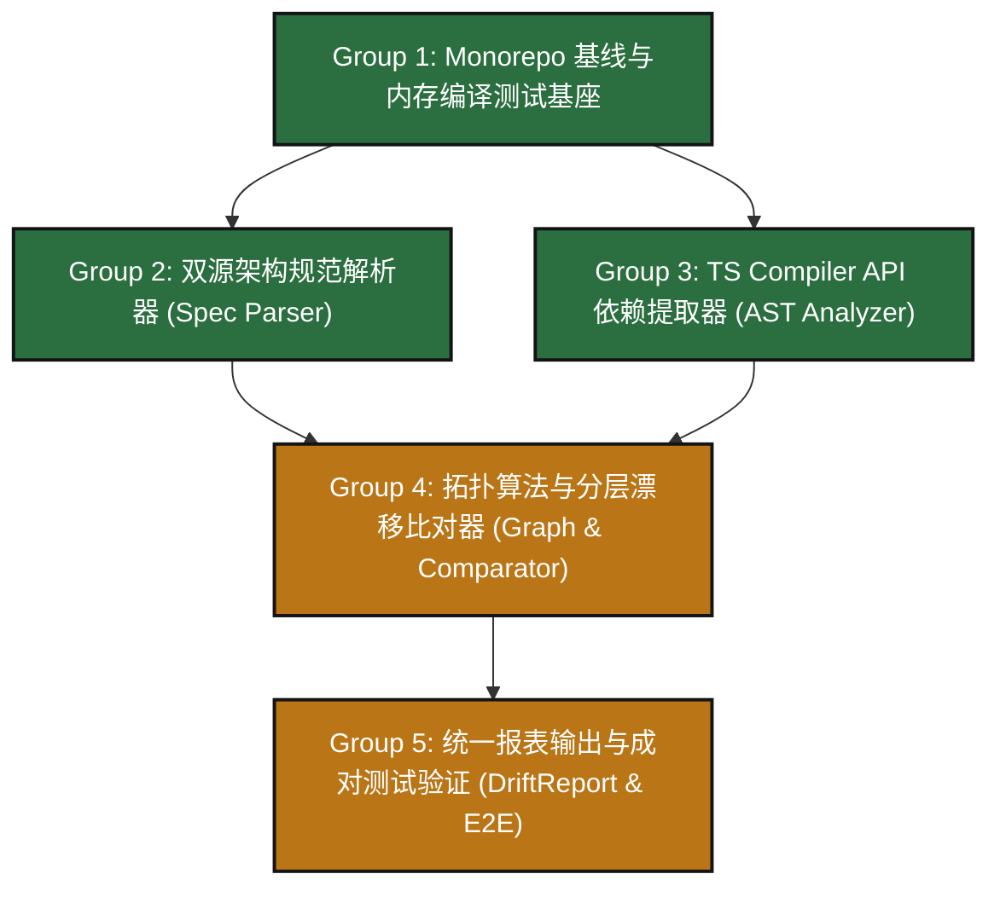

# Feature Implementation Plan: Phase 1 — Module Drift Engine

> **特性代号**：`phase-1-module-drift-engine`  
> **制定日期**：2026-09-16  
> **所属分支**：`feat/phase-1-module-drift-engine`  
> **基准规范**：[`requirements.md`](file:///home/redtea/Mona_project/SextantDriftV03/specs/2026-09-16-phase-1-module-drift-engine/requirements.md) | [`specs/roadmap.md`](file:///home/redtea/Mona_project/SextantDriftV03/specs/roadmap.md)  
> **执行模式**：TDD 模块化驱动，Core-First 无头先行，成对正反用例守护

---

## 任务分组概览 (Task Groups Overview)

---

## Task Group 1: Monorepo 骨架与虚拟内存编译测试基座

- **目标**：搭建符合六大戒律的物理分包拓扑，建立严格 TypeScript 编译、ESM 打包与毫秒级并发单测基准。
- **前置条件**：无

### 任务细分
- [ ] **Task 1.1: pnpm Workspaces 多包管理与依赖拓扑配置**
  - **描述**：配置 `pnpm-workspace.yaml`、根 `package.json`，初始化 `packages/core`、`packages/cli`、`packages/web-report`。
  - **核心约束**：`@sextant/core` 生产依赖仅允许 `typescript`，严禁任何 CLI 库与 DOM 库。
  - **涉案文件**：
    - `pnpm-workspace.yaml`
    - `package.json`
    - `packages/core/package.json`
    - `packages/cli/package.json`
    - `packages/web-report/package.json`
  - **验收与验证**：`pnpm install` 成功，`pnpm ls -r` 正常输出三个标准子包。

- [ ] **Task 1.2: TypeScript 严格模式配置与 tsup 编译流水线**
  - **描述**：建立统一 `tsconfig.base.json`（`target: ES2022`, `module: NodeNext`, `strict: true`），为 `@sextant/core` 配置 `tsup.config.ts`。
  - **核心约束**：纯 ESM 产物，生成完整 `.d.ts` 类型定义文件，支持 SourceMap。
  - **涉案文件**：
    - `tsconfig.base.json`
    - `packages/core/tsconfig.json`
    - `packages/core/tsup.config.ts`
  - **验收与验证**：`pnpm --filter @sextant/core build` 耗时 ≤ 1.5s，`dist/index.d.ts` 完整导出。

- [ ] **Task 1.3: Vitest 毫秒级多线程测试套件与内存虚拟编译器辅助工具**
  - **描述**：根目录配置 `vitest.config.ts`，在 `packages/core/tests/helpers/` 实现 `test-project.ts`，支持在内存中通过虚拟代码字典模拟 TS 源文件与项目编译环境，无需真实落盘读写。
  - **涉案文件**：
    - `vitest.config.ts`
    - `packages/core/tests/helpers/test-project.ts`
    - `packages/core/tests/smoke.test.ts`
  - **验收与验证**：`pnpm test` 启动空用例执行时间 ≤ 300ms。

---

## Task Group 2: 双源架构规范解析器 (`packages/core/src/parser/`)

- **目标**：实现对架构设计意图（Target Architecture）的解析，支持 `sextant.json` 与 Markdown/Mermaid 双源单源事实。
- **前置条件**：Task Group 1

### 任务细分
- [ ] **Task 2.1: 架构核心强类型定义 (`src/types/architecture.ts`)**
  - **描述**：定义 `Layer`, `Component`, `TargetArchitecture`, `AllowedDependency`, `InvariantRule` 等不可变数据接口。
  - **涉案文件**：
    - `packages/core/src/types/architecture.ts`
    - `packages/core/src/types/index.ts`
  - **验收与验证**：类型完备导出，无 `any` 宽松类型。

- [ ] **Task 2.2: 结构化 JSON 规范解析器 (`src/parser/json-spec-parser.ts`)**
  - **描述**：读取并解析 `sextant.json` / `.sextant/architecture.json`，校验必要的分层与组件字段，遇到损坏输出明确的行号错误。
  - **涉案文件**：
    - `packages/core/src/parser/json-spec-parser.ts`
    - `packages/core/src/errors/config-error.ts`
    - `packages/core/tests/parser/json-spec-parser.test.ts`
  - **验收与验证**：编写单测验证合法 JSON 快速解析，语法损坏抛出 `ConfigSyntaxError` 并携带定位信息。

- [ ] **Task 2.3: Mermaid 降级提取适配器 (`src/parser/mermaid-adapter.ts`)**
  - **描述**：从 Markdown 文本（`ARCHITECTURE.md` 或 `AGENTS.md`）中定位 Mermaid 代码块，解析 `subgraph`（对应 Layer）、节点定义（对应 Component）与箭头（对应依赖流向），统一映射为 `TargetArchitecture` 模型；提供 `.toMermaid()` 纯函数反向序列化。
  - **涉案文件**：
    - `packages/core/src/parser/mermaid-adapter.ts`
    - `packages/core/tests/parser/mermaid-adapter.test.ts`
  - **验收与验证**：单测测试标准 Mermaid 语法提取分层模型与反向导出完全一致。

- [ ] **Task 2.4: 统一规范分发中枢 (`src/parser/spec-resolver.ts`)**
  - **描述**：优先查找 `sextant.json`，若未发现则自动回退扫描 `ARCHITECTURE.md` 与 `AGENTS.md`，输出统一内部模型。
  - **涉案文件**：
    - `packages/core/src/parser/spec-resolver.ts`
    - `packages/core/tests/parser/spec-resolver.test.ts`
  - **验收与验证**：自动化单测覆盖优先查找逻辑与回退逻辑。

---

## Task Group 3: TS Compiler API 依赖提取器 (`packages/core/src/analyzer/`)

- **目标**：100% 依托 TypeScript 官方语法树提取真实物理依赖证据，精准还原路径别名并过滤横切噪音。
- **前置条件**：Task Group 1

### 任务细分
- [ ] **Task 3.1: 作用域文件爬虫 (`src/analyzer/file-scanner.ts`)**
  - **描述**：递归遍历目标源码目录，收集 `.ts`, `.tsx`, `.js`, `.jsx`, `.mjs`，硬性忽略 `node_modules`, `dist`, `.git` 等产物目录。
  - **涉案文件**：
    - `packages/core/src/analyzer/file-scanner.ts`
    - `packages/core/tests/analyzer/file-scanner.test.ts`
  - **验收与验证**：验证能正确过滤黑名单目录，1000 个文件扫描耗时 < 20ms。

- [ ] **Task 3.2: 语法树依赖遍历器 (`src/analyzer/ast-extractor.ts`)**
  - **描述**：基于 `ts.createSourceFile` 解析 AST，收集 4 类真实导入证据：
    1. `ts.SyntaxKind.ImportDeclaration`（含具名、默认、命名空间与 `import type`）；
    2. `ts.SyntaxKind.ExportDeclaration`（穿透导出 `export * from '...'`）；
    3. `ts.SyntaxKind.CallExpression` 中动态 `import()` 与 `require()`；
    同时记录行号（1-indexed）、列号与原始代码行片段。
  - **涉案文件**：
    - `packages/core/src/analyzer/ast-extractor.ts`
    - `packages/core/tests/analyzer/ast-extractor.test.ts`
  - **验收与验证**：单测覆盖四类语法导入用例，断言行号与代码行切片百分之百吻合。

- [ ] **Task 3.3: 别名与模块路径还原器 (`src/analyzer/path-resolver.ts`)**
  - **描述**：读取目标项目 `tsconfig.json` 的 `compilerOptions.baseUrl` 与 `compilerOptions.paths`，将 `@/controllers/user` 等虚拟路径精准解析为相对于项目根目录的物理路径。
  - **涉案文件**：
    - `packages/core/src/analyzer/path-resolver.ts`
    - `packages/core/tests/analyzer/path-resolver.test.ts`
  - **验收与验证**：单测验证复杂别名（包含通配符 `*`）正确还原为目标相对路径。

- [ ] **Task 3.4: C4 噪音过滤器 (`src/analyzer/noise-filter.ts`)**
  - **描述**：根据 C4 架构思想，未在架构规范中显式映射到具体组件的文件（如全局 `utils/**`、`logger.ts`、基础类型文件）天然标记为横切辅助工具，不产生跨层报警。
  - **涉案文件**：
    - `packages/core/src/analyzer/noise-filter.ts`
    - `packages/core/tests/analyzer/noise-filter.test.ts`
  - **验收与验证**：导入 `utils` 工具函数在比对时零误报。

---

## Task Group 4: 拓扑算法与分层漂移比对器 (`packages/core/src/graph/` & `src/comparator/`)

- **目标**：构建有向图数据结构，运行 Tarjan SCC 算法检测循环依赖，运行分层比对算法检测旁路与逆向。
- **前置条件**：Task Group 2, Task Group 3

### 任务细分
- [ ] **Task 4.1: 有向图邻接表 (`src/graph/directed-graph.ts`)**
  - **描述**：实现高内聚、不可变的内存有向图结构，支持添加节点、边、查找前驱/后继、计算出入度。
  - **涉案文件**：
    - `packages/core/src/graph/directed-graph.ts`
    - `packages/core/tests/graph/directed-graph.test.ts`
  - **验收与验证**：1000 节点图的增查操作耗时 < 1ms。

- [ ] **Task 4.2: Tarjan 强连通分量成环检测 (`src/graph/tarjan.ts`)**
  - **描述**：实现严格 $O(V + E)$ 复杂度的 Tarjan 强连通分量算法，找出节点数 $\ge 2$ 的连通块及自环，将环链格式化为直观路径（如 `A -> B -> C -> A`）。
  - **涉案文件**：
    - `packages/core/src/graph/tarjan.ts`
    - `packages/core/tests/graph/tarjan.test.ts`
  - **验收与验证**：单测验证多重嵌套环、自环、复杂 DAG 无环场景的高精度识别。

- [ ] **Task 4.3: 跨层旁路检测器 (`src/comparator/bypass-detector.ts`)**
  - **描述**：依据分层定义（如 `Layer 1 -> Layer 2 -> Layer 3`），检测是否存在跳过中间层的越级依赖边（如 `Layer 1 -> Layer 3`），除非在 `allowDependencies` 中豁免。
  - **涉案文件**：
    - `packages/core/src/comparator/bypass-detector.ts`
    - `packages/core/tests/comparator/bypass-detector.test.ts`
  - **验收与验证**：精准拦截 `CRITICAL_BYPASS` 违规并断言行号。

- [ ] **Task 4.4: 逆向依赖与违禁导入检测器 (`src/comparator/inversion-detector.ts`)**
  - **描述**：检测底层模块反向导入上层模块（`CRITICAL_INVERSION`），以及导入被明确禁止的三方库或敏感路径（`CRITICAL_FORBIDDEN_IMPORT`）。
  - **涉案文件**：
    - `packages/core/src/comparator/inversion-detector.ts`
    - `packages/core/tests/comparator/inversion-detector.test.ts`
  - **验收与验证**：单测验证反向引用与违规包导入 100% 告警。

---

## Task Group 5: 统一报表输出与成对测试验证 (`packages/core/src/index.ts` & `tests/`)

- **目标**：统筹封装 `analyzeModuleDrift` 纯函数，输出 `DriftReport`，并通过双向成对测试用例验证 0 误报与 100% 捕获。
- **前置条件**：Task Group 1 ~ Task Group 4

### 任务细分
- [ ] **Task 5.1: `DriftReport` 数据契约与顶层导出 (`src/index.ts`)**
  - **描述**：封装标准 `DriftReport`（包含 `passed`, `exitCode`, `summary`, `violations`, `stats`, `actualMermaid`），对外暴露纯函数 `analyzeModuleDrift(options)`。
  - **涉案文件**：
    - `packages/core/src/types/report.ts`
    - `packages/core/src/index.ts`
  - **验收与验证**：导出的纯函数入参出参具备完备类型提示，支持安全序列化为 JSON。

- [ ] **Task 5.2: 正向合规测试夹具 (`tests/fixtures/clean-layered-app/`)**
  - **描述**：构建标准分层示例项目（Controller -> Service -> Repository，配合常用 utils），测试断言 `passed === true`，违规数严格为 0。
  - **涉案文件**：
    - `packages/core/tests/fixtures/clean-layered-app/**`
    - `packages/core/tests/e2e/clean-fixture.test.ts`
  - **验收与验证**：0 误报（Zero False Positives），Exit Code 严格为 0。

- [ ] **Task 5.3: 反向违规测试夹具 (`tests/fixtures/drifted-bypass-app/`)**
  - **描述**：构建故意包含跨层直连、反向引用、循环引用与违禁导入的违规示例项目，测试断言 100% 准确捕获所有预期违规点，并校验行号精准性。
  - **涉案文件**：
    - `packages/core/tests/fixtures/drifted-bypass-app/**`
    - `packages/core/tests/e2e/drifted-fixture.test.ts`
  - **验收与验证**：所有预埋违规全部被检出（Zero False Negatives），Exit Code 严格为 1。

- [ ] **Task 5.4: 性能与端到端回归压测 (`tests/benchmark/`)**
  - **描述**：编写针对规模化虚拟文件的基准性能测试，验证 AST 提取与比对时间是否符合五秒原则。
  - **涉案文件**：
    - `packages/core/tests/benchmark/perf.test.ts`
  - **验收与验证**：单测全量运行耗时 ≤ 1000ms，性能基准符合预期。
