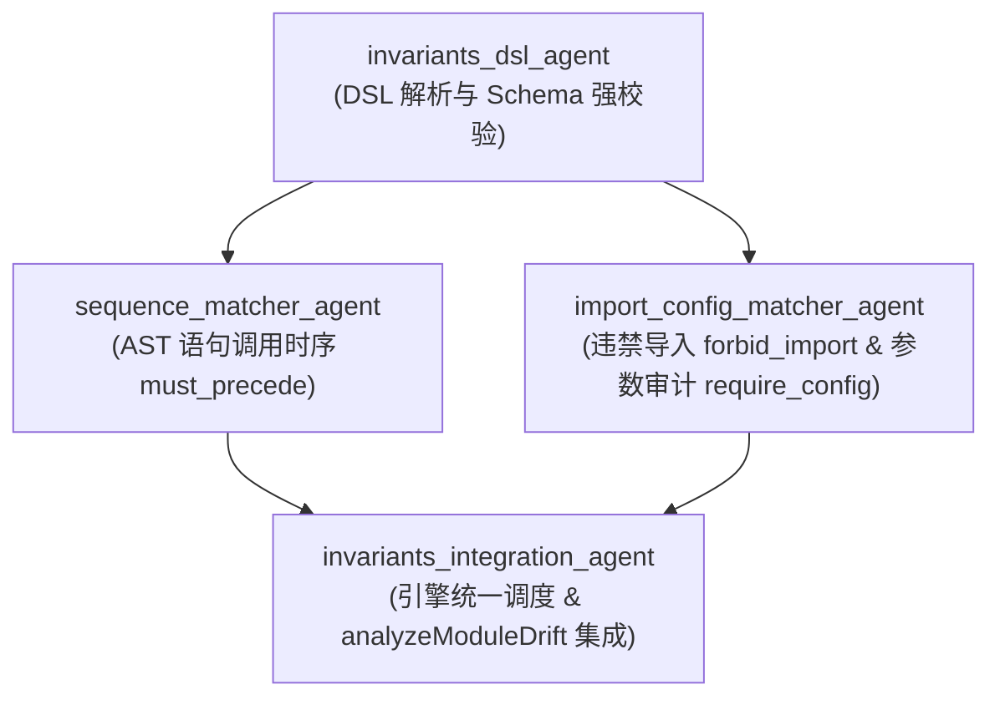

# Feature Implementation Plan: Phase 2 — Invariants Engine

> **特性代号**：`phase-2-invariants-engine`  
> **制定日期**：2026-09-17  
> **所属分支**：`feat/phase-2-invariants-engine`  
> **基准规范**：[`requirements.md`](file:///home/redtea/Mona_project/SextantDriftV03/specs/2026-09-17-phase-2-invariants-engine/requirements.md) | [`specs/roadmap.md`](file:///home/redtea/Mona_project/SextantDriftV03/specs/roadmap.md)  
> **执行模式**：TDD 模块化驱动，Core-First 无头先行，成对正反用例守护，Subagents 隔离分工

---

## 模块分工与 Subagent 矩阵



---

## Task Group 1: Invariants DSL 解析与模式定义 (`invariants_dsl_agent`)

- **目标**：为 `@sextant/core` 引入 `yaml`，扩展核心类型，实现 YAML 与 JSON 中的 Invariants 提取与严格校验。
- **任务细分**：
  - [x] **Task 1.1**: 更新 `packages/core/package.json` 引入 `yaml: "^2.4.2"`，执行 `pnpm install`。
  - [x] **Task 1.2**: 扩展 `packages/core/src/types/architecture.ts` 与 `report.ts` 中的 `InvariantPattern`, `InvariantRule`, `ViolationEvidence`, `DriftSummary`。
  - [x] **Task 1.3**: 实现 `packages/core/src/invariants/parser.ts`，支持 DSL 解析与 Schema 校验。
  - [x] **Task 1.4**: 更新 `spec-resolver.ts` 支持提取 Markdown 中的 ```yaml invariants 块。
  - [x] **Task 1.5**: 编写 `packages/core/tests/invariants/parser.test.ts` 覆盖正反例。

---

## Task Group 2: 同步作用域 AST 语句时序匹配器 (`sequence_matcher_agent`)

- **目标**：严格在同函数/同步作用域（`ts.Block.statements`）内检测 `must_precede` 与 `target` 的调用先后次序。
- **任务细分**：
  - [ ] **Task 2.1**: 实现 `packages/core/src/invariants/sequence-matcher.ts`。
  - [ ] **Task 2.2**: 编写 `packages/core/tests/invariants/sequence-matcher.test.ts`（包含合规、缺失前置、时序颠倒及作用域边界用例）。

---

## Task Group 3: 违禁导入与入参配置审计器 (`import_config_matcher_agent`)

- **目标**：实现 `forbid_import` 文件级导入拦截与 `require_config` 调用选项审计。
- **任务细分**：
  - [ ] **Task 3.1**: 实现 `packages/core/src/invariants/import-matcher.ts`。
  - [ ] **Task 3.2**: 实现 `packages/core/src/invariants/config-matcher.ts`。
  - [ ] **Task 3.3**: 编写 `packages/core/tests/invariants/import-matcher.test.ts` 与 `config-matcher.test.ts`。

---

## Task Group 4: 统一调度与顶层引擎集成 (`invariants_integration_agent`)

- **目标**：调度三大匹配器，将规则违规注入 `analyzeModuleDrift()`，并通过全量测试。
- **任务细分**：
  - [ ] **Task 4.1**: 实现 `packages/core/src/invariants/engine.ts`。
  - [ ] **Task 4.2**: 在 `packages/core/src/index.ts` 导出并整合调用。
  - [ ] **Task 4.3**: 编写 `packages/core/tests/invariants/engine.test.ts` 并更新端到端夹具测试。
  - [ ] **Task 4.4**: 运行全量测试套件 `./start.sh --test` 与 `./start.sh --build`，确认全部通过。
