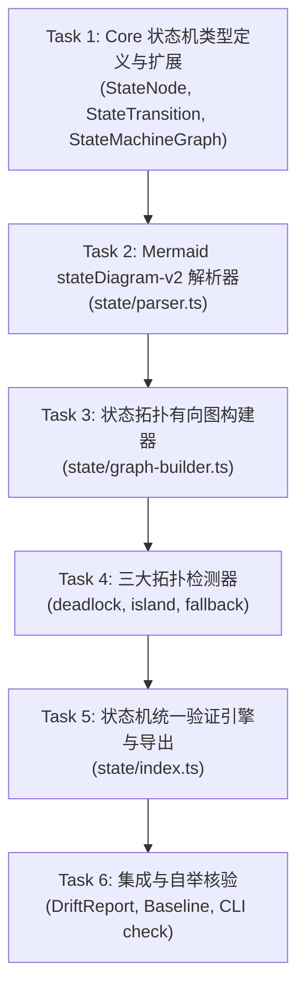

# Feature Implementation Plan: Phase 3 — State Verifier (状态机完整性静态分析引擎)

> **特性代号**：`phase-3-state-verifier`  
> **制定日期**：2026-09-17  
> **所属分支**：`main`  
> **基准规范**：[`requirements.md`](file:///home/redtea/Mona_project/SextantDriftV03/specs/2026-09-17-phase-3-state-verifier/requirements.md) | [`ROADMAP.md`](file:///home/redtea/Mona_project/SextantDriftV03/ROADMAP.md)  
> **执行模式**：TDD 严格驱动，分包隔离，每次代码变动全量单测通过后推进

---

## 模块分工与流水线

---

## Task Group 1: 核心类型定义与报表扩展 (@sextant/core)
- [x] **Task 1.1**: 在 `packages/core/src/state/types.ts` 定义 `StateNode`, `StateTransition`, `StateMachineGraph`, `StateViolation`；
- [x] **Task 1.2**: 在 `packages/core/src/types/report.ts` 扩展 `ViolationEvidence.type` 支持 `STATE_DEADLOCK`, `STATE_UNREACHABLE`, `STATE_MISSING_FALLBACK`；
- [x] **Task 1.3**: 在 `packages/core/src/types/report.ts` 扩展 `DriftSummary` 加入 `stateViolationCount`。

---

## Task Group 2: Mermaid stateDiagram-v2 解析器与测试 (TDD)
- [x] **Task 2.1**: 编写 `packages/core/tests/state/parser.test.ts`，涵盖标准状态机、注释过滤、复合跃迁与事件守卫提取；
- [x] **Task 2.2**: 实现 `packages/core/src/state/parser.ts` 使测试全绿。

---

## Task Group 3: 状态拓扑图构建与三大检测器 (TDD)
- [x] **Task 3.1**: 编写 `packages/core/tests/state/deadlock-detector.test.ts` 与实现 `packages/core/src/state/deadlock-detector.ts`；
- [x] **Task 3.2**: 编写 `packages/core/tests/state/island-detector.test.ts` 与实现 `packages/core/src/state/island-detector.ts`；
- [x] **Task 3.3**: 编写 `packages/core/tests/state/fallback-checker.test.ts` 与实现 `packages/core/src/state/fallback-checker.ts`。

---

## Task Group 4: 状态机统一引擎与端到端集成
- [x] **Task 4.1**: 实现 `packages/core/src/state/index.ts`，导出 `verifyStateDiagram()`, `extractAndVerifyStateDiagrams()`；
- [x] **Task 4.2**: 编写 `packages/core/tests/state/e2e-state-verifier.test.ts` 验证集成调用与端到端流程；
- [x] **Task 4.3**: 在 `packages/core/src/baseline/fingerprint.ts` 实现状态违规语义指纹计算；
- [x] **Task 4.4**: 在 `packages/core/src/index.ts` 整合状态机扫描与分析入 `analyzeModuleDrift()`；
- [x] **Task 4.5**: 更新 `packages/cli/src/formatters/terminal.ts` 支持友好终端高亮；
- [x] **Task 4.6**: 运行 `./start.sh --build`、`./start.sh --test` 与 `./start.sh --check`，确保 100% 通过。

