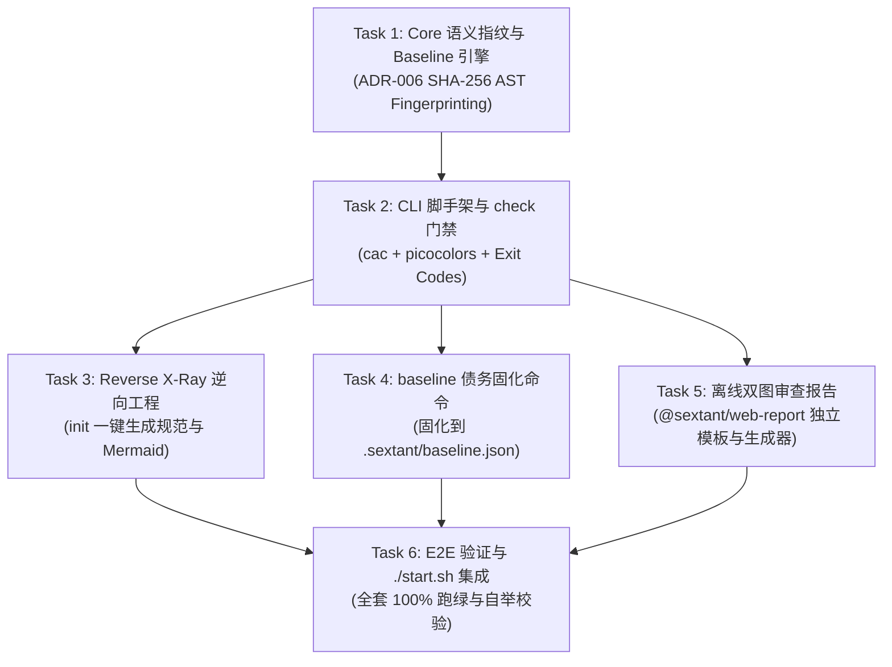

# Feature Implementation Plan: Phase 4 — CLI 门禁与双图审查报告 (CLI & Visual Report)

> **特性代号**：`phase-4-cli-and-visual-report`  
> **制定日期**：2026-09-17  
> **所属分支**：`feat/phase-4-cli-and-visual-report`  
> **基准规范**：[`requirements.md`](file:///home/redtea/Mona_project/SextantDriftV03/specs/2026-09-17-phase-4-cli-and-visual-report/requirements.md) | [`ROADMAP.md`](file:///home/redtea/Mona_project/SextantDriftV03/ROADMAP.md)  
> **执行模式**：TDD 严格驱动，分包隔离，每次代码变动全量单测通过后推进

---

## 模块分工与流水线

---

## Task Group 1: 语义指纹与 Baseline 引擎 (@sextant/core)
- [x] **Task 1.1**: 扩充 `DriftViolation` 与 `DriftReport` 类型定义，支持 `fingerprint` 与 `exemptions`；
- [x] **Task 1.2**: 在 `packages/core/src/baseline/fingerprint.ts` 实现双模 SHA-256 语义指纹计算函数；
- [x] **Task 1.3**: 在 `packages/core/src/baseline/manager.ts` 实现基线加载、比对与持久化；
- [x] **Task 1.4**: 编写 `packages/core/tests/baseline/fingerprint.test.ts` 与 `manager.test.ts`，验证空行/格式化免疫。

---

## Task Group 2: CLI 脚手架与核心 check 门禁 (@sextant/cli)
- [x] **Task 2.1**: 配置 `packages/cli/package.json`，引入 `cac` 与 `picocolors`；
- [x] **Task 2.2**: 实现 `packages/cli/src/formatters/terminal.ts`（ANSI 彩色输出，50~200 Tokens）；
- [x] **Task 2.3**: 实现 `packages/cli/src/formatters/json.ts` 与 `github.ts`；
- [x] **Task 2.4**: 实现 `packages/cli/src/commands/check.ts`，调用 Core 引擎与基线差分，管理 Exit Code 0/1/2；
- [x] **Task 2.5**: 创建可执行入口 `packages/cli/src/bin/sextant-drift.ts` 并更新构建脚本。

---

## Task Group 3: 存量债务固化 baseline 命令 (@sextant/cli)
- [x] **Task 3.1**: 实现 `packages/cli/src/commands/baseline.ts`，扫描违规并计算指纹存入 `.sextant/baseline.json`；
- [x] **Task 3.2**: 编写 `packages/cli/tests/baseline.test.ts`，验证历史债务豁免与新增违规拦截闭环。

---

## Task Group 4: 逆向推导 init 命令 (@sextant/cli)
- [x] **Task 4.1**: 实现 `packages/cli/src/commands/init.ts`，反向扫描目录生成 `sextant.json` 与 `ARCHITECTURE.md`；
- [x] **Task 4.2**: 编写 `packages/cli/tests/init.test.ts`，验证生成文件的有效性与 Mermaid 语法合规性。

---

## Task Group 5: 离线双图审查报告 (@sextant/web-report)
- [x] **Task 5.1**: 在 `packages/web-report` 中实现纯静态 HTML 模板与生成器；
- [x] **Task 5.2**: 内联工程图纸风格样式与离线 Mermaid.js；
- [x] **Task 5.3**: 在 CLI 中集成 `--report [path]` 与 `report` 命令；
- [x] **Task 5.4**: 编写 `packages/web-report/tests/report.test.ts`。

---

## Task Group 6: 全量集成与自举守护
- [x] **Task 6.1**: 编写 CLI 端到端测试与套件集成（`packages/cli/tests/`）；
- [x] **Task 6.2**: 更新根目录 `./start.sh --check` 支持 CLI 直接检查；
- [x] **Task 6.3**: 运行 `./start.sh --build` 与 `./start.sh --test`，全量子包编译与测试 100% 跑绿通过。
