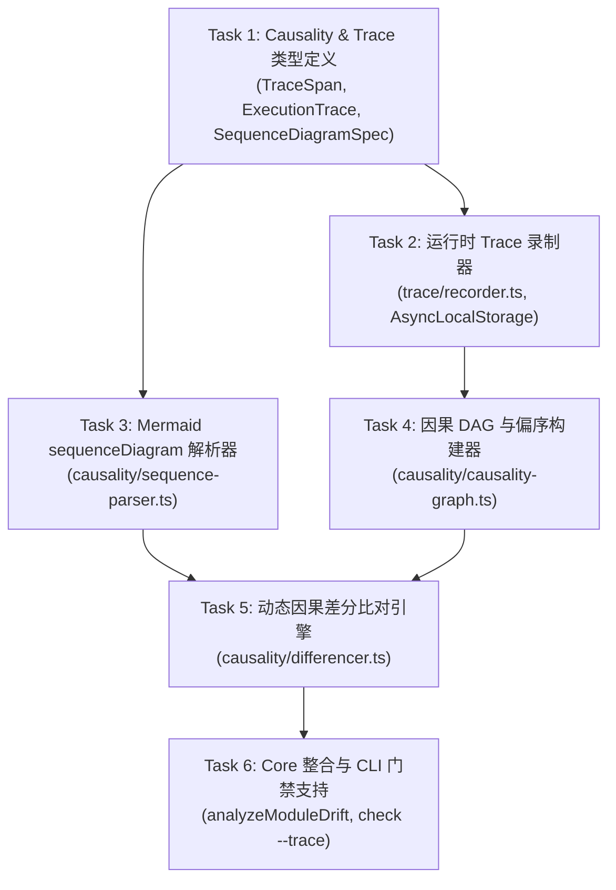

# Feature Implementation Plan: Phase 5 — Dynamic Trace & Causality Engine

> **特性代号**：`phase-5-dynamic-trace`  
> **制定日期**：2026-09-19  
> **所属分支**：`feat/phase-5-dynamic-trace`  
> **基准规范**：[`requirements.md`](./requirements.md) | [`ROADMAP.md`](../../ROADMAP.md)  
> **执行模式**：TDD 严格驱动，Core-First，无头优先，全量单测通过后推进

---

## 模块分工与流水线

---

## Task Group 1: 核心类型定义与报表扩展 (@sextant/core)
- [x] **Task 1.1**: 在 `packages/core/src/trace/types.ts` 定义 `TraceSpan`, `ExecutionTrace`, `TraceContext`；
- [x] **Task 1.2**: 在 `packages/core/src/causality/types.ts` 定义 `SequenceInteraction`, `SequenceDiagramSpec`, `CausalityNode`, `CausalityEdge`, `CausalityGraph`；
- [x] **Task 1.3**: 在 `packages/core/src/types/report.ts` 扩展 `ViolationEvidence.type` 支持 `DYNAMIC_OUT_OF_ORDER`, `DYNAMIC_UNEXPECTED_CALL`, `DYNAMIC_MISSING_CALL`，并在 `DriftSummary` 加入 `dynamicViolationCount`。

---

## Task Group 2: 运行时 Trace 录制器 (TDD)
- [x] **Task 2.1**: 编写 `packages/core/tests/trace/recorder.test.ts`，验证多层异步上下文（`AsyncLocalStorage`）、嵌套父子 Span 链、单调耗时与异常状态捕获；
- [x] **Task 2.2**: 实现 `packages/core/src/trace/recorder.ts`，导出 `TraceRecorder`, `withTraceSpan`, `recordTraceCall`，使测试全绿。

---

## Task Group 3: Mermaid sequenceDiagram 解析器 (TDD)
- [x] **Task 3.1**: 编写 `packages/core/tests/causality/sequence-parser.test.ts`，覆盖参与者别名、同步调用（`->>`）、异步调用（`-)`）、返回（`-->>`）与注释过滤；
- [x] **Task 3.2**: 实现 `packages/core/src/causality/sequence-parser.ts`，提取有序的期望交互链表。

---

## Task Group 4: 因果拓扑图构建器 (TDD)
- [x] **Task 4.1**: 编写 `packages/core/tests/causality/causality-graph.test.ts`，测试基于 parentSpanId 的因果树构建、同一作用域内的时间先后偏序判定（Happened-Before）；
- [x] **Task 4.2**: 实现 `packages/core/src/causality/causality-graph.ts`。

---

## Task Group 5: 动态因果差分比对引擎 (TDD)
- [x] **Task 5.1**: 编写 `packages/core/tests/causality/differencer.test.ts`，测试合规执行、次序倒置（Out-of-Order）、非法跨模块调用（Unexpected Call）与缺失关键调用（Missing Call）；
- [x] **Task 5.2**: 实现 `packages/core/src/causality/differencer.ts`。

---

## Task Group 6: 整合分析流与 CLI 门禁支持
- [x] **Task 6.1**: 在 `packages/core/src/baseline/fingerprint.ts` 补充动态时序违规语义指纹；
- [x] **Task 6.2**: 在 `packages/core/src/index.ts` 中整合 Trace 差分能力，支持传入 `tracePath` 或在 `.sextant/trace.json` 存在时自动执行动态差分；
- [x] **Task 6.3**: 更新 `packages/cli` 命令行（`--trace` 参数）与终端彩色高亮格式化；
- [x] **Task 6.4**: 运行 `./start.sh --build`、`./start.sh --test` 和 `./start.sh --check` 确保全量通过。
